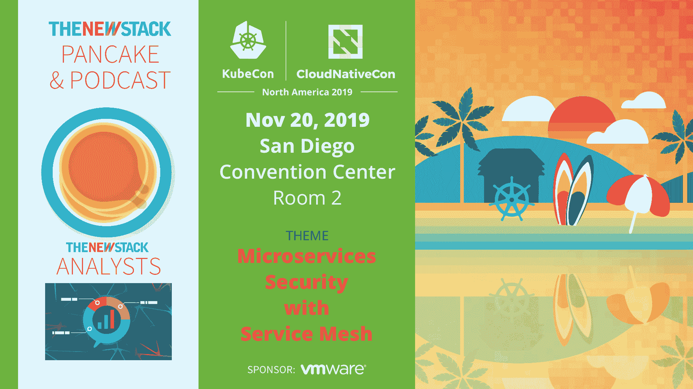

# 上下文:如何选择专有工具还是开源工具

> 原文：<https://thenewstack.io/context-how-to-choose-proprietary-vs-open-source-tools/>

VMware 赞助了这个播客。

今天，在新的 Stack Context 播客中，我们与 [CloudBees](https://www.cloudbees.com/) 的开源社区经理 [Kara de la Marck](https://twitter.com/karamarck?lang=en) 谈论何时依赖开源工具是有意义的，何时应该考虑专有替代方案。

当团队权衡哪些选项最适合他们的业务需求、基础设施和工作流时，云原生生态系统中丰富的工具可能会势不可挡。为了帮助提供一个决策框架，De la Marck 本周写了一篇关于“[开源工具:好的，坏的和真相之间的](/open-source-tools-the-good-the-bad-and-the-truth-in-between/)”的文章，作为云原生计算基金会几周后即将举行的 KubeCon 和 CloudNativeCon 圣地亚哥活动的预览。

[上下文:如何选择专有与开源工具](https://thenewstack.simplecast.com/episodes/context-how-to-choose-proprietary-vs-open-source-tools)

“你真的需要尽职调查，你必须问，作为一家企业，我们需要什么？我们需要什么级别的安全功能或保证，我们愿意接受什么级别的风险？”德拉马克说。“对于每个企业来说，这将是一个不同的答案。因此，不存在一个标准，当您采用依赖关系时，需要在所有权衡中进行大量仔细的思考和考虑。”

同样在这一集里，New Stack 创始人兼发行人 Alex Williams 和执行主编 Joab Jackson 讨论了该网站上的热门播客和故事，包括 Pivotal 的 SpringOne 会议上的一个播客，内容是[世界各地的开发人员如何比较 Kubernetes](/how-developers-compare-around-the-world-when-it-comes-to-kubernetes/)，以及关于如何[利用软件定义的广域网(SD-WAN)扩展贵组织的影响范围](/extend-your-organizations-reach-with-software-defined-wide-area-networking/)的文章，关于容器安全性的[初级教程](/primer-what-is-container-security/)，以及关于使用 GRE 在文本文件中查找字符串的[教程](/tutorial-find-strings-in-text-files-using-grep-with-regular-expressions/)

CloudBees 和 CNCF 是新堆栈的赞助商。

通过 Pixabay 的特色图片。

<svg xmlns:xlink="http://www.w3.org/1999/xlink" viewBox="0 0 68 31" version="1.1"><title>Group</title> <desc>Created with Sketch.</desc></svg>