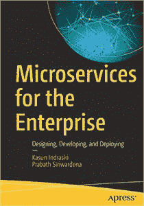

# 上下文:面向企业的微服务，Docker 的最新漏洞

> 原文：<https://thenewstack.io/context-microservices-for-the-enterprise-dockers-latest-vulnerability/>

[面向企业的微服务架构](https://thenewstack.simplecast.com/episodes/microservice-architectures-for-the-enterprise)

在本周的[新堆栈上下文](https://thenewstack.io/podcasts/context)播客中，我们将与最近出版的新书《面向企业的[微服务:设计、开发和部署](https://www.amazon.com/Microservices-Enterprise-Designing-Developing-Deploying/dp/1484238575)》的两位作者讨论企业如何部署微服务 Kasun Indrasiri 是新堆栈的赞助商 [WSO2](https://wso2.com/) 的集成架构总监，Prabath Siriwardena 是 WSO2 的安全架构副总裁。

该书深入探讨了以厂商中立的方式构建微服务的关键挑战和解决方案。微服务基础通过企业软件架构中的用例进行解释。这本书涵盖了集成微服务和消除中央企业服务总线(ESB)，为您的服务选择最佳的服务间通信技术，API 管理和微服务的治理等等。在播客中，我们讨论了将微服务引入企业的挑战，作者提供了许多实用技巧。

在播客的后半部分，我们讨论了本周来自该网站的一些帖子，包括[最新的 Docker 漏洞](https://thenewstack.io/docker-symlink-race-vulnerability-could-allow-unauthorized-data-access/)，以及关于[使用 WSO2 的芭蕾舞演员编程语言和亚马逊网络服务的 Lambda 无服务器服务](https://thenewstack.io/a-step-by-step-guide-for-aws-lambda-deployments-with-ballerina/)的分步指南。我们还总结了本月早些时候在巴塞罗那举行的 KubeCon + CloudNativeCon 2019 的一些剩余新闻。我们[还与 Oracle 高级软件开发人员 Maddie Patrichi 和 Autom8 联合创始人兼首席技术官 Gregg Altschul 讨论了最近的播客](/serverless-functions-and-challenges-in-todays-cloud-native-world/)。谈论新服务和工具的人不断涌现，以进行云原生部署。

KubeCon + CloudNativeCon、Oracle、Twistlock 和 WSO2 是新堆栈的赞助商。

特征图片:KubeCon + CloudNativeCon 拍摄的 CoreOS reunion。提示:这个团体自称“Coreos”，发音不像他们以前的公司，而是像 cookie，以字母 c 开头。红帽[在 2018 年收购了](https://thenewstack.io/red-hat-will-acquire-coreos-greater-kubernetes-presence/) CoreOS。

<svg xmlns:xlink="http://www.w3.org/1999/xlink" viewBox="0 0 68 31" version="1.1"><title>Group</title> <desc>Created with Sketch.</desc></svg>