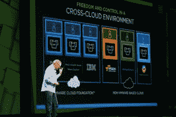
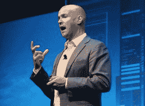

# 背景:VMware 计划带领企业穿越虚拟化丛林

> 原文：<https://thenewstack.io/context-vmwares-plan-lead-enterprises-virtualization-jungle/>

如果由 VMware 首席技术战略官 Guido Appenzeller 决定，如果架构是唯一考虑的因素，他将每天运行容器。

Appenzeller 说:“每个人都在虚拟机中运行容器——几乎是我接触过的每个人。"我想不起人们在裸机上运行它的任何一个实例."

VMware 首席技术战略官 Guido Appenzeller 在 VMworld 2016 上。

本期 [The New Stack: Context](/tag/the-new-stack-context/) 播客来自 VMworld 2016，我们将了解 VMware 在新兴容器生态系统中打算扮演的角色。虚拟机将继续为容器提供基础设施，还是容器将使虚拟机完全过时？

可以说，VMware 在其基础架构资源组合中握有一张非常重要的牌:它在企业中的安装基数。就目前的销售而言，其现有的服务器虚拟化平台据说占有高达 80%的全球市场份额。至少有一家分析公司——Gartner—[—将 VMware 评为](https://thenewstack.io/vmworld-las-vegas-2016-keys-conference-scrambling-foundation/)服务器虚拟化基础架构技术的领导者，这一类别也包括容器技术。Gartner 认为容器引擎主要是开发人员的工具，而不是操作员或管理员的工具。

对于许多企业来说，正如一项调查所揭示的那样，几乎 90%的企业云革命止步于虚拟机的边界。在这些环境中，容器根本不会渗透到基础设施中。因此，超大规模——可以说是将应用程序真正部署为微服务所需的环境类型——从未在那里实际发生。

VMware 不希望成为绊脚石。然而，它显然已经设计了一对扩展容器化的选项(如果不是超大规模，那么至少超越单个虚拟机)，其路径是通过它自己的主要产品之一来引导的:NSX 网络虚拟化平台。

VMware 副总裁 Paul Fazzone。

“我认为，由于集装箱化技术，我们将看到的基础设施的变化和基础设施的完全自动化将会加快，”VMware 副总裁兼 NSX 产品管理负责人 Paul Fazzone 承认道。“如果您想一想，开发人员可以多快、多容易地在一个环境中启动数十个或数百个容器，并将它们拼接成一个应用程序，这将推动基础架构的性能和响应速度。”

Fazzone 继续承认，他认为人类不应该阻碍这方面的进步——只要作为自动化工具的容器化的实施存在障碍，开发人员就会找到绕过这些障碍的方法。

因此，VMware 并没有试图制造一些人为的进入壁垒。此外，它还打破了围绕容器已经存在的天然屏障，这种屏障是由于企业对安全性、合规性和互操作性的不确定性而建立起来的。VMware 正在通过这一障碍开辟多条道路。在分析师和顾问搭建舞台的环境中，Docker 甚至可能都不是参与者，企业会选择哪条道路？

现在请听由 Scott Fulton 和 Luke Lefler 制作的最新版本的《新堆栈:上下文》**超大规模只带你到此为止**。

[Show 7:超大规模只带你到此为止](https://thenewstack.simplecast.com/episodes/show-7-hyperscale-only-takes-you-so-far)

专题图片:第一次(不成功的)试图修建巴拿马运河的插图——1885 年的库莱布拉切割图——摘自《哈珀周刊》的印刷本，现已公开。

<svg xmlns:xlink="http://www.w3.org/1999/xlink" viewBox="0 0 68 31" version="1.1"><title>Group</title> <desc>Created with Sketch.</desc></svg>