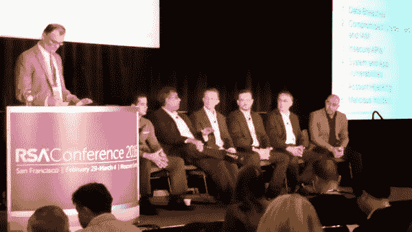

# 上下文:每个人将如何保护微服务？

> 原文：<https://thenewstack.io/context-will-everybody-secure-microservices/>

本周在西雅图的 DockerCon，Docker 公司。首席执行官 [Ben Golub](https://www.linkedin.com/in/bengolub) 重复了我们之前从他那里听到的一句话:更多的企业正在转向 Docker，他说，*因为*他们对安全性的担忧。言外之意，Golub 说，随着包加密和数字签名的迅速增加，容器安全性不可能比企业今天应对的安全状态更差。

保护数据中心或云的整个基础设施不是 Docker Inc .的责任，也不是任何一家公司的责任，甚至不是任何一个开发社区的责任。然而，参与这一过程是每个人的责任。尽管如此，人们诉诸颠覆或革命的原因是，这两者都比达成共识容易得多。你认为击退英国兵很难吗？试着写一部宪法。

去年 2 月 29 日，云安全联盟在旧金山召开会议，讨论云服务提供商社区的迫切需求。集装箱化带来的建筑特点是议程的重点，尽管一些与会者真正关心的是转向集装箱是否有任何方向。

那天，我向一个 CSA 安全小组询问，容器化的发展如何改变了 infosec 专业人员保护基础设施所必需的安全技能，尤其是在监控工具的使用方面。

“容器正在改变一切，”Veracode 安全技术总监 Erik Peterson 回应道，“但最重要的是，这是一条最终将成为无服务器计算的道路，因为人们正试图摆脱管理所有底层基础设施和所有其他东西。如果我可以打包所有东西，用一堆容器构建我的微服务架构，并快速部署它，那么我的所有问题都将迎刃而解。

“除了人们在建造容器时不知道它们是由什么组成的，”彼得森继续说道。“他们会说，‘我会从网上下载下来。’他们运行的是完全不可信的软件。所以你必须知道那些容器里发生了什么。但这的确令人印象深刻。我认为那些将从集装箱化中获得最大利益的公司，会在管理基础设施的系统上进行大量投资…因为这将允许人们管理基础设施，而不是整天忙于跟踪集装箱。但这是一个真正的西部荒原。没有多少人知道那里的所有挑战。"

在某种程度上，安全产品和服务社区似乎已经在考虑，在最终加入进一步的运动之前，看看集装箱化过程最终会采取什么方向。这就让 Docker 来解释 Docker 安全将如何涵盖整个数据中心，至少在此期间是这样。在全球极少数数据中心中，集装箱化构成了整个基础设施。去年，VMware 曾警告客户，脱离虚拟机管理程序驱动的虚拟化相当于一列开往 Erik Peterson 的“狂野西部”的货车

我们最新版的[新堆栈:背景](/tag/the-new-stack-context/)将头朝下同时潜入集装箱安全池的三面，看看哪一面先裂开。在本播客中，您将了解到我们在上届 RSA 大会上参加云安全联盟峰会的更多信息，我们将在会上与云服务提供商社区和安全服务社区进行交流。我们将把他们的优势与 Docker 的优势进行比较，Docker 到目前为止在打造基础设施安全的新模式方面还不得不孤军奋战。

听着:

[展示 2:微服务和不可持续的安全模式](https://thenewstack.simplecast.com/episodes/show-2-microservices-and-the-unsustainable-security-model)

Docker 是新堆栈的赞助商。

<svg xmlns:xlink="http://www.w3.org/1999/xlink" viewBox="0 0 68 31" version="1.1"><title>Group</title> <desc>Created with Sketch.</desc></svg>