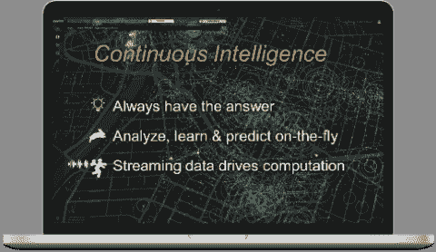
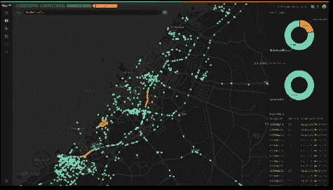
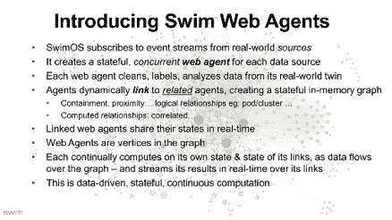

# 持续智能填补了智能数据库无法提供帮助的领域

> 原文：<https://thenewstack.io/continuous-intelligence-fills-in-where-smarter-databases-cant-help/>

 [西蒙·克罗斯比

西蒙·克罗斯比是 Swim 的首席技术官，该公司是一家持续智能软件供应商，专注于基于边缘的快速数据学习。他在 2010 年共同创立了 Bromium，现在担任战略顾问。此前，他是 Citrix Systems 数据中心和云部门的 CTOXenSource 创始人、CTO、战略和企业发展副总裁；英特尔的首席工程师，剑桥大学的教员。西蒙是 DCVC 的股权合伙人，在美国剑桥董事会任职，是许多初创公司的投资者和顾问。他撰写了 35 篇研究论文和专利，涉及多个数据中心和网络主题，包括安全性、网络和服务器虚拟化以及资源优化和性能。](https://www.linkedin.com/in/sicrosby/) 

组织淹没在来自产品、资产、应用和基础设施的数据流中。大数据“存储然后分析”架构很难及时找到答案，因为数据流是无限的，但数据只是短暂有用的。高数据量和地理上分散的数据源使得集中式架构极具挑战性且成本高昂。

数据库能跟上吗？有数百种可供选择。所有这些都旨在解决底层的基础设施难题。单个 API 调用可以触发快照或事务回滚。它们提供分析功能，甚至是机器学习、缓存、集群和分布式操作。它们对故障具有弹性，并且越来越安全。有什么不喜欢的？但是，也许一个更有用的问题是:数据库能帮助企业从他们的数据中寻找持续的情报吗？

但是数据库是由客户更新和用户查询的。当新数据到来时，它们不会驱动(重新)计算洞察，也不会将数据转换为洞察流。这对于持续的智能应用来说是不够的，这些应用需要在数据到达时得到答案。可悲的是，数据库不运行应用程序，也不能理解数据。

一个新兴的软件类别——持续智能——旨在解决这个问题。它通过使用数据来推动持续的分析、学习和预测，即时提供来自流数据的见解。

## 什么是持续智能？

持续智能的目标是始终有答案，实现实时响应。这是通过对流式数据进行持续的分析、学习和预测来实现的:

*   **数据驱动的计算:**分析由到达的数据驱动(相对于查询或批处理)，原因有三:用户需要实时的自动化反应；数据流是无限的，真实世界的数据只是短暂的有用。
*   **有状态的上下文分析:**包含、邻近等关系，甚至是关联或预测等分析关系，对于推理事件集体意义的应用程序都是至关重要的。关系是流动的，并且不断被重新评估。
*   **时间是基础:**由于数据驱动计算，并且结果可以立即获得，因此时间的概念是“内置的”——洞察不断流向应用程序、存储和用户，并可用于驱动自动化。

每个新事件都会触发对所有依赖关系的重新评估。例如:智能城市应用程序可能会提醒检查员在两分钟内停止任何制动行为不良的卡车，如果预测它与检查员在同一条道路上。因为没有必要告诉检查员停下已经通过的卡车，所以响应必须是实时的和情境相关的:只有与标记的卡车在同一条街上并且在标记的卡车前面的检查员才应该被警告。该应用程序需要实时为城市中的所有卡车和所有检查员提供结果。

卡车和检查员之间的短暂关系需要复杂的分析，即每时每刻使用每辆卡车的位置和速度来评估“刹车不良”，预测其路线并警告检查员。它们不能在任何传统的数据库中表示。可以说，对于这种不断发展的现实世界系统来说，将数据库作为“真理”存储库的想法无论如何都是不合适的，因为源的当前状态不如其随时间推移的行为有用:

*   从一段时间内的变化计算出的分布、趋势或统计数据通常更有用
*   ML、回归和其他预测工具使用过去的行为来预测未来
*   现实世界中的数据通常包含一些值，这些值本身就是估计值或时间窗口
*   源之间的复杂关系通常只能在时域中找到

需要整个系统在一段时间内的行为来确定其当前可能的状态，并预测其可能的未来状态以提取意义。持续智能应用程序提供连续的洞察和响应流，这些洞察和响应来自于对所有事件随时间推移对有状态系统模型的联合影响的持续解释。随着关系的变化——地理上的、数学上的或其他方面的，关系集——作为动态更新的图形保存在内存中以捕捉含义——不断更新。当接收到新数据时，会计算新的见解和更新的关系链接。

持续智能给数据处理架构带来了两个重要变化:

1.  算法需要适应处理无限的输入，例如使用草图和无监督学习。
2.  分析需要是有状态的，并且必须包括对依赖关系的(即时)重新评估，以确定级联影响。这反过来又导致了内存架构，从而避免了与数据库的长时间往返。

## SwimOS:OSS 连续智能平台

[SwimOS](https://github.com/swimos) 是一个轻量级的、Apache 2.0 许可的分布式运行时，用于持续智能应用。每个数据源都由一个称为 Web 代理的有状态并发参与者来表示。Web 代理就像一个并发的数字孪生数据源，它处理自己的数据，但它也可以执行复杂的业务逻辑，评估谓词，甚至在没有数据库往返的情况下实时学习和预测。它甚至可以做出反应，实时做出反应。

Web 代理基于它们所代表的源之间的真实关系动态地相互链接，比如包含或邻近，甚至是分析关系，比如相关性。当 Web 代理相互链接时，它们形成了数据源之间上下文丰富的关联的流动内存图。链接允许并发的、有状态的 Web 代理共享它们的内存状态。Web 代理在处理事件时会根据现实世界中不断评估的变化来建立和断开链接。由此产生的内存图有点像一个活的“LinkedIn for things”:Web 代理，就像数据源的“智能数字双胞胎”，相互链接形成一个图。

链接的神奇之处在于，它使每个 Web 代理能够使用自己的状态和与其链接的其他代理的状态同时进行计算，从而实现粒度上下文分析、学习和预测以及主动响应。因此，现实世界中实体部分的变化的连锁效应会立即在其 Web 代理和所有相关(链接)的 Web 代理中显示为状态变化。

Web 代理还充当不断重新评估的并发物化视图。他们可以链接到数以百万计的其他 Web 代理，以获得 KPI 或聚合视图。在 Web 代理的应用服务层中使用链接、关系、分析和学习的力量，允许开发人员轻松地向已经活跃的持续智能部署添加额外的服务层。

<svg xmlns:xlink="http://www.w3.org/1999/xlink" viewBox="0 0 68 31" version="1.1"><title>Group</title> <desc>Created with Sketch.</desc></svg>