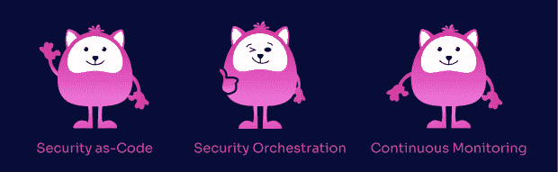

# 持续安全性，开发速度的下一次发展

> 原文：<https://thenewstack.io/continuous-security-the-next-evolution-of-developer-velocity/>

这是关于持续安全性的三部分系列文章中的第二部分。

在我们的[上一篇文章](https://thenewstack.io/what-good-security-looks-like-in-a-cloudy-world/)中，我们概述了[持续安全](https://jit.io)背后的 Jit 哲学，以及将采用这种方法的精英和现代工程团队将如何实际提高速度，尽管围绕安全的常见误解使工程陷入困境。

安全性已经存在，需要尽早嵌入。我们从“左移”中学到了这一点，这已经被证明不够早，而[天生左移安全性](https://www.jit.io/post/born-left-vs-shift-left-security-and-your-1st-security-developer-architect)现在是一种新兴的实践——早在第一行代码中就嵌入了安全性。

然而，在实践中应用它需要一些过程和实践的重新调整。通过确定可以立即进行的修复并对其余的进行优先排序，我们可以创建一个好的框架和基线安全状态来维护和改进。

当我们谈论持续安全性时，它还包括几个支柱，这些支柱将有助于使安全性更接近工程实践，并释放开发人员拥有的安全性的真正潜力。

这些支柱包括:

*   **代码形式的安全性(SaC)** :通过符合行业和定制安全框架的代码驱动计划，将安全性*嵌入为代码*
*   **安全协调**:围绕嵌入安全协调流程和工作流，包括自动化、工具和补救
*   **持续监控**:使用适当的工具和流程来持续监控我们的安全状况，并最终进行改进

## 安全需要先修复的心态

我们在之前的帖子中简单地谈到了这一点，但为了更深入地揭示这一点，让我们看看精英工程是什么样子的，以及这种方法可以带来什么样的安全性。当我们谈论量化精英工程的指标时，DORA 关注两个主要类别:速度和安全。

随着攻击面的不断演变和攻击手段的日益复杂，每次攻击的风险都越来越高，安全必须停止成为工程中的事后想法。虽然这通常以变更失败率(CFR)和平均恢复时间(MTTR)等指标来量化，但在工程流程中越来越受重视的另一个极其重要的焦点是安全风险管理。

但是这回避了一个问题:为什么直到现在安全还没有成为发展过程中的一个本地公民，尽管所有的努力都将其向左移动，甚至使其生来就向左。

这是因为整个安全思维是问题驱动的，而工程思维是修复驱动的。

让我们来看看 DORA 安全指标，它是用 CFR 和 MTTR 衡量的。即使你在系统中引入了故障(CFR 衡量这种情况发生的频率)，MTTR 也会衡量你引入修复和恢复系统的速度，这在很大程度上被视为定义精英工程团队的指标。然而，今天的安全工具仅仅引入了噪声和它们标记的许多问题，并且很少有工具采用修复优先的方法。

目前使用的最常见的开放源码软件工具侧重于检测，很少用于补救。即使是那些提供如何修复问题的指导，也很少会给你指出要修复的确切代码行。

专注于高速度的工程团队对错误不感兴趣。他们感兴趣的是当它出错时如何修复它(他们将把“发生了什么”留给事后分析或 sprint 回顾)。解决问题成为软件交付的最高价值。

开发运维与自动化引入了最佳实践，最终甚至推出了可以自动处理最常见故障的行动手册。

如果我们从持续安全性的第一个支柱开始，代码安全性(SaC)与开发人员工作流保持一致，并在整个编码过程中提供对已知问题的修复。更重要的是，它还提供了可扩展性，因为安全性被编码，因此是可编程的，这最终允许人们管理他们自己的定制风险和过程。

安全协调是通过改进补救流程来实现的，使其更加自动化、面向批处理且更加简单。最后，持续的监控有助于确保不会引入新的威胁，并且在运行服务中出现的威胁会被快速捕获和缓解。

虽然修复优先的思维方式使我们能够不引入新问题，但这并不否定您应该投入的具体努力和资源，以持续减少现有关键问题的安全债务。这是它的编排部分。

通过将类似的问题聚集在一起并进行批量处理，您可以实现更高的安全效率，并更快地将积压的工作减到最少(许多安全产品现在都采用这种方法。).持续监控和[安全协调](https://jit.io)齐头并进，因为一旦您意识到存在的问题并发现生产问题，良好的自动化流程将比以前的流程更快地帮助降低这些风险。

这类似于修补船上的缺口。你首先要确保在排水之前把洞修好。一旦您能够在新问题出现时确定解决新问题的机制，并灌输“先解决”的思想，那么就有可能从解决现有问题的工作中分离出来，并使这一过程自动化。

然而，这基本上是安全性失败的地方。一长串的漏洞已经不再管用了。

虽然可见性和可观察性是修复故障的第一步，但了解如何实际跟进和快速修复问题将是使安全性成为工程和交付中的一等公民的真正措施，然后自动化可能的事情并优先考虑其余的事情。

太好了，那是怎么做到的？

## 嵌入安全修复优先的思维模式

一旦我们理解了这种基本的思维转变，我们就可以逆向工程如何将修复优先的方法应用于现代工程过程的安全性——其中的主要目标是在已经嵌入安全性的情况下尽可能快地将代码交付给生产。

在我们之前的文章中，我们讨论了实现这一目标的三个核心部分:差异化、优先化和补救。下面，我们将深入探讨如何在您的工程实践中立即应用这一点。

### 代码内安全性

让我们讨论一下当前的安全关口，以及在必要时可以在哪里优化、自动化或转移到待定项中。当我们谈到持续集成和部署时，典型的图包括**构建> >测试> >发布> >部署**。

对此，多年来，我们增加了预编码、编码和后期部署的层次——所以现在看起来是这样的:**计划> >代码> >** 构建> >测试> >发布> >部署 **> >运行/操作**

对于其中的每一个阶段，我们都试图尽可能无缝地嵌入安全性，这既有成功的一面，也有失败的一面。

DevSecOps 方法最大的成功之一是以一种以代码为中心的方式嵌入安全检查，并且在任何情况下都有其他入口的地方，在拉请求(PR)期间(对构建、测试和发布有不同的控制)。

这使得将可操作的安全修复包含到其他代码和错误修复中成为可能，同时仍然在相同的上下文中设计相同的代码片段。事实证明，这种方法对于在早期，在将代码合并和部署到生产环境之前，将安全性嵌入到代码中是非常有效的。

### 动态应用和基础设施安全管理

已经证明不太成功的是在运行时在云提供商基础设施和应用程序级别处理安全漏洞的方式。这一层的常见做法是按照预定义的计划运行这些检查，并提醒开发人员或云工程师注意任何问题(在运行/操作阶段)。这与任何工程过程完全分离，并且经常使该区域处于无人地带，或者为创建基础设施漂移打开了大门。针对运行时应用程序发现的安全发现也会出现相同类型的问题。

一旦代码被部署并在生产中运行，追踪代码所有者并把他们带回到这段代码的上下文中是很困难的，甚至更困难。事后出现的基础设施安全问题是基础设施漂移的常见原因，因为很多时候工程师更喜欢在控制台或 UI 中进行更改，而不是通过基础设施作为代码进行更改。这将需要通过常规管道重新部署代码，并检查和添加其他人到流程中。

另一半是即使在产品中完成了调试，很多时候由于修复的紧迫性，这些更改也经常绕过代码门控。这还假设修复和检测都很简单，但实际上这两者都不正确。很少以代码的形式提供解决方案，因为这些往往是容易出错的复杂解决方案。即使是这样，修复也不总是简单明了的，尽管比以往任何时候都更需要运行时的“左移”实践。

这种情况经常发生，因为在部署之后，关于所有权不再有真正的明确性，并且计划的检查与任何正在进行的工程过程分离。因此，如果出现警报，工程师会希望尽快处理，只有在下一次计划运行时才能检测到手动更改或偏差。当另一个工程师随叫随到时，这可能是几小时、几天或几周之后的事。

### 改善卫生状况

一个好的做法是将这些检查和控制转移到同一个以代码为中心的入口(PR)中，并确保至少在第一次部署到试运行阶段时捕获它们，以便不到达生产阶段，同时编写代码的工程师仍然在上下文中。这将确保所选择的基础设施和运行时不会出现警报或问题。

为了更进一步，我们可以通过 IDE 内安全警报和预提交挂钩，从编码本身就开始采取安全措施，以帮助尽早将安全性嵌入我们的产品和系统。

## 持续安全性—精英团队的下一个前沿

以代码为中心的方面是容易的部分。它们通常已经在注重安全性的组织中实现，在那里每个 PR 都被视为现有代码的一个新的安全增量。

对于非以代码为中心的更改，如基础架构更改、IaC 甚至配置为代码—更准确和清晰地说，这些更改包括导致非代码问题的代码更改，如 IaC 的更改会对基础架构运行时产生一些影响，或者应用程序代码的更改会导致运行时的非代码问题—这稍微困难一些。但是，找到一个好的框架来定义基线并确保在每次部署或环境变化时都保持这一点，并不是不可能的。

不属于这两类立即可修复问题的任何问题都被视为待处理修复，并通过我们根据其严重性、可修复性以及自动化和协调能力定义的优先级和补救框架。

例子包括:

*   它可以修复吗？(自动化还是半自动？)
*   需要付出什么样的努力？
*   批量操作可能吗？
*   有什么努力？
*   严重性？
*   小区报警？

这些只是影响我们对待办事项中的问题进行优先排序和决策的一些参数。

## 持续安全:所有 CISOs 都能支持的计划

通过将以前令人望而生畏的安全领域分解为以开发人员为中心的语言、工具、工作流和流程，持续安全成为可能。通过将安全性作为代码来交付，在其他工程学科中已经可能实现的自动化现在在安全性中也是可能的。一旦我们确定了我们可以自动化的领域，就有可能实现真正的安全协调—基本上是工作流的自动化，而不是简单的一次性任务。最后一点是，通过持续监控和整理我们的安全储备，确保我们始终保持我们已经定义和实现的基线安全态势。

在我们的下一篇文章中，我们将深入探讨这种方法的采用如何使 CISO 受益，并分享 CISO 的观点，展示以前对立的观点现在如何融合为一个单一的世界观，直到最近，这个世界观一直是许多工程组织中摩擦和挫折的根源。所有这些将共同推动工程速度，使首席技术官和首席信息官能够自信地快速部署。

<svg xmlns:xlink="http://www.w3.org/1999/xlink" viewBox="0 0 68 31" version="1.1"><title>Group</title> <desc>Created with Sketch.</desc></svg>