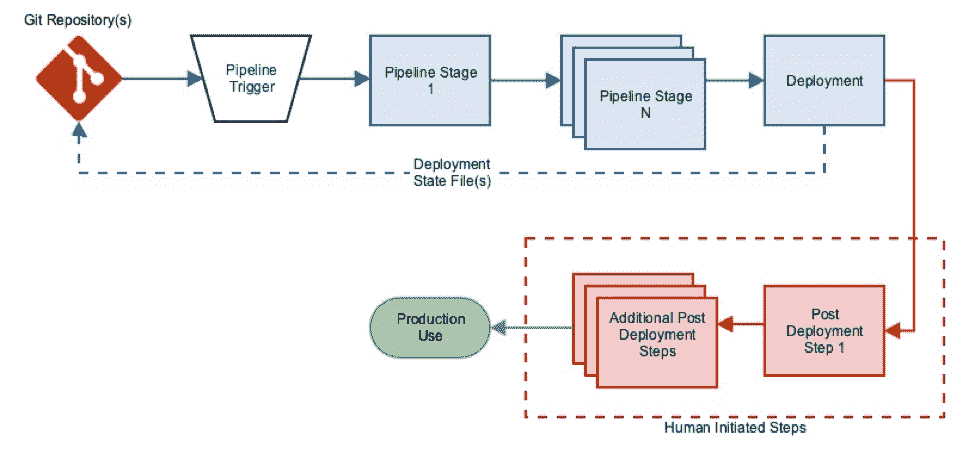
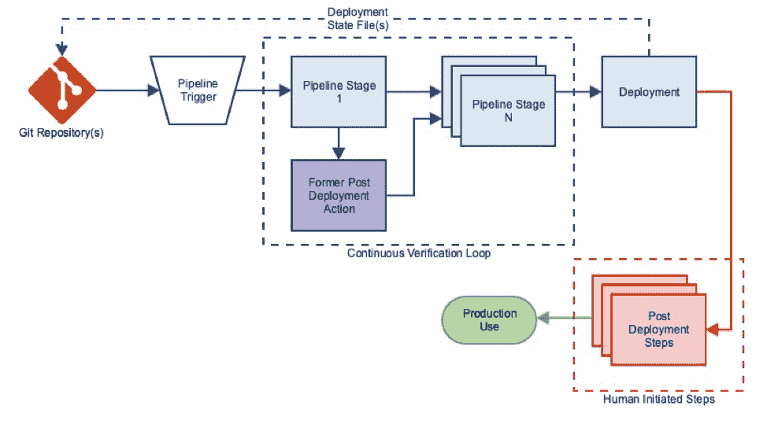

# 持续验证:实现管道完全自动化的缺失环节

> 原文：<https://thenewstack.io/continuous-verification-the-missing-link-to-fully-automate-your-pipeline/>

 [丹·伊尔森

丹是 VMware 云服务组织的云倡导者。目前，Dan 主要专注于 Kubernetes 生态系统、功能即服务框架和云原生应用程序开发。他还关注公共云中应用程序的管理和操作。在此之前，他自 2013 年起担任 NSBU 系统工程师。在加入 VMware 之前，Dan 是服务提供商组织 Cisco Systems 的一名咨询系统工程师。Dan 拥有德雷克塞尔大学的电子和计算机工程学士和硕士学位。](https://www.linkedin.com/in/danillson/) 

很难找到任何一个组织不在压力下发布软件，以更少的缺陷和更高的特性速度更频繁地部署。不一致的过程和手工操作是阻碍团队实现他们在软件交付方面的潜力的一些常见问题。为了应对这些挑战，已经有很多关于在软件速度上采用持续集成和持续交付(CI/CD)实践的好处的文章。

然而，许多应用程序在其部署管道完成时还没有准备好使用。“操作化”或“硬化”服务的部署后工作仍然是相当常见的实践，并且通常会降低软件交付的整体速度。数字说明了一切:企业管理协会(EMA)发起的一项由 Riverbed 赞助的研究发现，在 63%的受访组织中，不到一半的端到端持续部署流程是自动化的。只有 6%的人将他们的过程描述为 90%到 100%自动化。

在这篇文章中，我们描述了一个替代的实践，连续验证(CV)，如何减少和潜在地消除这些部署后的行为，以加快软件交付的速度和可靠性。

 [巴胡巴利(比尔)谢蒂

Bahubali 在 VMware 领导着一个公共云倡导者团队，完全专注于在 AWS/Azure/GCP 上进行应用程序开发和部署的最佳实践。Bahubali 之前在云公司担任过开发人员、产品经理和销售工程师。在过去的 10 年里，他一直致力于云的各种主题和功能。](https://www.linkedin.com/in/billshetti/) 

VMware 将 CV 定义为:

*“查询外部系统并使用来自响应的信息做出决策以改进开发和部署过程的过程。”*

该定义取决于部署流程的存在，该流程包括一个或多个 CI 和/或 CD 管道。持续验证是一种优化实践，其中持续集成和交付是输出驱动的，从而产生工件或部署。在许多组织中，在部署的应用程序准备好供预期用户利用其功能之前，需要一系列部署后活动。通常，这些步骤没有被包括在管道中，因为它们是手动执行的，或者是由定制的脚本驱动的，而这并不是广泛编排的流程的一部分。

与已部署的应用程序的每一次人为交互都会产生额外的时间，在这段时间内，应用程序不会向组织交付价值。将这些活动转移到管道中提高了流程的整体效率，并减少了部署和可用性之间的操作“滞后”。这些效率收益是通过总体减少人为行动实现的。

图一。部署管道和部署后步骤的框图。

CV 可以通过将一些或所有的部署后步骤转移到管道中的反馈循环中来扩充上面的流程。一旦这些活动被编码到管道中，它们将根据管道的过程和组织定义的逻辑被可靠地和可预测地执行。这种方法和操作的一致性减少了部署之间的可变性，提高了部署的可靠性。反过来，这些趋势允许人们专注于设计必要的政策，以进一步增加组织管道的范围和效率。我们已经在一篇名为“栅栏和大门”的文章中详细讨论了这些因素。

图二。上图中的“部署后第 1 步”已经进入管道。

随着这些部署后步骤被整合到管道中，整体效率得到了提高。这些“验证”步骤创建了能够改变管道最终输出的反馈回路。随着这些操作越来越多，部署时间(Td)趋势越来越短，部署也越来越准确地反映了组织策略。

有哪些人工验证的例子？

*   验证资源的利用率和/或成本没有超过授权的限制；
*   验证基础设施(AWS VPC/AWS EKS/etc)的配置是否符合组织规定；
*   了解开发人员是否暴露了 CI 工件中的漏洞；
*   确保应用在基础设施的延迟限制内运行
*   确认应用程序被授权使用正确的资源和服务集。

根据您的内部需求和流程，其中一些部署后步骤可以集成到 CD 管道的一个或多个阶段中。

在大多数情况下，部署成本是持续管理的。在业务运营持续监控成本(部署前/部署后)的同时，在部署后检查是否超出预算。然而，在部署之前，在 CD 管道中使用诸如 Cloudability、[cloud health by VMware](https://www.cloudhealthtech.com/)或 Cloudyn 之类的工具自动执行简单的检查，不仅有助于减少部署时间，还可以消除由于过剩而导致的任何回滚。我们的团队已经在我们的一篇博文中详细说明了如何实现这一点:“在一个持续自动化的世界中保持预算意识”

在部署软件之前，了解软件所在的基础设施是否根据组织策略进行了正确配置是很重要的。没有这种保证，部署可能会从一开始就失败或受到影响。有很多选择，从开源工具(云托管等)到现成的产品(红锁、 [VMware 安全状态](https://cloud.vmware.com/secure-state) 等。).我们的文章《 [利用 Jenkins 和 Terraform](https://cloudjourney.io/blog/implementing_a_continuous_security_model_in_public_cloud_with_jenkins_and_tf_part_2-su/) 在公共云中实施持续安全模型》详细介绍了这一概念的一个应用示例

在启动任何部署之前，必须进行一个非常重要的验证，即确保构建的工件没有暴露任何漏洞。无论是 AWS AMI、可执行文件、容器映像等，都应该在构建后使用 Clair(针对容器漏洞)之类的工具进行检查，或者在构建期间使用 OWASP 依赖检查(java 构建等)之类的工具进行检查。有大量的漏洞分析工具，应该在 CI 流程中以及部署之前添加这些工具。在我们的博客文章中，我们详细介绍了如何使用 docker 容器分析漏洞:“ [你的开发人员今天违反了什么？](https://cloudjourney.io/blog/CI-security-checks-bs/)

这些只是 CV 如何帮助组织更快地部署生产就绪软件的几个例子。许多其他策略驱动的任务可以转移到“管道”中，以提高部署流程的效率，并使“生产就绪”部署更接近现实。

*要继续讨论这个话题，或其他与现代应用和公共云相关的话题，请访问我们的 [cloudjourney.io](https://cloudjourney.io/) 。*

<svg xmlns:xlink="http://www.w3.org/1999/xlink" viewBox="0 0 68 31" version="1.1"><title>Group</title> <desc>Created with Sketch.</desc></svg>