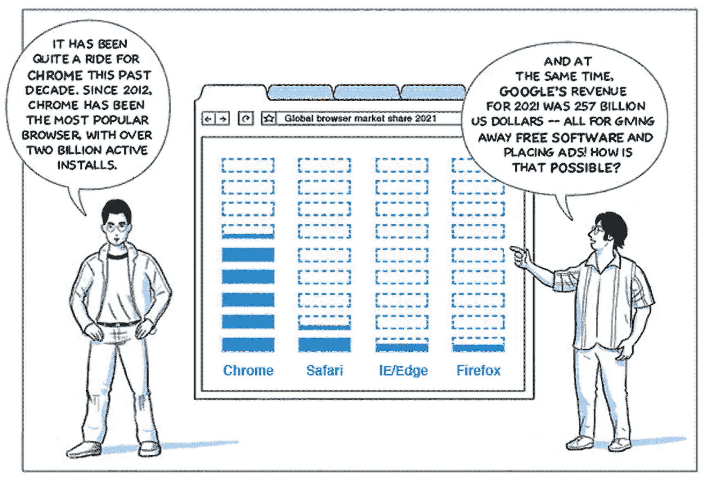
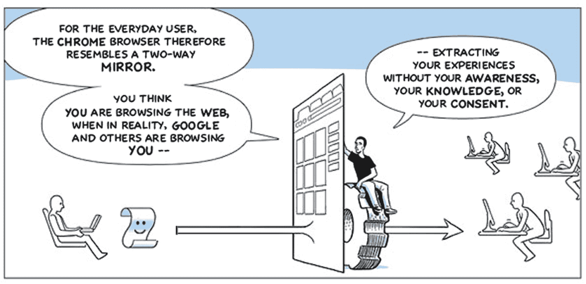

# Contra Chrome:对谷歌 2008 年 Chrome 漫画的辛辣讽刺

> 原文：<https://thenewstack.io/contra-chrome-a-biting-satire-of-googles-2008-chrome-comic/>

对于我们这些年龄足够大的人来说，还记得 Web 2.0 的全盛时期，那个时代的经典“文本”之一是 2008 年 9 月发布的 [Chrome 漫画书](https://www.google.com/googlebooks/chrome/)，与此同时第一版 [Chrome 浏览器也推出了](https://googleblog.blogspot.com/2008/09/fresh-take-on-browser.html)。作为当时的一名科技博客作者，我很幸运地收到了这本漫画的纸质副本，直到今天我还把它放在我的书架上。这个星期，当我在网上发现了这部漫画的新“混音版”时，我大吃一惊。

以“ [Contra Chrome](https://contrachrome.com/) 的名字出版，乍看起来像是漫画原著作者斯科特·麦克劳德发布了他创作的更新版本。但在网站版的 Contra Chrome 的第二页，很明显这是对原著漫画的讽刺，而不是致敬。

来自 Chrome 漫画混音版的第二页。

麦克劳德肯定不会在 2008 年反咬一口吧？或者这是苹果 Safari 团队的热门作品？(我必须承认这是我的第一反应，因为我是通过一名苹果员工发来的一条兴奋的推特发现这个混音的。)最后，在点击网站的[关于页面](https://contrachrome.com/about-2/)后，作者暴露了自己:莉亚·埃利奥特，自称“漫画艺术家和数字权利活动家。”

哎哟！来自 Contra Chrome 的第 5 页。

在仔细阅读了埃利奥特的 Chrome 漫画的混音版本(你可以下载 PDF 格式的版本)后，它被证明是对谷歌 Chrome 隐私政策的绝对严厉的批评。她重新使用了麦克劳德的漫画，必须说，相当出色，修改后的文字明显是反谷歌的。这部重新混合的漫画让 Web 2.0 时代的一些原始谷歌网络开发团队感到不安，尽管迄今为止它还没有引起谷歌的任何官方回应。

本周早些时候，我联系了埃利奥特，问了她一些问题。我想知道她创作这张混音版的动机，为什么她对谷歌的隐私政策有如此强烈的感觉，以及她是否有任何发表这张混音版的专业理由。她确实回复了我，并表示她愿意回答我的问题。所以我把它们发出去了(在她的建议下，用 PGP 加密的邮件)。然而，在写作时，我还没有收到任何进一步的答复。如果有，我会在下周单独写一篇文章。

## 本周发展

### 发布 WebAssembly 公共工作草案

W3C 的 WebAssembly 工作组已经[发布了](https://www.w3.org/blog/news/archives/9509)三份第一次公开的工作草案。正如迈克尔·拉贝尔[在 Phoronix](https://www.phoronix.com/scan.php?page=news_item&px=WASM-2.0-Public-Drafts) 中指出的，这些建议包括“固定宽度 SIMD、大容量内存操作、引用类型、JavaScript 的 BigInt 到 WebAssembly i64 支持、对多个返回值的支持以及可变全局变量的导入/导出。”《T4》黑客新闻线索有更多评论可以挖掘。

在其他 WASM 新闻中， [Renee Shah 采访了](https://reneeshah.medium.com/how-webassembly-gets-used-the-18-most-exciting-startups-building-with-wasm-939474e951db) 18 家“要么在生产中使用 WebAssembly，要么构建核心基础设施来开发 Wasm 应用程序”的初创公司对于那些刚接触 Wasm 或者想知道它如何适应您的应用程序开发管道的人来说，这是一篇很有启发性的文章。

### 堆栈溢出 Web3 调查

栈溢出开发者社区对 Web3 的大肆宣传有自己的看法。在对 595 名开发者的调查中，25%的人认为 Web3 是互联网的未来，15%的人认为这是一堆炒作，14%的人认为它对 crypto 和相关应用很重要，9%的人认为这是一个骗局。显然，36%的人回答“Web3 是什么？”—因此，他们显然没有阅读我们在新堆栈中的报道。

该调查还研究了“区块链标签中最常见的非区块链标签”，不出所料，JavaScript 名列榜首，其次是 Python。Stack Overflow 的开发者倡导者 Matt Kiernander 评论道:“JavaScript 对 Web3 至关重要，但 Web3 不是 JavaScript 生态系统的基础。

### 乐高为新应用程序使用纯铬 API

为了新闻平衡的利益，我觉得我需要在这篇文章的最后给谷歌浏览器一些爱。说到网络功能，谷歌的开源 Chromium 浏览器项目是首屈一指的。但是当乐高宣布一个使用高级网络功能的复杂的新应用程序——以串行 API 和网络蓝牙 API 的形式——在某些方面，这被攻击为垄断。然而，我怀疑为什么 Mozilla 和 Apple 没有选择支持这些 API。如果你通读了[GitHub](https://github.com/mozilla/standards-positions/issues/336)上这篇关于串行 API 的 Mozilla 线程，它可以追溯到 2020 年 5 月，有很多令人信服的理由支持它——例如，它支持教育和医疗应用的网络版本。任何与本地医疗应用的变幻莫测做斗争的人都知道其中一些解决方案有多糟糕(我是作为一名多年来背负着可怕的 iOS 应用的 1 型糖尿病患者而言的)。

### Dev 本周推特

最后，让我们用一条有趣的推特来结束这一周吧！也许只有 Web3 开发者会得到它，因为 Nader Dabit 是那个社区的英雄。无论如何，告诉我你下周的提名，[@里克马克](https://twitter.com/ricmac)。

<svg xmlns:xlink="http://www.w3.org/1999/xlink" viewBox="0 0 68 31" version="1.1"><title>Group</title> <desc>Created with Sketch.</desc></svg>