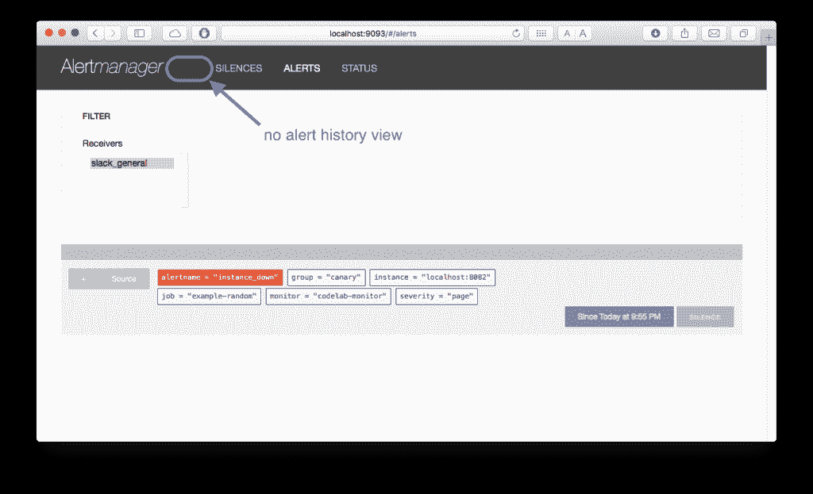
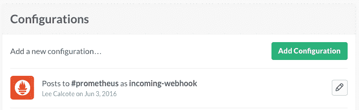
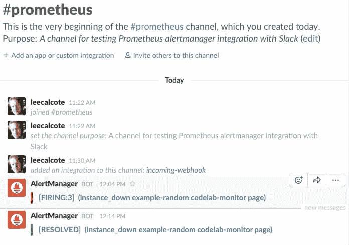
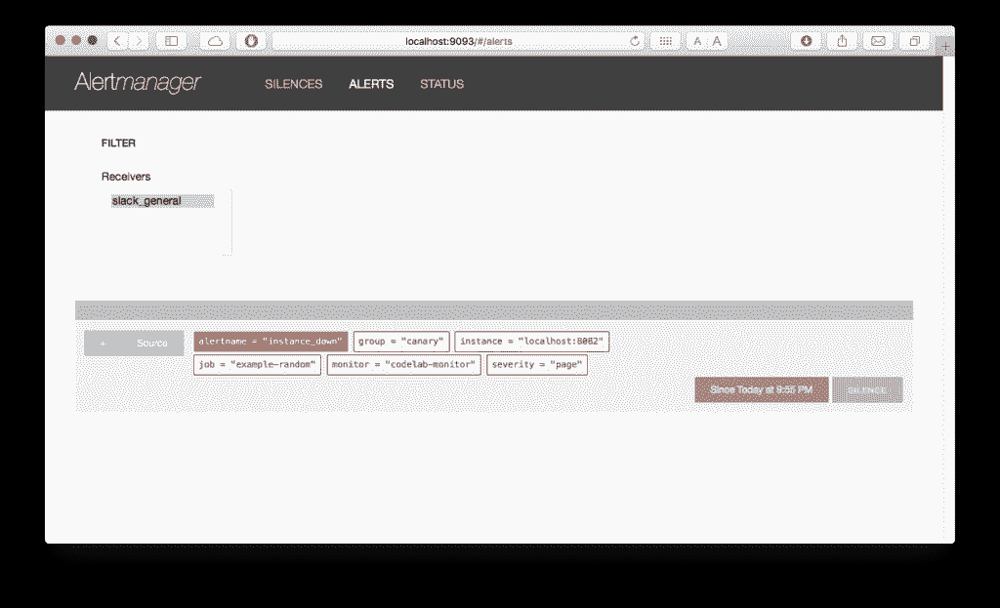
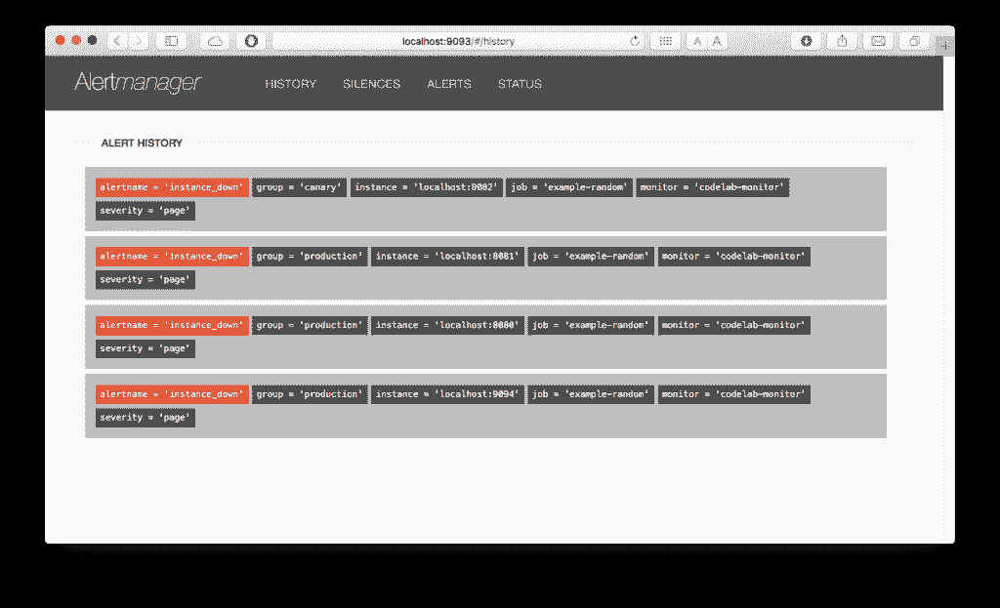

# 贡献给普罗米修斯:一个开源教程

> 原文：<https://thenewstack.io/contributing-prometheus-history-alertmanager/>

最近[被云本地计算基金会](https://thenewstack.io/cloud-native-computing-foundation-prometheus-second-hosted-project/)采用， [Prometheus](http://www.prometheus.io) 是一个开源系统监控和警报工具包，专注于支持微服务和容器的运行。像任何开源项目一样，它可以增加额外的功能。

为 Prometheus 做贡献与大多数其他开源项目没有什么不同，像许多项目一样，Prometheus 欢迎[社区贡献](https://prometheus.io/community/)。让我们通过给 Prometheus 的[警报管理器](https://github.com/prometheus/alertmanager)增加一个新的“历史”视图来更好地熟悉这个过程。

提示:参见[本指南](https://guides.github.com/activities/contributing-to-open-source/)了解一个更完整的为开源项目做贡献的方法。

当然，第一步是检查特定存储库(在本例中是 Alert Manager)的贡献指南。

当选择为任何开源项目做贡献时，您将希望确保您能够运用项目所使用的技术——在这种情况下，这些技术是 Go、AngularJS、SQL 等。

AlertManager 组件处理由客户端应用程序(如 Prometheus 服务器)发送的警报，仔细地对其通知进行重复数据删除、关联，并将其路由到相应的接收者(如电子邮件、webhook 等)。).该组件的当前行为只是显示主动触发的警报。

[](https://thenewstack.io/wp-content/uploads/2016/06/prometheus-alertmanager-no-history.png)

Prometheus 警报管理器—无警报历史记录

如果您想了解通过 AlertManager 通知的警报的历史情况，该怎么办？输入我们的用户故事:

**故事:**

作为一名操作员，我不仅希望看到触发警报的列表，还希望看到所有发生的警报的列表，这样我就可以有额外的上下文作为给定的已定义警报的阈值行为。

**限制:**

1.  AlertManager 数据库(SQLite)并不打算提供长期存储。

**验收标准:**

1.  一旦触发，无论是否主动触发，警报都将显示在历史页面上。
2.  可选地，触发的警报将被通知给松弛信道。

在这个有限的范围内，我们能够专注于完整的普罗米修斯架构的一个子部分，即警报管理器，它作为普罗米修斯本身之外的一个单独的二进制程序运行:
[](https://thenewstack.io/wp-content/uploads/2016/06/Simple-Prometheus-Architecture.png)

## 先决条件

有了架构，有了用户故事，让我们创建我们的开发环境。我们的用户故事并不要求改变 Prometheus 服务器本身。所以，我们只需要以预编译二进制文件的形式与这个组件进行交互。按照[入门说明](https://prometheus.io/docs/introduction/getting_started/)下载、配置并运行 Prometheus 服务器。确保创建并运行[随机样本目标](https://prometheus.io/docs/introduction/getting_started/#starting-up-some-sample-targets)，并将其指向您即将使用的 AlertManager:

```
./prometheus  -config.file=prometheus.yml  -alertmanager.url=http://localhost:9093

```

我们希望确保定义一个或多个容易触发的警报规则。这里有一个简单的警报规则，当任何给定的目标超过 5 秒都无法到达时将触发:

```
ALERT instance_down
IF up == 0
FOR 5s
LABELS {severity="page"}
ANNOTATIONS {
 DESCRIPTION="{{$labels.instance}} of job {{$labels.job}}
             has been down for more than 5 seconds.",
     SUMMARY="Instance {{$labels.instance}} down"}

```

将此警报规则保存到另一个 YAML 文件(如 alert.rules ),并引用 alert.rules 文件普罗米修斯服务器配置:

### /prometheus.yml

```
...
# Load and evaluate rules in this file every 'evaluation_interval' seconds.
rule_files:
  -  "alert.rules"
...

```

提示:可以使用[路由树编辑器](https://prometheus.io/webtools/alerting/routing-tree-editor/)来可视化 AlertManager 配置。

接下来，检查 AlertManager 项目代码:

```
 $  git clone https://github.com/prometheus/alertmanager.git

```

鉴于我们的用户故事包括对 AlertManager 进行前端更改，请确保您安装了一个小实用程序来从任何文件生成 Go 代码。在这种情况下，Prometheus 项目使用该工具嵌入静态 web 文件(HTML、CSS、AngularJS 等)。)到警报管理器二进制文件中。执行:

```
$  go get  -u  github.com/jteeuwen/go-bindata/...

```

### 可选先决条件

接下来(可选)创建一个警报通知接收器。在支持的 AlertManager 接收器中，让我们选择集成 Slack。

[](https://thenewstack.io/wp-content/uploads/2016/06/Slack-Incoming-Webhook-for-Prometheus-AlertManager.png)

为你的应用程序创建一个[传入网页挂钩](https://slack.com/apps/A0F7XDUAZ-incoming-webhooks)，选择一个现有的频道或创建一个新的频道，然后选择“添加传入网页挂钩”复制您的新 webhook URL(例如 https://hooks.slack.com/services/asdfXX/asdfXX)并将其与您的频道名称一起使用，创建一个具有以下 YAML 配置的文件(例如 notification . yml):

```
route:
  group_by:  [cluster]
  # If an alert isn't caught by a route, send it slack.
  receiver:  slack_general
routes:
  # Send severity=slack alerts to slack.
  -  match:
    severity:  slack
    receiver:  slack_generalreceivers:
-  name:  slack_general
  slack_configs:
    -  api_url:  '&lt;your-web-url-here&gt;'
    channel:  '#&lt;your-channel-name-here&gt;'
    send_resolved:  true

```

### 构建、运行、测试

接下来，通过构建和运行项目来验证您有一个功能开发环境:

```
$  make assets #invokes go-bindata to inject static web files
$  go build  #compiles go code
$  ./alertmanager  -config.file=notification.yml  #runs alertmanager with the specified configuration

```

随着您在创建新项目功能的整个过程中使用同样的三步构建、运行和测试循环，您将会熟悉这些步骤。

### 核实

如果您选择设置一个松弛通道，您现在应该会看到当您的随机目标上下波动时，会发出新的警报。
[](https://thenewstack.io/wp-content/uploads/2016/06/prometheus-slack-integration.jpeg) 
不考虑可选的 Slack 集成，您应该会在 AlertManager 用户界面中看到新的警报。
T12

## 编码

现在我们的开发环境已经设置好了，让我们开始我们的贡献吧。

[](https://thenewstack.io/wp-content/uploads/2016/06/prometheus-alertmanager-no-history.png)

普罗米修斯警报管理器-无警报历史

任何现代软件的一个好原则是通过可靠的 API 来确保可扩展性和编程集成。用户界面中显示的任何功能都应该由底层 REST API 提供。让我们打开/api.go 文件来添加这个新的 api 端点。

### /api.go

所有的 UI 功能都应该可以通过 API 寻址。让我们注册一个[新/历史 API 端点](https://github.com/leecalcote/alertmanager/blob/master/api.go#L93) :
`r.Get("/history", ihf("history", api.listAllAlerts))`

由于/api/v1/history 端点是一个新的可寻址 api 端点，我们需要构建一个函数来处理对它的请求。[API . listalalerts](https://github.com/leecalcote/alertmanager/blob/master/api.go#L185-L209)函数将处理对新端点的入站 HTTP 请求。

```
func  (api *API)  listAllAlerts(w  http.ResponseWriter,  r  *http.Request)  {
  alerts  :=  api.alerts.GetAll()
  defer alerts.Close()

  var  (
  err error
  res  []*types.Alert
  )
  for  a  :=  range alerts.Next()  {
  if err  =  alerts.Err();  err  !=  nil  {
  break
  }
  res  =  append(res,  a)
  }

  if err  !=  nil  {
  respondError(w,  apiError{
  typ:  errorInternal,
  err:  err,
  },  nil)
  return
  }
  respond(w,  types.Alerts(res...))
}

```

### /ui/app/js/app.js

定义了新的/api/vi/history 端点和处理程序后，我们需要在前端用户界面中注册和定义这个新的后端端点。通过修改/ui/app/js/app.js，我们将提供一种调用这个端点的方法，然后导航到一个历史视图。角度应用程序有许多更新要做。

首先在 NavCtrl 中为[历史菜单项](https://github.com/leecalcote/alertmanager/blob/master/ui/app/js/app.js#L144-L149) :
添加一个项目

```
angular.module('am.controllers').controller('NavCtrl',
  function($scope,  $location)  {
    $scope.items  =  [{
      name:  'History',
      url:  'history'
    },

```

插入一条[新历史指令](https://github.com/leecalcote/alertmanager/blob/master/ui/app/js/app.js#L22-L33) :

```
angular.module('am.directives').directive('history',
  function()  {
 return  {
 restrict:  'E',
 scope:  {
 alert:  '=',
 group:  '='
 },
 templateUrl:  'app/partials/history.html'
 };
  }
);

```

以及[新的历史服务](https://github.com/leecalcote/alertmanager/blob/master/ui/app/js/app.js#L121-L130) :

```
angular.module('am.services').factory('History',
   function($resource)  {
      return  $resource('',  {},  {
         'query':  {
         method:  'GET',
         url:  'api/v1/history'
         }
      });
   }
);

```

和一个[新的历史控制器](https://github.com/leecalcote/alertmanager/blob/master/ui/app/js/app.js#L166-L184) :

```
angular.module('am.controllers').controller('HistoryCtrl',
  function($scope,  History)  {
    $scope.refresh  =  function  ()  {
      History.query({},
        function(data)  {
          $scope.groups  =  data.data;
          console.log($scope.groups);
        },
        function(data)  {
          console.log(data.data);
        })
    }
    $scope.refresh();
  }
);

```

最后，我们需要一个页面来查看发生的警报。因此，在/ui/app/partials 下创建一个新文件，[history.html](https://github.com/leecalcote/alertmanager/blob/master/ui/app/partials/history.html)。History.html 将简单地格式化显示一个表格记录集。将从我们的数据提供程序中检索一个新的记录集。

### /提供商

API 端点和前端更改就绪后，让我们将注意力转向从数据提供者收集正确记录集的后端:

1.  向/provider/provider.go 添加一个新的 AlertIterator (例如 GetAll() AlertIterator)
2.  向/provider/sqlite/sqlite.go 添加一个[新的 AlertProvider 和 SQL 查询](https://github.com/leecalcote/alertmanager/blob/master/provider/sqlite/sqlite.go#L179-L248)
3.  向/provider/boltmem/boltmem.go 添加一个[新的 AlertIterator 和 AlertProvider](https://github.com/leecalcote/alertmanager/blob/master/provider/boltmem/boltmem.go#L150-L191)

## 试验

假设您已经经历了几个构建、运行、测试周期，您应该会看到一个新的 History 菜单项，其中列出了所有触发的警报，无论是否正在触发。

[](https://thenewstack.io/wp-content/uploads/2016/06/Prometheus-AlertManager-with-History-View.png)

## 摘要

虽然 AlertManager 并不打算提供历史记录(路线图需要一种其他工具也可以使用的日志记录形式)，但是这个示例增强提供了一个瞬态历史记录视图，即 SQlite 数据库所包含的时间段的视图。示例增强并不是完整的历史记录。

普罗米修斯开源项目进展顺利。确保在创建任何重要的增强之前提交一个 pull 请求，以避免受挫。考虑到数据提供者后端的巨大变化，这个示例增强并没有很好地与项目轨迹保持一致。

对于那些有兴趣深入了解普罗米修斯的人，请加入我们在德克萨斯州奥斯汀举行的 2016 年 DockerCon 后聚会。普罗米修斯是下一个微服务和容器奥斯汀会议的主题。

<svg xmlns:xlink="http://www.w3.org/1999/xlink" viewBox="0 0 68 31" version="1.1"><title>Group</title> <desc>Created with Sketch.</desc></svg>