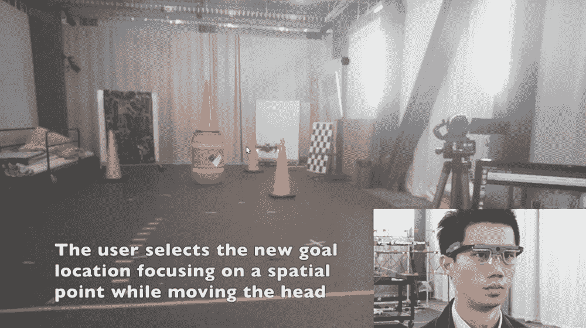

# 用眼球追踪眼镜控制无人机

> 原文：<https://thenewstack.io/control-a-drone-with-eye-tracking-glasses/>

控制无人机不一定是最直观的活动，正如许多被无人机蹂躏的婚礼(以及随后的诉讼)所显示的那样。通过深度学习让无人机更加[自主，并为其配备](https://thenewstack.io/deep-learning-drone-detects-fights-bombs-shootings-in-crowds/)[安全功能](https://thenewstack.io/foldable-drone-origami-like-protective-cage-makes-safer-deliveries/)可以有所帮助，但并不能解决根本问题。对于其他机器，我们已经看到了各种可能的解决方案，例如使用[脑机接口](https://thenewstack.io/control-robotic-arm-mind-using-machine-learning/)(BCIs)[增强现实](https://thenewstack.io/smartphone-app-can-control-robots-augmented-reality/)或一个人的[语音](https://thenewstack.io/mits-alterego-headset-lets-you-silently-converse-with-voice-controlled-devices/)来控制设备。

但是还有很多其他可能的方法。正如宾夕法尼亚大学、美国陆军研究实验室和纽约大学的一个团队所展示的那样，控制无人机可能很简单，只需使用一副眼球追踪眼镜，然后故意移动视线，将它指引到需要去的地方。看一看:

[https://www.youtube.com/embed/brF6TDqu1ec?feature=oembed](https://www.youtube.com/embed/brF6TDqu1ec?feature=oembed)

视频

根据该团队的说法，这里的想法是为人们远程控制飞行器创造一种直观和非侵入性的方式。虽然之前有一些尝试开发基于视觉的无人机控制方法，但这一次不同的是，这是一个独立的系统，不使用外部传感器来跟踪无人机，相对于控制的人来说。

此外，导航系统是相对于用户的，而不是相对于无人机的，这意味着所有方位点都是从用户的立场出发的。例如，如果用户告诉无人机向右走，它将走向用户的右边，而不是走向无人机的右边，这对用户来说将表现为无人机向左走(因为这是镜像运动)。团队系统的配置方式是，所有这些寻路都不需要结合其他外部系统，如运动捕捉技术或 GPS 来跟踪用户和无人机相对于彼此的位置。

根据研究团队的说法，该系统包括一些现成的组件，如 Tobii Pro Glasses 2，这是一款视线跟踪可穿戴设备，配备了一个[惯性测量单元](https://en.wikipedia.org/wiki/Inertial_measurement_unit) (IMU)，此外还有一个高清摄像头，以及一个 NVIDIA Jetson TX2 CPU 和 GPU，以便使用深度神经网络来帮助处理数据。

一旦用户戴上眼镜，他或她就可以通过观察无人机来检测无人机，从用户位置看到的四旋翼无人机的大小，处理器将使用来自 IMU 和机载相机的方向数据来确定其相对位置大约有多远。正如该团队所指出的那样，IMU 还可以帮助确定用户的头部方向，这有助于“将凝视方向与头部运动分离”，这意味着该系统可以在用户只移动眼睛或同时移动眼睛和头部的情况下工作。

纽约大学机器人学助理教授、宾夕法尼亚大学 [GRASP 实验室](https://www.grasp.upenn.edu/)主任 Giuseppe Loianno 博士在 [*数字趋势*](https://www.digitaltrends.com/cool-tech/fly-drone-eye-tracking-glasses/) 上解释说:“这种解决方案提供了在人类和机器人之间创建新的非侵入式互动形式的机会，允许人类在未经训练的环境中向机器人发送新的 3D 导航航路点。“用户可以通过凝视来控制无人机，只需指向一个空间位置，这与我们的头部方向不同。”

该团队目前正在努力完善该系统将二维“凝视坐标”转化为三维导航航路点的方式。根据该团队的说法:“理想情况下，3D 导航航路点将直接来自眼球追踪眼镜，但我们在实验中发现，眼镜报告的深度分量噪音太大，无法有效使用。在未来，我们希望进一步调查这个问题，以便让用户对深度有更多的控制。”

该团队的目标是最终创造出直观、反应灵敏的新人机界面，特别是可以结合多种交互模式的界面——无论是通过视觉、手势还是基于语音的命令。除了允许几乎没有经验的人安全驾驶无人机，这种多模式界面还有许多潜在的用途，例如让残疾人更容易控制他们的设备，或用于检查目的，执法或搜索和救援任务。

图片:纽约大学

<svg xmlns:xlink="http://www.w3.org/1999/xlink" viewBox="0 0 68 31" version="1.1"><title>Group</title> <desc>Created with Sketch.</desc></svg>