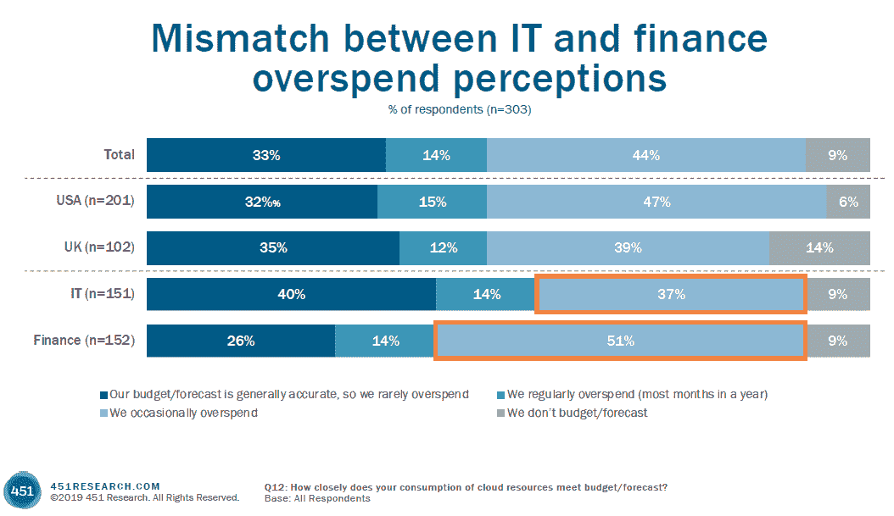
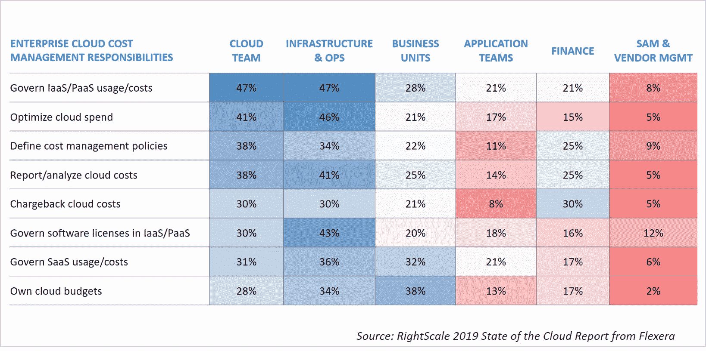

# 通过组织协调控制云成本，而不仅仅是软件

> 原文：<https://thenewstack.io/control-cloud-costs-with-organizational-alignment-not-just-software/>

公共云计算方面的支出持续增长，it 部门对控制云预算的方法也越来越感兴趣。最近的两项研究表明，IT 职责的变化以及与其他部门的协调通常决定了“不受控制的”云支出问题的严重程度。

根据 451 Research 的“[云时代的成本管理](https://get.cloudability.com/ebook-cost-management-in-the-cloud-age.html)”(由 Cloudability 赞助)报告，IT 和财务部门显然需要更好地协调他们的云成本管理。40%的 IT 职位受访者表示他们的预算和预测是准确的，而只有 26%的财务职位受访者表示他们很少超出云预算。如果与 it 部门密切合作，财务部门可以更好地了解支出情况，但目前只有 28%的受访者正式与 IT 部门和财务部门合作。

另一种防止云支出意外的方法是让 IT 部门共享他们可能已经获得的关于预期云消费实时变化的报告。尽管 IT 部门广泛使用仪表板，但大多数指标并没有集成到首席信息官仪表板中，更少的指标涉及首席信息官所关注的内容。如果没有跨部门的问责文化，许多成本管理工具很可能成为一纸空文。

IT 部门与财务部门对云支出看法不一致的另一个原因可能是来自 IT 部门之外的云支出。事实上，根据 Flexera 的“ [RightScale 2019 年云状态](https://info.flexerasoftware.com/SLO-WP-State-of-the-Cloud-2019)”报告，38%的公司拥有自己的云预算业务部门。即使业务部门没有自己的云预算，他们仍然不太可能相信中央 it 部门应该负责管理和优化云服务的成本。

## 

## 减少云支出的其他方法

*   **合理调整规模:**降低云支出的最简单方法可能是合理调整组织的虚拟机(VM)规模。换句话说，确保您不会为通常未充分利用的大型实例付费。根据 451/Cloudability 报告的受访者，在云上花费大量资金的公司在这方面比其他公司更好，但即使是那些每月在云上花费 100 万美元的公司，也只有大约 55%的虚拟机的规模适合其工作负载。RightScale/Flexera 的研究对合理调整更乐观一些，但即使是它的报告也显示只有 30%的人会自动合理调整。
*   **云代理:**对于复杂的工作负载，对来自多个云提供商的云服务进行自动化云代理目前是不现实的。软件工具可以有所帮助，但就目前而言，451 Research 的 [Owen Rogers](https://twitter.com/owenrog) 认为，你仍然需要有人从工具中获取数据和建议，然后对业务优先级和风险做出定性判断。
*   **回到私有云:**将工作负载转移到私有云或本地数据中心是为某些类型的工作负载节省资金的一种切实可行的方式。然而，平均而言，与向其他方向迁移相比，公司仍在向公共云迁移更多的工作负载。
*   软件:举几个例子，看看 IT 中心站的[评论](https://www.itcentralstation.com/categories/cloud-cost-management)。
*   **多云:**采用多云策略的一个主要原因是为了与现有提供商谈判优势。

通过 Pixabay 的特色图片。

<svg xmlns:xlink="http://www.w3.org/1999/xlink" viewBox="0 0 68 31" version="1.1"><title>Group</title> <desc>Created with Sketch.</desc></svg>