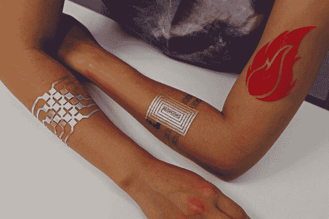
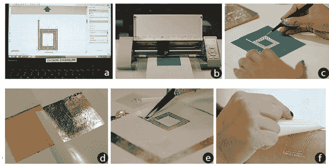
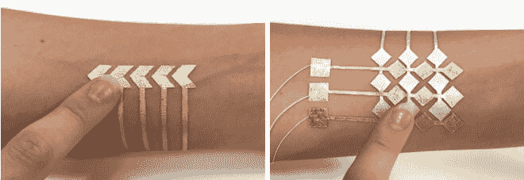
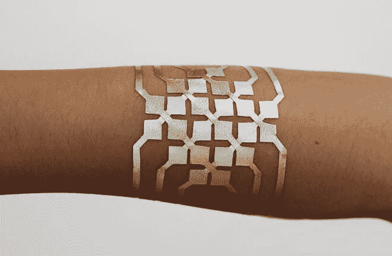
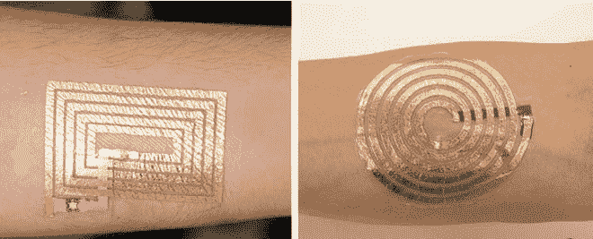
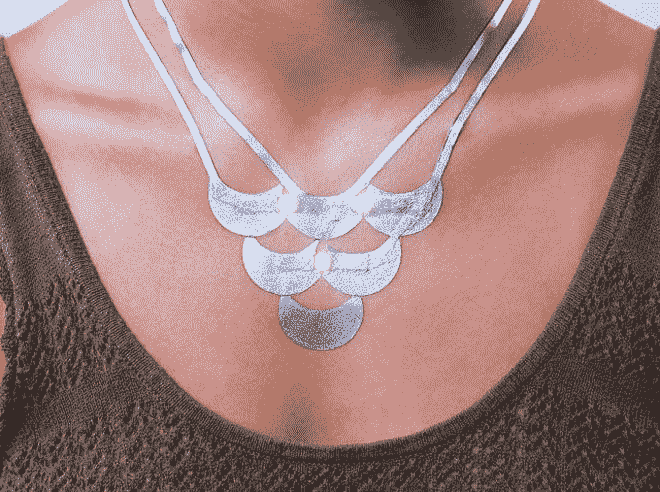

# 使用临时可穿戴皮肤界面控制您的设备

> 原文：<https://thenewstack.io/control-devices-temporary-wearable-skin-interfaces/>

无论是跟踪你健身养生的进展，还是[确保你不会复发](https://thenewstack.io/wearables-better-track-drug-use-addicts/)，或者[甚至改变你的情绪](https://thenewstack.io/why-wearables-make-sense-people-just-want-to-get-high/)，像 FitBit 和 Thync 这样的可穿戴技术都是一个不断增长的趋势，预计在未来几年内将扩展到数十亿美元。

把这些东西戴在手腕或头上一段时间后会变得有点笨重，尤其是当它们不够符合人体工程学，不能长时间佩戴时。

这个问题可能会随着皮肤可穿戴技术的出现而完全消除，例如，这种技术将允许人们直接从手臂上操控他们的设备。麻省理工学院媒体实验室[的研究人员已经提出了一种新颖且价格合理的替代品，名为](https://www.media.mit.edu/) [Duoskin](http://duoskin.media.mit.edu/) ，这是一种无线电子用户界面，可以像粘贴纹身一样暂时贴在皮肤上，并且由任何工艺品商店都可以买到的现成材料制成，价格低廉。

在他们的论文[中，研究人员描述了他们如何将 DuoSkin 设计得尽可能“对皮肤友好”，该论文将于下周在](http://duoskin.media.mit.edu/duoskin_iswc16.pdf)[可穿戴计算机国际研讨会](http://www.iswc.net/iswc16/)上发表。特别是，他们受到了金属“闪光”纹身的可用性和美学的启发，这种纹身目前显然非常流行。 观察它是如何制造和工作的:

该团队的制作过程包括首先绘制设计草图，使用图形设计软件为这些定制电路最终确定引人注目的几何设计。这些皮肤界面的电路模板是用无毒的硅基纹身纸和乙烯薄膜层制作的——所有这些都可以从任何工艺品商店廉价买到。然后用手或便宜的电子切割机切割。

然后，像金箔和银箔这样的导电材料粘附在这个硅树脂-乙烯基夹层的顶部，然后将电子设备安装在金箔的表面，并添加另一层薄纹身纸，使用水转移过程将电路粘附到皮肤上，就像传统的临时纹身通常是如何应用的一样。

生产了三种不同版本的可穿戴原型。第一类包括一个输入传感设备，类似于我们习惯的传统用户界面，如按钮、滑块和二维触摸板，所有这些都浓缩到一个有吸引力的皮肤界面中。材料的分层显然可以防止用户皮肤上的电荷干扰接口正常运行所需的精确电容测量。例如，在团队的实验中，使用 DuoSkin 平台构建了功能性音乐控制器界面。

第二类是皮肤上的“软显示器”，利用热敏热致变色颜料，根据皮肤温度改变颜色，创建一个简单的显示器，可能没有令人兴奋的高分辨率图形，但可以做一些简单的事情，如改变颜色以显示某人的感受，如贴在皮肤上的情绪戒指。前两个班级都使用 Arduino Mini 微控制器处理传感器数据，并使用可充电电池供电。

无线通信设备构成了第三类表皮接口。使用[近场通信](https://en.wikipedia.org/wiki/Near_field_communication) (NFC)协议交换数据，DuoSkin 设备被转换为电子可读的“标签”，由连接到芯片的各种线圈天线组成。与其他两个版本不同，这些标签是被动供电的，本身没有处理器。

除了这三类皮肤界面，该团队还开发了纯粹装饰性的 DuoSkins，尝试可以用喷墨打印机打印的复杂设计，并附加节能照明，以创建一个可以点亮的“LED 皮肤项链”，从而创建一种令人眼花缭乱的新型珠宝。

这里有很多可能性来进一步推动可穿戴设备的发展。笨重的医疗监测设备可能最终会让位于柔软、真正可穿戴的可穿戴设备，这种设备的大规模生产成本很低。

但也许最有趣的因素是，这些直观而不显眼的界面可以由用户根据自己的口味和需求进行定制和设计，这是其他大规模生产的小工具所无法做到的。最重要的是，它有一点浮华的吸引力，指向一个潜在的未来，设备接口可能会舒适地附着在我们的皮肤上，而不是戴在手腕上。

“我们认为，皮肤是物理和数字领域之间的桥梁，使用户能够利用当今可穿戴技术中经常缺失的个人美学原则，”研究人员写道，他们接着设想未来的可穿戴设备将完全集成到我们的身体上，而不是作为一个附加的物体。“我们的愿景是，未来的皮肤电子产品将不再是黑盒和神秘的；但它们将朝着用户友好性、可扩展性和身体装饰的美学方向融合，形成一个似乎已经消失的双重皮肤。”

图片:麻省理工学院媒体实验室

<svg xmlns:xlink="http://www.w3.org/1999/xlink" viewBox="0 0 68 31" version="1.1"><title>Group</title> <desc>Created with Sketch.</desc></svg>