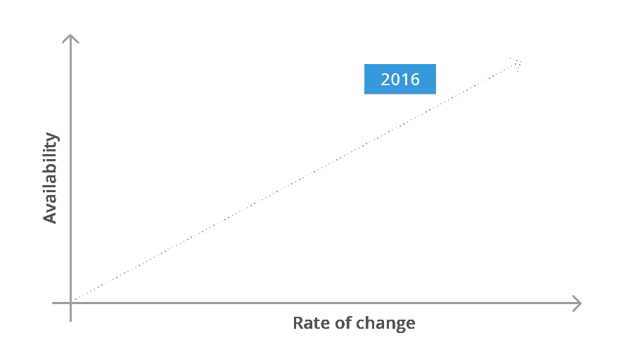
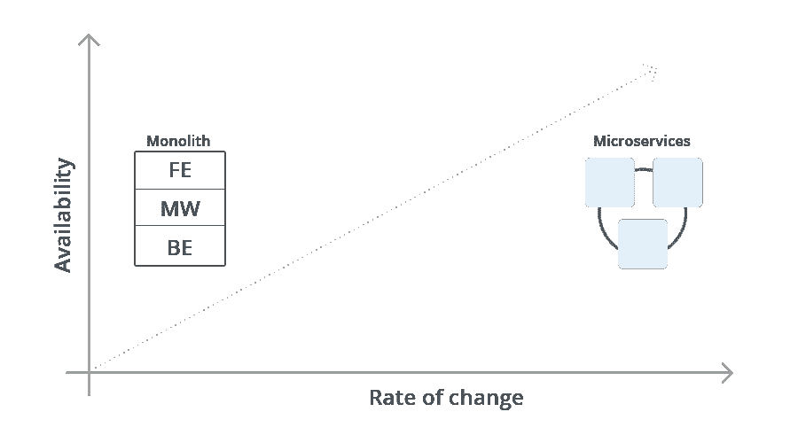
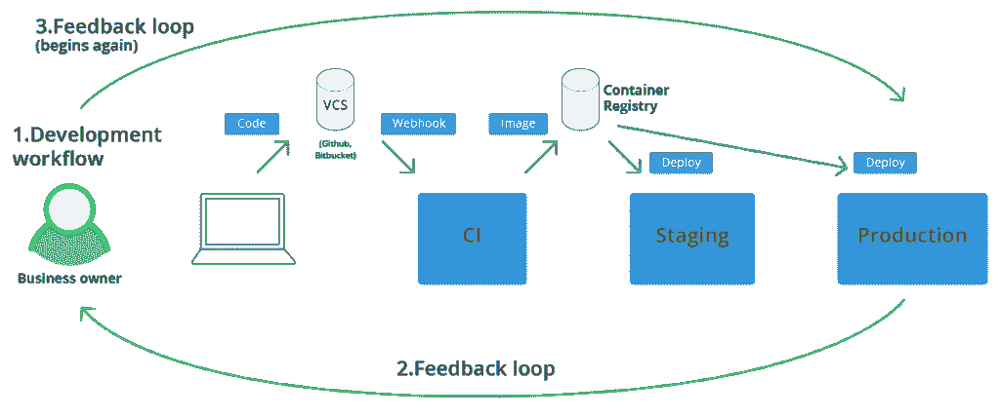

# 适应或死亡:软件交付的新模式

> 原文：<https://thenewstack.io/convergence-new-software-paradigm/>

 [韦恩·吉宾斯

韦恩是一名正在恢复的风投，曾在软件工程、产品管理、市场营销、运营、通信和品牌方面工作过。他目前是 Wercker 的首席商务官。](https://www.oracle.com/corporate/acquisitions/wercker/) 

在今天的软件世界中竞争意味着尽可能快地将可工作的软件提供给客户，并在软件出现后保持其运行。

这种感觉在初创企业中更加强烈，创始人发现自己正盯着越来越短的跑道，但越来越多的企业也感受到了来自新晋竞争对手的压力，这些竞争对手蚕食着他们的利润，而客户的要求越来越高。这种急于推出软件的现象不是一次性的。

公司需要快速连续地推出许多不同版本的软件，经常同时运行多个版本，以便在市场上测试他们的假设，并了解下一步将精力集中在哪里。

简而言之，公司需要高度适应，所以他们的软件也需要高度适应。

作为微服务的热情支持者，[阿德里安·科克罗夫特](https://twitter.com/adrianco)，网飞前云架构师，目前在亚马逊网络服务公司工作，[描述了这样适应的需要](http://www.infoq.com/interviews/adrian-cockcroft-microservices-devops):“一切基本上都是为了能够比别人更快地做出决策和构建事物。”

但是速度并不是唯一的因素，如下图所示:

这里我们看到，虽然变化率或敏捷性很重要，但软件的弹性也需要增加，同时所有这些都以前所未有的规模发生。现代软件的这三个方面；敏捷性、弹性和可伸缩性起初看起来是矛盾的，事实上，对于传统的软件实践来说，它们是矛盾的。

然而，近年来，我们已经看到了软件新发展的爆炸式增长；每个都旨在实现上述目标。当前软件开发的核心，也称为“云原生计算”，正处于容器、微服务、持续集成/持续交付/部署和现代云的交汇点。

> 与整体式系统相比，基于微服务的系统可以快速发展，以响应新功能请求或大型报告，因为每个微服务都可以在需要对子组件进行更改时重新部署。

对于在 [Wercker](https://www.oracle.com/corporate/acquisitions/wercker/) 的我们来说，这意味着我们要以快速、可重复和安全的方式构建、测试和部署基于 Dockerized 微服务的应用。这意味着从开发人员笔记本电脑上的代码到在 [Kubernetes](/category/kubernetes/) 容器编排引擎上大规模运行的容器。这是我们玩耍的地方。

在本文中，我们将看看前面提到的软件开发实践和运动，看看为什么它们中的每一个都有助于公司在规模上变得更加敏捷和有弹性。

## 微服务

微服务架构在过去几年越来越受欢迎，因为它们旨在通过将软件解决方案解耦为预计会失败的较小功能块来专门解决现代软件开发的问题。

通过仔细研究微服务的使用方式和原因，我们可以看到它们如何直接让团队实现更高的敏捷性和弹性。

软件解决方案的敏捷性指的是它改变的能力。 [Martin Fowler，微服务的早期支持者，](http://martinfowler.com/articles/microservices.html#CharacteristicsOfAMicroserviceArchitecture)声称这种敏捷性来自于将运行系统解耦为“一套小服务”

与整体式系统相比，基于微服务的系统可以快速发展，以响应新功能请求或大型报告，因为每个微服务都可以在需要对子组件进行更改时重新部署。不再需要为每次更新重新部署整个应用程序，这严重限制了整体应用程序的灵活性。

然而，这种敏捷性最初是以团队的成本为代价的。在前面提到的文章中，Fowler 还指出，由于微服务架构的分布式本质，单个服务“需要被设计为能够容忍[其他]服务的故障。”然而，如果团队坚持通过一个困难的入口，他们最终会发现他们有一个总体上更有弹性的应用程序。

发生这种情况是因为系统中的服务期望；1)它们的依赖关系将是远程的，能够降低下一个虚拟机、机架或大陆的风险；2)它们的依赖关系将会失败，迫使开发人员从一开始就建立恢复能力。

因此，微服务允许团队构建更敏捷、更有弹性的软件。然而，在接下来的章节中，我们将会看到毅力并不是达到这个目标的唯一要求。云原生应用受益于新的工具和新的软件架构。

## 码头集装箱

尽管网飞和吉尔特集团等高技能工程组织已经在使用微服务架构，但在 2013 年 Docker Inc .发布 Docker 时，微服务架构获得了长足的发展。现在几乎无处不在，Docker 以一种开发人员友好的方式包装了现有的基于容器的虚拟化技术，并将证明是虚拟机作为微服务部署单元的完美替代品。

那么 Docker 如何帮助软件公司在规模上变得敏捷和有弹性呢？

首先，容器比虚拟机(VM)小。通过共享底层主机操作系统，他们可以在数百毫秒而不是几分钟内启动，从而为使用他们的团队带来更快的测试、更快的部署和更高的整体敏捷性。它们更小的尺寸还允许团队将更多的计算打包到相同数量的底层硬件上，从而增加基于容器的解决方案所能达到的整体规模。

其次，Docker containers 已经引入了不可变服务器模式,虽然在 containers 出现之前就已经使用了，但现在证明，当与微服务和 CI/CD 结合起来进行高速测试和部署时，这是一个完美的模式。

容器还允许团队通过它们在各种基础设施之间的可移植性实现更高水平的弹性。在容器出现之前，软件公司试图通过在各种云之间“对冲赌注”来实现更高的弹性，会遇到各种不可互操作的 VM 格式。这个问题虽然可以用哈希公司的[打包机](https://packer.io/)这样的工具解决，但仍然给团队导航增加了额外的复杂性。

Docker 容器的[“一次编写，随处运行”](https://en.wikipedia.org/wiki/Write_once,_run_anywhere)设计允许工程和运营团队将他们的基础设施分布到多个云提供商，只要 Docker 守护程序或容器编排引擎就位。我们将在下面的现代云部分触及这一点。

## 持续集成/持续交付/持续部署

持续集成(CI)和持续交付/持续部署(在 CD 中两者都可以互换，尽管有细微的不同)在 2010 年[杰斯·亨布尔](https://twitter.com/jezhumble)和[大卫·法利](http://www.davefarley.net/)的书《[持续交付](https://www.safaribooksonline.com/library/view/continuous-delivery-reliable/9780321670250/)》出版时已经在不同程度上被使用了。

直接来源于[敏捷宣言](http://manuel.kiessling.net/2011/04/07/why-developing-without-tests-is-like-driving-a-car-without-brakes-2/)的“工作软件优于全面文档”原则，持续集成首先寻求确保对一个软件的每一个新的改变都被充分测试。

持续集成是团队在发布软件之前采用更彻底的自动化测试的关键驱动力。为什么？这个问题可能最好在 Kevlin Henney 首先提出的问题中得到回答:

*“汽车为什么要有刹车？”*

*“这样他们才能走得更快。”*

因此，持续集成允许团队通过以自动化测试的形式将弹性构建到他们的软件中来增加他们的敏捷性。这种测试发生在许多层上，但是完整的描述超出了本文的范围，将在后续的文章中介绍。

连续交付通过不仅测试软件，而且将软件交付为准备部署的工件，将连续集成向前推进了一步。这是完整测试中至关重要的一步，因为连续交付还允许软件系统在投入生产之前，在通常称为试运行环境的环境中进行“完整”测试。

连续部署更进一步，在所有变更准备就绪后直接将其投入生产，并使用金丝雀测试和蓝/绿测试等技术，根据实际生产流量检查新变更的生产准备情况。

出于几个原因，Docker 容器恰好是完美的现成构件。首先，由于它们“一次构建，随处部署”,这确保了它们在进入生产环境之前可以毫无困难地部署到各种测试环境中。

第二，由于他们相对较小的运行时内存占用，开发人员通常可以在他们自己的开发机器上运行更全面的测试，给他们关于新变化的最快的反馈，结果是更高的灵活性。

该领域的高级工具，如 [Wercker platform](http://www.wercker.com/platform) ，自早期 CI(以及后来的 CD)工具问世以来已经发生了显著变化，这与微服务架构依赖高度可扩展和适应性强的构建管道是一样的。Wercker 不仅能够处理每个服务的构建管道，还能够处理 Docker 映像工件库和上面提到的高级部署方法。

因此，现在我们有了基于微服务的应用程序，作为 Docker 容器捆绑在一起，快速、灵活地进行构建、测试和部署。下一节将着眼于它们最终被部署到哪里。

## 现代云

到目前为止，我们已经看到了微服务架构如何与 Docker 容器结合，并由 Wercker 等高级 CI/CD 工具推动，形成了现代软件工程的蓝图。但是这些分离的、容器化的和经过严格测试的工作负载，当然需要在某个地方运行。这是现代云进入的地方。

亚马逊在 2006 年推出了[弹性计算云](https://aws.amazon.com/ec2/faqs/) (EC2)服务。快速(当时)、低成本和开发人员友好的虚拟机只适用于那些足够幸运地在具有先进内部云的前瞻性公司工作的软件工程师。

软件可能正在吞噬世界，但许多公司开始意识到，要想变得敏捷，他们必须专注于吞噬世界上他们拥有强大领域知识的部分。通过让亚马逊承担基础设施方面的重任，公司可以专注于构建客户关心的软件功能，而不是管理客户不想看到或听到的基础设施。

在许多方面，这种廉价、快速和丰富的虚拟机供应使得一些公司能够利用 Docker 容器中流行的不可变服务器模式。该模型用于提高团队的敏捷性，因为他们可以从版本化的工件虚拟机中快速重新部署，而不是必须使用配置管理工具(如 Puppet)来管理长期运行的实例的状态，这往往会导致他们自己的运营问题。

当然，市场上有更多的参与者，尽管由于我们的可扩展集成模型，我们的客户可以在任何地方部署，但我们与亚马逊网络服务、微软 Azure 和谷歌云平台密切合作。这是为什么呢？因为他们目前是最大和最好的([甲骨文最近宣布](https://thenewstack.io/oracle-clouds-secret-sauce-virtual-cloud-network/)它紧随其后，所以随着企业采用率的增加，将会有更多的市场活动

公共云对规模和弹性的影响是显而易见的；

1.  公共云拥有的数据中心比您可能想要维护的数据中心更大，以适应未来的增长。
2.  在保持正常运营方面，公共云可能比许多运营团队做得更好。

但是，如前所述，虚拟机在几分钟内启动，而不是几秒钟，并且虚拟机格式通常被相关的云提供商锁定。这意味着根据需求扩展工作负载的速度较慢，并且实际上几乎不可能迁移到另一家云提供商。

容器的出现巧妙地解决了这个问题，它在底层虚拟机和正在运行的应用程序之间放置了一个层，通常称为容器编排引擎。

这里我们只说 Kubernetes。Wercker 支持所有这些工具，但我们喜欢 Kubernetes，我们在 Kubernetes 上运行我们的堆栈，我们认为它是最受欢迎和最成功的容器调度程序。我们将很快推出一系列 Kubernetes 博客文章、教程和示例应用程序来添加到我们现有的 Kubernetes 内容中。

通过跨越多个云，容器编排引擎与容器化应用程序的结合使“一次构建，随处运行”成为现实。

## 摘要

通常很难跟踪软件世界中正在发生变化的一切，更不用说去猜测它的发展方向了。在 Wercker，我们认为微服务架构、Docker 容器、现代 CI/CD 和现代云的结合在计算史上创造了一个独特的点；真正的范式转变。

在 Wercker，我们非常高兴能够提供所需的开发人员自动化层，从开发人员的角度来看，这是将所有这些概念有效地结合在一起的粘合剂。从笔记本电脑到 Kubernetes 集群，我们的客户正全心全意地接受这一新模式，我们很高兴在软件和云行业的这个激动人心的时代与他们并肩作战。

[Wercker](https://www.oracle.com/corporate/acquisitions/wercker/) 是新堆栈的赞助商。

由[乔舒亚·厄尔](https://unsplash.com/@joshuaearle)拍摄，经由[未剪辑](https://unsplash.com/?photo=8MbdD0pHXGY)的特写图像。

<svg xmlns:xlink="http://www.w3.org/1999/xlink" viewBox="0 0 68 31" version="1.1"><title>Group</title> <desc>Created with Sketch.</desc></svg>