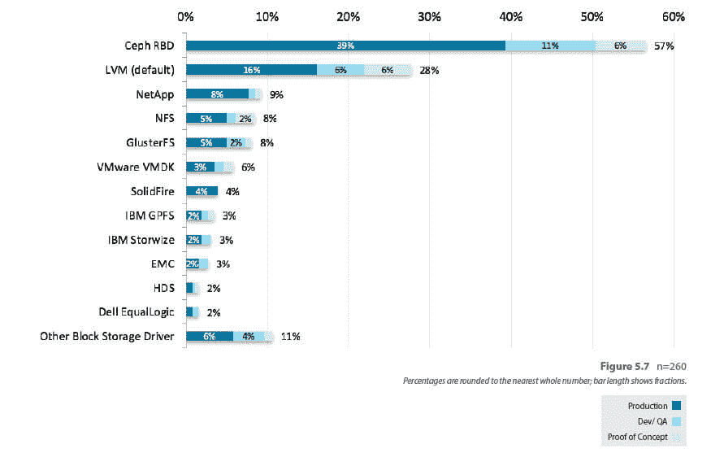

# 聚合存储:CephFS 现已投入生产

> 原文：<https://thenewstack.io/converging-storage-cephfs-now-production-ready/>

相反，企业可以将其所有存储服务器群集到一个巨大的存储池中，然后可以按需分配，并且成本可能低于单独购买每个存储系统(可能是专有的)的成本。

在 Vault 的另一次演讲中，英特尔高级软件工程师张建指出，Ceph 已经在许多中国电信公司(OpenStack 在中国很大)中得到应用，这在很大程度上是因为他们可以拥有一个用于所有三种类型存储的单一存储基础设施。

这种池化方法很容易符合基于 OpenStack 构建的面向服务的云系统背后的架构思想，在 open stack 中，存储可以像任何其他 IT 资源一样作为按需服务提供。根据最近的 OpenStack 用户调查，Ceph RDB 已经是 OpenStack 用户中最受欢迎的块设备驱动程序。添加文件系统组件将有助于 OpenStack 用户更轻松地将他们的传统应用程序带入 OpenStack 环境。

【T2

Ceph 在另一个主要方面也是非常云友好的，因为它是一种横向扩展技术。如果您需要更多存储，只需添加另一台服务器。大型云供应商都提供横向扩展存储，许多专有供应商也是如此，但由于 Ceph 是开源的，这种横向扩展能力现在可以由所有供应商部署。

分布式文件系统除了有可能解开大部分专有的存储行业之外，还在存储处理方式上带来了革命性的变化。Ceph 由 Sage Weil 创建，是许多分布式架构文件系统中的一种，这种设计选择赋予了它这种向外扩展的能力。传统的文件系统通常受到单个存储管理器的限制，要么在存储服务器本身上，要么受到阵列网关的限制。在存储和客户端之间传输的所有数据都必须流经管理器，这是一个天然的瓶颈。

相比之下，分布式文件系统(其他包括 GlusterFS、Lustre 和 HDFS)可以将单个文件系统名称空间分布在多个服务器上。在 Ceph 的例子中，在单个节点的工作内存中维护的单个元数据服务器(MDS)跟踪所有存储节点上的数据，每个存储节点由一个对象存储守护进程(OSD)管理。如果一个节点退出，或者添加了更多节点，这些更改将由 MDS 管理。

当客户端需要在文件系统上读取或写入数据时，它会向 MDS 查询数据的位置和相应的权限。然后，客户端直接与 OSD 连接，无需通过中央存储管理服务器路由所有流量。复杂的锁系统确保多方读写数据时的一致性。

让客户端直接连接 OSD，并通过 MDS 进行一些智能管理，这使得 Ceph 具有几乎无限的可伸缩性和吞吐量。例如，如果用户想要提高应用程序的性能，那么该应用程序可以跨更多的 OSD 进行条带化。

显然，Ceph 发展的下一步是将其整合到其他基础设施工具和软件中。为此，Red Hat 工程师 John Spray 在 vault 为马尼拉 OpenStack 存储管理服务开发了一个新的 CephFS 驱动程序。Manila 是 T2 Cinder open stack 存储管理服务的一个分支，专注于分布式文件系统的使用。使用 Manila 客户端驱动程序，OpenStack 用户可以为他们的工作负载请求一个共享(或具有单一名称空间的私有分区)。

<svg xmlns:xlink="http://www.w3.org/1999/xlink" viewBox="0 0 68 31" version="1.1"><title>Group</title> <desc>Created with Sketch.</desc></svg>