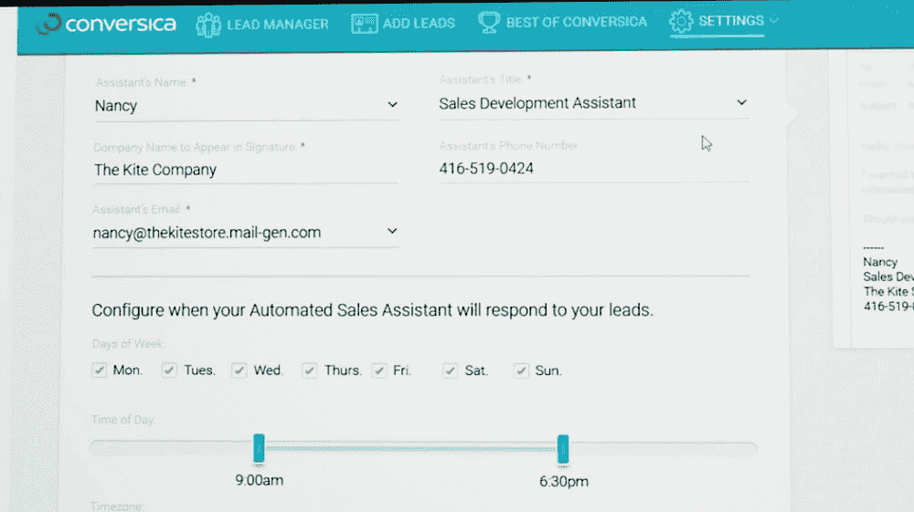
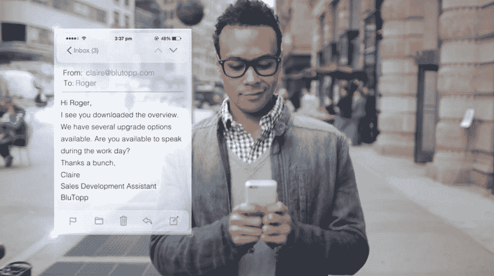
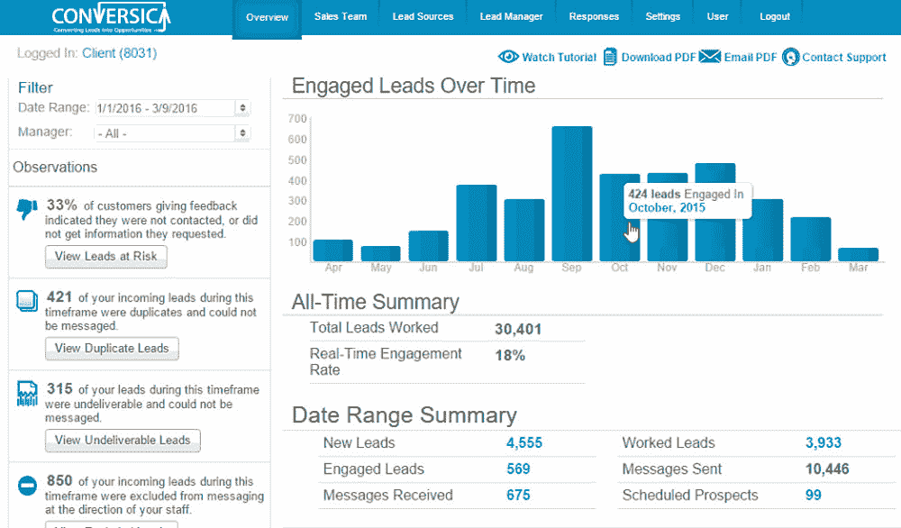
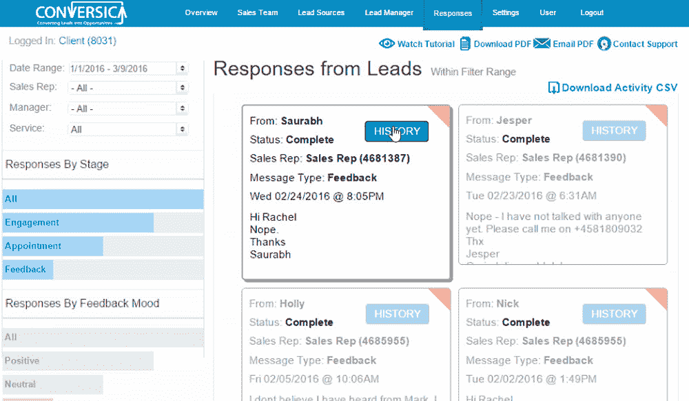
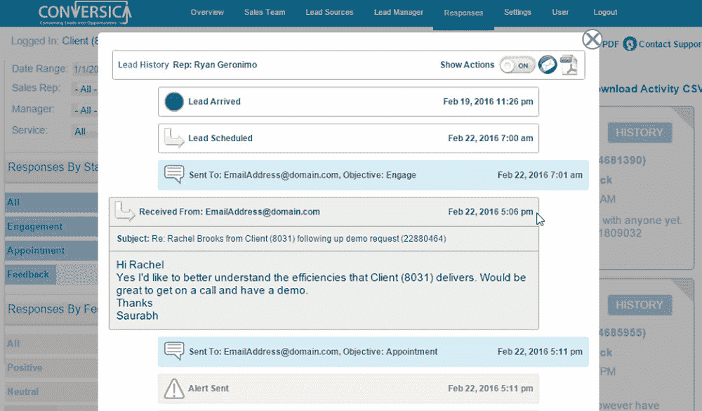

# Conversica 基于人工智能的虚拟助手可以帮助寻找更好的销售线索

> 原文：<https://thenewstack.io/conversicas-ai-based-virtual-assistant-can-help-generate-better-sales-leads/>

在过去的一年里，人工智能已经令人印象深刻地进入了一些行业，如[医疗保健](https://thenewstack.io/scientists-artificially-intelligent-nanoarray-can-diagnose-disease-using-breath/)、[房地产](https://thenewstack.io/real-estate-platform-trulia-utilizing-machine-learning-apache-kafka/)、[网络安全](https://thenewstack.io/darktrace-applies-math-unsupervised-machine-learning-automate-network-security/)，甚至可能[使选举信息民主化](https://thenewstack.io/apis-artificial-intelligence-help-democratize-election-information/)。因此，人工智能也在改变销售和营销领域的工作方式，帮助自动化时间密集型任务——例如跟进最初的客户询问或培养潜在的有利可图的销售线索——并在适当的时候将这些线索传递给人类，这一点可能并不令人惊讶。

这就是总部位于加州的公司 [Conversica](https://www.conversica.com/) 通过其虚拟销售助理所做的事情，该公司使用基于云的“对话式人工智能”平台来帮助公司更好地与客户互动并创造更多收入。

## 人工智能有自己的名字和邮箱

该公司表示，其目标不是取代人类，而是将人工智能的效率和成本效益与建立信任和加深公司与客户关系的人类技能结合起来。在这里，人工智能是销售人员和营销人员用来管理、理解和处理海量数据的又一个工具。

在 Conversica 的技术中看到的人工智能自动化将允许公司以不懈的努力全天候联系每一个突然出现的线索。为了给客户留下他们正在与一个人对话的印象，Conversica 的智能销售助理使用人工智能和机器学习来创建电子邮件或短信，以使潜在客户参与持续的对话。

虽然它可能不是人类，但 Conversica 的虚拟销售助理被分配了自己的名字和电子邮件地址，使其能够在流程中的预定点将线索交给人类之前，自主联系、参与和“培育”线索。

## 增加销售线索参与度

像这样的技术可以减轻追踪每一条线索的难度。每次与客户接触，或者用行业术语称之为“接触”,都要花费金钱和时间，因此，人类员工可能只接触几次潜在的线索，然后就进入下一个。

相比之下，人工智能可以保持循环，同时还可以个性化与客户的对话。据该公司称，其虚拟销售助理可以帮助销售团队大规模实施最佳实践，例如将每个线索的接触率提高到 7 或 10，同时将人类销售人员解放出来，只追逐最有希望的线索。

据该公司称，由于这种持续的方法，Conversica 已经帮助 IBM，Epson，Talend 和 Cake 等企业将其销售线索参与度提高了 33%，降低了单位销售线索成本，并创造了超过 80 亿美元的销售收入。

为了更深入地了解该平台是如何工作的，我们请 Conversica 的高级工程副总裁 Werner Koepf 提供关于他们虚拟助手的更多细节。

**你能更详细地描述一下 Conversica 的人工智能是如何工作的吗？**

**Werner Koepf:** 本质上，我们使用人工智能和机器学习来推动我们的“虚拟助理”和客户线索之间的对话。总之，我们在过程中使用了四种“智能”。

首先，我们使用自然语言生成(NLG)来创建助理发送的电子邮件，以便在对话中引入线索并继续这种来回对话。第二，我们使用自然语言处理(NLP)分类器，从来自领导的信息中辨别洞察力。第三，我们通过我们的推理引擎运行这些见解，以确定接下来要做的正确事情(如继续对话、更新客户关系管理[CRM]、通知某人、移交给人类、停止发送消息等)。).第四，我们在人工智能无法以高度自信解释人类反应的例外情况下引入人类智能。

Conversica 的人工智能是如何扩展的？

使我们的人工智能可扩展的第一个方面是，它是一种使用自然语言生成、NLP 和推理引擎的分层方法，允许我们独立地对这三层中的任何一层进行改进。其次，我们的 AI 基于双向对话的非常优雅和模块化的概念，允许我们轻松地添加额外的构建模块来扩展我们的对话，以迎合新的用例或创建额外的虚拟助手。

开发这种人工智能的挑战是什么？

一如既往，最难的部分是执行。也就是说，让事情在我们客户复杂的销售和营销环境中实际工作，这包括特定的技术(如 CRM 和营销自动化)，特定的流程，当然还有人。

通过多年来这样做和数百万次的来回对话，我们已经开发了大量的智能过程和最佳实践知识，用于构建基于人工智能的模块化分层系统。但是，这可能只是一个科学实验，如果不应用于为我们的客户解决真正的业务问题。将我们的人工智能集成到我们客户的技术和流程中是最难解决的部分，其次是通过数百万次对话训练机器，以准确理解人类说是的、不、也许、也许以后、不是现在等的所有方式。

【Conversica 的人工智能如何与 CRM 和营销自动化系统集成？

对于我们的旗舰产品 [AI 销售助理](https://www.conversica.com/how-it-works-persona-helps-you-identify-hot-leads-that-are-ready-to-buy-now/)，我们正在与客户的潜在客户合作，并需要与他们的潜在客户管理系统(如 CRM 和营销自动化)集成，以检索潜在客户记录并更新我们与他们联系和互动的进度。我们与许多 CRM 和营销自动化系统(如 Salesforce、Marketo、Eloqua 等)进行了标准集成。)以便我们的客户能够快速启动并运行。

例如，让我们假设一个新的销售线索从一个在网站上请求演示的客户进入 Salesforce。该销售线索被添加到 Salesforce 中的活动中，该活动将该销售线索与 Conversica 中的对话同步。助理开始通过电子邮件联系销售线索，随着对话的进行，将更新发送回 Salesforce 销售线索记录。当销售线索同意会面并且助理已经验证了电话号码时，销售人员会收到警报，并且信息会在 Salesforce 中再次更新，通常还会创建一个任务供销售人员跟进。所有这些都是完全自动发生的，不需要人工干预。

**为什么没有更多的公司在销售策略中使用人工智能？他们应该有哪些理由？**

我们看到人工智能在销售和市场营销中越来越多地被使用，我们发现它有助于将用途分为两类:咨询性人工智能和自主性人工智能。咨询型人工智能分析并提出建议，供人类实施，例如建议你在有可能成交的情况下接下来应该从事哪个销售机会，而自主型人工智能实际上在没有人类干预的情况下接管任务并完成任务，就像我们的助理联系、参与和确认销售线索一样。这两者对提高销售过程的有效性和效率都很重要，因为有些任务最好由人来完成，有些最好交给人工智能。

【Conversica 在不久的将来还会有什么新的发展吗？

我们继续通过新的功能来增强我们的人工智能助手，通过不同的对话扩展到新的行业，并添加新的助手来自动化额外的业务对话。例如，我们正在为助理配备新的沟通渠道，如 messenger 应用程序，并添加她可以进行对话的新语言。我们继续改进我们的仪表板和报告，以便我们的客户能够更好地了解他们的助理在做什么，以及他们如何改进他们的关键指标。我们还一直在测试新的人工智能算法、新的对话方式和新的性格特征，以提高助理与线索的互动。进入人工智能行业是一个激动人心的时刻。

图片:Conversica

<svg xmlns:xlink="http://www.w3.org/1999/xlink" viewBox="0 0 68 31" version="1.1"><title>Group</title> <desc>Created with Sketch.</desc></svg>