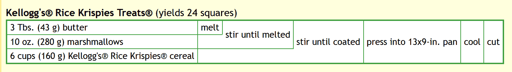

# 为工程师烹饪:赞美传奇的食物黑客

> 原文：<https://thenewstack.io/cooking-for-engineers-in-praise-of-legendary-food-hacks/>

“有分析头脑？喜欢做饭？这才是该看的网站！”这是硅谷工程师迈克尔·朱(Michael Chu)于 2004 年创办的热门网站的口号。一个[的传记页面](http://www.cookingforengineers.com/article/138/About-Cooking-For-Engineers)提到他曾是一名网络工程师和软件程序员，甚至是 PDA 的硬件设计师、计算机视觉研究员和笔记本硬件应用工程师。

但是楚也喜欢烹饪。

有了史蒂夫·沃兹尼亚克的母校加州大学伯克利分校的电子工程学位，朱棣文开始建立一个个人网站，记录他对食物世界的热情探索(以及他自己在烹饪食谱中展示数据的独特示意图)。)

朱棣文孜孜不倦地、有条不紊地探索了困扰着一个有工程头脑的厨师的所有那些迫切的问题——比如啤酒罐鸡肉的烧烤过程是否真的[赋予了任何额外的啤酒味道](http://www.cookingforengineers.com/article/171/Beer-Can-Chicken)？

这个问题一出现在他的脑海里，他就必须找到答案。很快，他就抱着两只鸡站在超市的结账队伍里，和他身后的男人争论这个问题。

“我反驳说，在烹饪过程中，我们可以闻到许多挥发性化合物，但其中许多化合物消散得如此之快，以至于它们没有进入肉类，”楚在他的博客帖子中写道。“如果气态酒精是如此好的调味剂，为什么没有人用一罐顶级赤霞珠来蒸蔬菜或鲜肉呢？”

随着岁月的流逝，朱棣文钻研了越来越多的科学话题。例如，[*烹饪*](http://www.cookingforengineers.com/article/283/An-Introduction-to-Sous-Vide-Cooking)*，“通过将配料浸入温度可控的水浴中来制备食物(通常将配料装入真空密封的塑料袋中)。”一个配套的帖子提供了设置[你自己的家庭水浴和真空密封器](http://www.cookingforengineers.com/article/289/Sous-Vide-Cooking-at-Home-Setup-Guide)的指南。*

 *而 [到底是什么样的*最好的熏肉做法*](http://www.cookingforengineers.com/article/3/Bacon-Part-I)？微波？油炸的？烧烤？烤的？[挂在专门为微波炉设计的熏肉架上](http://www.cookingforengineers.com/article/110/Bacon-Part-II)？

每一页都有多年来感恩的读者留下的大量评论。(“OMG，好脆哦。”)一个页面上有 56 条评论，调查煮鸡蛋的最佳方法(照片显示了一个鸡蛋在两分钟、三分钟后的内部——每个间隔长达九分钟)。

其中一页描述了朱棣文尝试自制棉花糖的过程。

最近有人看到朱棣文在 Quora 上回答烹饪问题。他的上一篇关于工程师烹饪的帖子是 2016 年对[一个为你的肉食吸烟者准备的无线温度计](http://www.cookingforengineers.com/article/348/Thermoworks-Smoke)的评论。

但在推出 18 年后，该网站仍然拥有粉丝。上个月,“给工程师做饭”的链接出现在黑客新闻上——很快就获得了 184 次投票(和另外 114 条评论)。

一位评论者写道:“尽管我很欣赏一步一步的说明及其附带的图片，但我一直认为天才元素——也许是一个可能具有真正知识产权价值的元素——是结合食谱和烹饪过程的示意图。”

另一个评论者[同意](https://news.ycombinator.com/item?id=30799874):“是的，这是天才。我真希望每个食谱都是这样写的。”

另一位评论者指出，“显然，他试图为它申请专利，但在各种专利搜索中，我什么也没找到。”

## 食谱网

在网站创建初期，褚是一个名为 Fanpop 的流行文化网站的首席设计师。当 Fanpop 在 2006 年推出时，他[，](http://www.cookingforengineers.com/article/182/Fanpop)“从某种意义上说，我一直在做饭——只是不是那种美食。”

朱棣文开始为工程师做饭是在很久以前，他的灵感来自于他掌上电脑的一次事故。他一直用早期的手持设备保存他最喜欢的食谱——直到一个同步错误将它们一起删除。他已经失去了一切，除了他的金枪鱼砂锅面食谱，他网站的[常见问题解答解释](http://www.cookingforengineers.com/article/138/About-Cooking-For-Engineers)。

所以他决定转向一个更可靠的备份系统:网络。

所有的探索都始于《厨师画报》杂志上的一份沙拉食谱(切碎并加入更多的蒜瓣和少许盐)。朱棣文的食谱页面吹嘘道:“我们找到了最佳的口味组合。”但更重要的是，正如 FAQ 指出的，这也是他长期运行的网站的开始。

今天，这个网站就像回到了很久以前的时代，那时世界上所有的食谱都还没有移植到其他人的平台上。这个仍然屹立不倒的领域不会让人们忘记，在 insta gram——甚至 YouTube——之前很久，一位开发人员已经将他最喜欢的食谱收集到了自己的网站上。多年来，这个网站一直在增长，直到他收集了近 300 个不同的帖子。

这一切都证明了一颗好奇的心可以让最简单的菜肴变得生动。

## 啪，啪，啪

甚至在制作米饼点心时，朱棣文也会先在烤盘里铺上一层羊皮纸，以便更容易地分发(或“脱模”)成品点心。“如果你厌倦了米饼，尝试用同样的食谱搭配普通的麦片或另一种膨化谷物，”朱[建议他的读者](http://www.cookingforengineers.com/recipe/104/Kelloggs-Rice-Krispies-Treats)——同时也探索了由此引发的各种哲学问题。

“如果它们不含脆米麦片粥，你还能称之为脆米麦片粥吗？我给凯洛格写信，没有得到明确的答复。他们确实告诉了我以下内容:

*Krispies Treats 配方由 Kellogg Company 注册商标，公众不得使用。因此，我们不能授予使用该名称的权限。就像你做的任何食谱一样，你想怎么用就怎么用。然而，如果你决定出售的话，你必须使用一个通用的名字，比如米酥谷物棒。*

但是没有什么能阻挡网站的读者群，这些年来，他们一直在建议更好的家庭测试谷物替代品。比如用可可豆做的点心。或者水果卵石。金色柳林。玉米片。麦片。(“搅拌一杯里斯碎片。”)玉米糖。

一位评论者甚至建议将太妃糖与黄油融在一起，而另一位则建议加入蔓越莓。(“浆果的扑鼻味道被释放到黄油中，这使得最终的结果变得清淡爽口。”)

事实上，出现了超过 167 条评论，还有各种各样的备选策略。一位评论者建议:“为了达到懒惰的极致:使用果酱软糖奶油。”。

楚自己的个人秘密？他加了巧克力片。或者有时，M&Ms 或者甚至葡萄干。葡萄干。坚果。

个人帖子上的评论也被收集起来，并在[社区论坛](http://www.cookingforengineers.com/forums/index.php)上发布，该论坛显示了超过 23，000 条评论(以及近 60，000 名注册用户，使用“Dilbert”和“Julius Child”等假名)。

最近的一次讨论涉及到煮饭时使用的 T2 水的正确比例。

今年三月，一位用户感谢朱棣文[2006 年发布的巧克力蛋奶酥配方](http://www.cookingforengineers.com/recipe/160/Dark-Chocolate-Souffle)。"我用这个配方大约有 10 年了，从来没有失败过。"

朱棣文在原始食谱中写道，“只要提到巧克力蛋奶酥，就能让人联想到颓废和奢侈的感觉。准备巧克力蛋奶酥的能力通常会赢得食客的赞赏。

"然而，随着时间的推移，制作蛋奶酥的难度被夸大了."

朱棣文的网站还有一个“推荐阅读”栏目，为工程师迷们提供烹饪方面的书籍建议。它包括“爱因斯坦对他的厨师说了什么:厨房科学解释”，以及“关于食物和烹饪”，褚称之为“可能是有史以来用英语写的最伟大的食品科学书籍”。没有食谱，只有关于食物的历史、科学和技术的直接信息。”

甚至网站的礼品店也仍然在营业，让烹饪爱好者购买印有网站标志的 t 恤、咖啡杯和手提袋，以及一张[脆饼](https://www.cafepress.com/cookingengineer/1209840)或一片[香蕉坚果面包](https://www.cafepress.com/cookingengineer/1282934)的图片。

很明显，Chu 在为工程师做饭上投入了大量的时间和热情，它仍然是一个有趣的网站，可以通过一些与烹饪相关的休闲网页浏览来消磨一个下午的时间。这里有一个关于啤酒罐鸡肉的剧透:

“这两种鸡肉之间没有什么区别……也许我需要一种更烈、颜色更深的啤酒——但一些区别应该是可以察觉的，即使是用百威啤酒和白开水。”

<svg xmlns:xlink="http://www.w3.org/1999/xlink" viewBox="0 0 68 31" version="1.1"><title>Group</title> <desc>Created with Sketch.</desc></svg>*