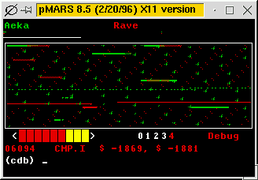

# 核心战争显示了 WebAssembly 需要赢得的战斗

> 原文：<https://thenewstack.io/core-wars-shows-the-battle-webassembly-needs-to-win/>

今年可能是 WebAssembly (Wasm)年，但现在它仍然是编译器的“字节码目标”。换句话说，这只是创建和管理可执行程序的另一种方式。尽管名字如此，它并不局限于浏览器——它的主要潜力在于物联网(IoT)。所以你可能会问，为什么这么大惊小怪？

更仔细地看文档，我不禁注意到，相当多的思想都致力于[安全性](https://webassembly.org/docs/security/)。实现高安全性的一个方法是编写一个非常仔细的规范，这样选择的自由是有限的，但又是透明的。汤姆·斯图亚特甚至浪费了相当多的时间[用 Ruby 做一个 WebAssembly 解释器，](https://www.youtube.com/playlist?list=PLGinoXCc3xS24Zy-Nj-5PjdFgbOctcHjH)仅仅是基于规范和他们的测试。这通常有助于创建安全的代码，但也有倾向于不相信代码在一开始就能正常工作。

这与雄心勃勃的**组件模型**相得益彰。这一直是协作模型的最大弊端——在收获更广泛的生态系统的好处的同时，计算出在多大程度上信任你一无所知的代码。不管是出于恶意还是无能，当运行代码出错时，社会会非常不便。

为了获得对淘气代码的欣赏，我想重新介绍一下[核心战](https://vyznev.net/corewar/guide.html)。

> 核心战争是一种编程游戏，其中汇编程序试图在模拟计算机的内存中互相摧毁。

这可能是一个古老的开发者思维的虚拟运动，但作为副产品，它提供了一个错误软件问题的有用演示。我们不打算深究细节，但我们将着眼于足以理解战士的方式。原谅有些睾丸激素诱导的命名；记住这是 20 世纪 80 年代的产品。



在 pMARS 模拟器下运行的核心战争游戏([通过维基百科](https://en.wikipedia.org/wiki/Core_War))

## 核心战争基础

所以最基本的是，你有两个或更多的竞争程序，运行在一个虚拟的空间，并试图用代码破坏对方。总而言之:

*   这种类似汇编语言的语言叫做 Redcode。
*   Redcode 由一个名为 MARS(内存阵列 Redcode 模拟器)的程序运行。
*   竞争对手的程序被称为“勇士”，用红色代码编写，由 MARS 管理。
*   基本单位不是一个字节，而是一个指令行。
*   MARS 一次执行一条指令，交替执行每个“战士”程序。

核心(模拟计算机的内存)，或者也许是“战场”，是指令行的连续缠绕循环，除了分开设置的竞争程序之外，最初是空的。代码直接运行，数据直接存储在这些行上。

每个 Redcode 指令包含三个部分:操作本身(操作码)、源地址和目的地址。当我说“地址”时，我指的是指令所在行的相对引用。所以+1 指的是下一行。

虽然在现代芯片中，代码以神秘的方式通过并行线程移动，但核心的 War 设置仍然是计算机如何工作的基本要素。无论代码是如何编写的，我们都知道它最终是一组机器代码指令。

那么 Redcode 是什么样子的呢？这里是已知最简单的战士，**小鬼**，坐在战场中央。它只是将一行的内容复制到下一行:

现在指令“MOV”实际上是一个复制指令。(这个用词不当之所以挥之不去，有各种原因，但没有一个是好的。)上面写着“将相对地址为 0 的行(这一行)复制到相对地址为+1 的行(下一行)。”

所以第一条指令行执行后，会出现两行 Imp:

这在技术上意味着 Imp 已经**扩展了自己**，因为它在自己的列表末尾创建了一个新指令。这也意味着 MARS 只是执行指令，而没有意识到 warrior 程序的正式结束。

因此，结果是，在执行多次后，整个战场将充满了小鬼。在某个时候，另一个程序会执行一个 Imp，然后…变成一个 Imp。

核心战争战士的实际胜利条件是迫使对手执行流氓“DAT”指令。因此，让我们通过看一个稍微复杂一点的投掷“DAT”炸弹的程序来结束我们对核心战争的短暂逗留。

这是被称为**矮人** :
的战士程序

```
..
ADD  #4, 3        
MOV  2,  @2
JMP  -2
DAT  #0, #0
..

```

这里不是处理各种“寻址模式”的地方，所以我不打算详述“4”、“4”和“@2”之间的区别。可以说，它们只是如何使用值、地址和结果的指导。没人再用汇编程序是有原因的！然而，一旦你注意到跳转语句，设计就显露出来了。

“JMP”指令创建了一个简单的循环——程序从第三行跳回两步，再次跳到第一行。第一行将数字 4 添加到 DAT 语句的第三行。然后，根据 DAT 语句第二个字段中的值，MOV 语句将 DAT 语句复制到多行之下的两行。这个数字从 0 开始，但是记住 ADD 语句…

这里是矮人一次迭代后的战场:

```
..
ADD  #4, 3
MOV  2,  @2  
JMP  -2 
DAT  #0, #4 
.. 
.. 
.. 
DAT  #0, #4

```

简而言之，矮人实际上是一个炮兵单位，改变发射角度，然后发射 DAT 炮弹，在战场上越来越远。所以当小鬼复制自己的时候，矮人会留在原位射击。完全不同的机制，即使是在造成严重破坏的小代码中。

## 这与 Wasm 有什么关系？

好的，所有这些的目的是为了展示即使是一个非常简单的程序，如果放任自流，也可能是“破坏性的”，并更好地了解像 Wasm 这样的系统必须应对什么。

或许首先要认识到的是“沙箱”的概念——通常被认为是足够大到不会吞下沙子的孩子的安全游戏区。请注意，我们的核心战争“战场”是一个连续的记忆环，也不会去任何地方。Wasm 还在小心隔离的情况下执行模块。

另一件要注意的事情是，虽然原始的 warrior 代码是已知的，但它可以有效地覆盖自身——或者更糟，覆盖其他正在运行的程序。这意味着一段代码可能以一种形式出现，但在运行时会变成另一种形式。这导致了不允许被呈现的代码改变自身的想法——也就是说，它是**不可变的**。此外，代码的移动性意味着它在技术上的开始和结束需要严格的控制。

像许多系统一样，Wasm 允许**陷阱**——这些条件语句寻找意外事件，如果发现就立即停止执行。例如，如果试图访问不在容器边界内的内存(例如，试图逃离沙箱),就会发生陷阱。

大多数系统通过不断更新来处理安全漏洞，但如果系统被分割成许多可能以独特配置构建的组件，这总是有点困难。Wasm 最初将根据其运行代码的效率来判断，但组件模型的安全性将决定其在未来市场的竞争力。

<svg xmlns:xlink="http://www.w3.org/1999/xlink" viewBox="0 0 68 31" version="1.1"><title>Group</title> <desc>Created with Sketch.</desc></svg>