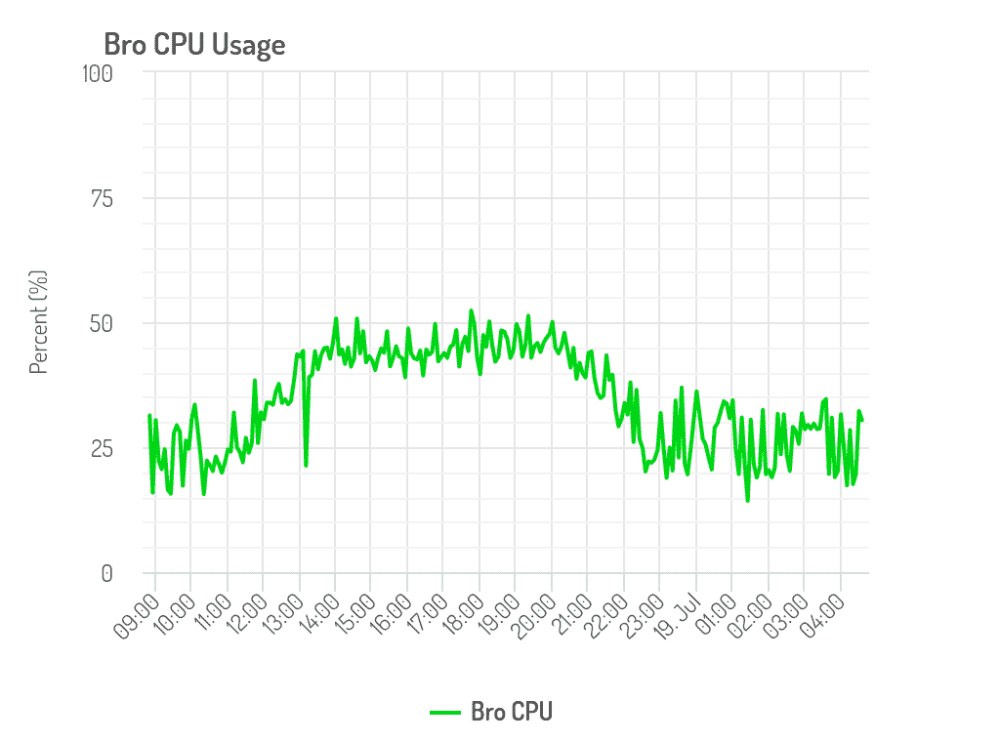
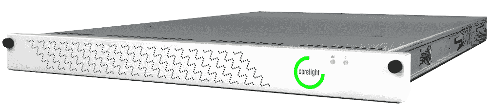

# Corelight 提升久经沙场的 Bro 网络监控技术

> 原文：<https://thenewstack.io/corelight-boosts-battle-hardened-bro-network-monitoring-tech/>

随着企业努力应对日益复杂的安全威胁，一项古老的安全技术正获得新的动力。总部位于三藩市的 Corelight 公司将开源的 Bro(T2)网络安全监视器商业化，该公司报告称，企业，尤其是全球跨国公司的兴趣激增。

首席执行官 [Greg Bell](https://www.linkedin.com/in/gregoryryanbell/) 将这项技术描述为久经沙场、广泛部署的开源软件。Bro 是 20 多年前由计算机科学家 Vern Paxson 为了研究复杂的互联网流量模式而创建的。作为一个灵活的脚本驱动的入侵检测系统，Bro 被认为是一个最适合关键高性能环境的强大但具有挑战性的工具。

它将 Bro 称为在后台工作的“飞行数据记录器”，对“正常”交通应该是什么样子没有先入之见。它监视所有网络流量，并将详细信息报告到为事故响应者设计的数据流中。它允许用户轻松地回到过去，了解复杂的网络攻击。

“大多数先进组织并不指望阻止每一次攻击，”贝尔说。“他们认为你必须为此做好准备，并准备好对明天威胁形势下发生的事情感到惊讶。大多数先进的组织都采用实时数据流，并将它们聚合到某种分析平台中。”

Corelight 从多个网络流量来源提取实时数据。他说，虽然传统工具被广泛用于做这件事，但提取的数据不是很详细，也不是很有帮助。

“我们的技术不是嵌入式解决方案，也不是防火墙，它位于企业边缘或数据中心边缘，监控网络流量的副本。随着公司对这项技术越来越熟悉，他们将它部署到更深的核心中，以查看关键业务资产前面的网络流量。它查看流量，并生成非常详细的特定于协议的发生情况摘要，”他说。

## 交通监控

该公司的 [Corelight 传感器](https://www.corelight.com/#specifications)是一种以 10Gbps 及以上速度执行网络流量分析和文件提取的设备。那个[与](https://www.corelight.com/#compare)相比，开源版本的分析吞吐量为 3 到 4Gbps。

[San Institute research](https://www.sans.org/reading-room/whitepapers/intrusion/open-source-ids-high-performance-shootout-35772) 指出了 Bro 的学习曲线，因此 Corelight 提供了商业支持和企业功能。贝尔说，该设备连接到企业分组经纪人，如 Gigamon 或 Ixia，并成为来自这些分组经纪人看到的网络流量的高保真数据源。

“但我们肯定对监控云中的工作流或虚拟实例中的开发感兴趣，所以我们期待为有需要的客户部署虚拟化传感器，”他说。

他说，对于数据分析，大多数客户已经有了一个解决方案，对大多数人来说是 Splunk，但也可能是 Elastic 或其他解决方案。

“我们不知道他们想要使用什么样的数据平台，”他说。“我们不想仅仅为了分析 Bro 数据而为客户提供另一个平台。这种从所有这些来源收集数据并加以组合的想法的强大之处在于消除了这些独立的、孤立的工具，并将数据放在一个地方。所以我们是数据的来源，但不是提供新的玻璃。这就是为什么企业集成是我们工作的重要组成部分。”

其企业功能包括全面的 API、Splunk、亚马逊 S3 和 Kafka 的集成、性能优化、基于高性能现场可编程门阵列(FPGA)的网络接口卡、优化的文件提取和日志过滤。

## 出生于学术界

该公司最初名为 Broala ，于 2013 年从加州大学伯克利分校附属的领先计算机科学研究中心[国际计算机科学研究所](https://www.icsi.berkeley.edu/icsi/) (ICSI)分离出来。Broala 的名字指的是乔治·奥威尔的“[老大哥](https://www.amazon.com/1984-New-Classic-Edition/dp/B000Q6ZLOI/ref=sr_1_1?ie=UTF8&qid=1509124659&sr=8-1&keywords=1984)”，因为它标志着网络监控运营商需要保持对用户权利和隐私的关注。

Bro 项目最初由 Seth Hall、Vern Paxson 和 Robin Sommer 创建，已经吸引了数百万美元的研究资金，包括 2010 年来自美国国家科学基金会的近 300 万美元。一些较大的部署已经在伊利诺伊大学厄巴纳-香槟分校的国家超级计算应用中心、2012 年巴拉克·奥巴马美国总统竞选、意大利眼镜公司 [Luxottica](http://www.luxottica.com/en) 以及劳伦斯·伯克利国家实验室和其他由[能源科学网络](https://www.es.net/)支持的实验室进行。

该公司去年更名为 Corelight。直到最近，在开源社区的支持下，它刚刚宣布了一轮 920 万美元的投资。贝尔说他不能说出用户的名字，但补充说它在财富 100 强中有 6 个客户。它专注于财富 2000 强。

<svg xmlns:xlink="http://www.w3.org/1999/xlink" viewBox="0 0 68 31" version="1.1"><title>Group</title> <desc>Created with Sketch.</desc></svg>