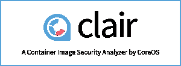

# CoreOS 为 Clair 集装箱安全扫描仪增加了补救挂钩

> 原文：<https://thenewstack.io/coreos-adds-remediation-hooks-clair-container-security-scanner/>

CoreOS 增强了开源容器图像安全分析器 [Clair](https://github.com/coreos/clair) ，以建议可用的补丁或更新来纠正它发现的漏洞。

这项新功能是 Clair 的完整生产就绪 1.o 版本的一部分。除了补救，Clair 1.0 [还具有](https://coreos.com/blog/clair-v1.html)在性能和可扩展性方面的显著改进。

“我们充实了 API，让 Clair 更具可操作性，让你不仅能更好地了解你有哪些漏洞，还能更好地了解你可以采取什么措施来消除或修复这些漏洞，”CoreOS 产品经理、Quay 联合创始人[雅各布·莫申科](https://twitter.com/jacobmoshenko)说，CoreOS 收购了 Quay，以获得其容器注册技术。

该软件解决了一个新生但日益增长的问题，即如何在容器投入生产后对其进行更新。“通常是开发人员创建容器映像，而不是操作人员，他们传统上负责更新操作系统，”Moshenko 说。该软件提供了一种将安全更新整合到基于容器的开发和部署流程中的方法。

Clair [在去年年底首次发布了测试版](https://thenewstack.io/coreos-introduces-container-scanning-for-vulnerabilities/)，它将一个容器中的内容与大量特定于 Linux 发行版的 [CVE 数据库](https://cve.mitre.org/)(目前由 Red Hat、Ubuntu 和 Debian 维护)进行比较。然后，如果容器中的任何软件有已知的漏洞，它会提醒用户。它既可用于扫描现有容器中的已知漏洞，也可用于在出现新漏洞时扫描它们。

今天，许多容器都基于标准的全尺寸 Linux 发行版，如 Debian 或 Ubuntu，因此，就攻击中可能使用的漏洞而言，具有相当大的攻击面。

CoreOS，索引托管在该公司自己的 [Quay container registry](https://quay.io/) ，的集装箱发现，超过70%的检测到的漏洞可以简单地通过更新这些集装箱映像中的安装包来修复，超过 80%的关键漏洞可以通过简单的更新来修复。

更新后的 Clair 现在不仅通过其 API 提供修复漏洞的软件包版本发现的特定漏洞，还提供来自[通用漏洞评分系统](https://nvd.nist.gov/cvss.cfm) (CVSS)的可用数据，包括基本的漏洞特征，如访问方式、是否需要身份验证以及对机密性、完整性或可用性的影响。

该软件会标记漏洞所在的特定图像层，为系统管理员提供应用补丁的快捷方式。

“如果操作系统供应商修复了问题，我们会告诉您问题是在哪个打包版本中修复的。如果操作系统供应商没有修复它，我们也会告诉你这个问题，”莫申科说。

该系统还提供了加速修正过程的建议，例如，显示多个漏洞可以通过一次更新来修复的情况。

通常，纠正容器中的漏洞包括用更新的软件重建容器。这可以通过 Quay 在内部完成，也可以通过 Clair webhook 在持续集成/持续部署系统中触发新的构建流程。

## 准备值勤

大部分性能改进都要归功于一个新的支持数据库的使用， [PostgreSQL](https://thenewstack.io/postgresql-9-5-geared-liberate-enterprises-data-warehouse/) 。以前，该公司使用图形数据库，尽管它能够使用 PostgreSQL 的[递归查询](http://www.postgresql.org/docs/9.4/static/queries-with.html)来模拟类似图形的结构。该公司声称，这种转换将 API 响应延迟从 30 秒降低到 30 毫秒。

CoreOS 还扩展了 API，以 RESTful JSON 的形式呈现，希望它可以更容易地集成到内部或第三方软件提供商创建的工作流和系统中。该软件的各种子系统都是可扩展的，包括诸如漏洞获取器、检测器、通知挂钩等组件，并用于处理图像格式。

CoreOS [Quay registry](https://quay.io/) 的用户将免费获得该产品。注册中心可以通过网站通知、通过返回到用户自己的站点的 webhook 或使用其他配置向用户发出通知。GitHub 上也有该软件。

CoreOS 是新堆栈的赞助商。

通过 Pixabay 的特征图像。

<svg xmlns:xlink="http://www.w3.org/1999/xlink" viewBox="0 0 68 31" version="1.1"><title>Group</title> <desc>Created with Sketch.</desc></svg>