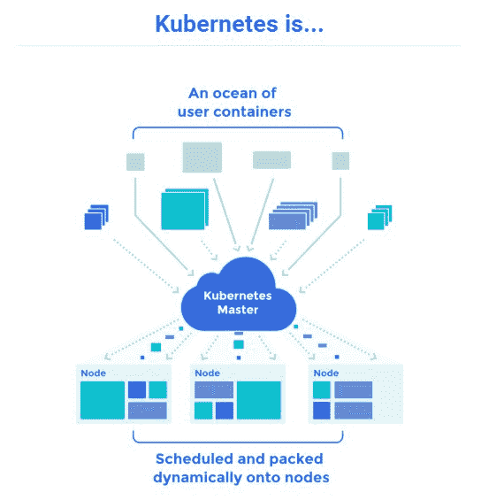
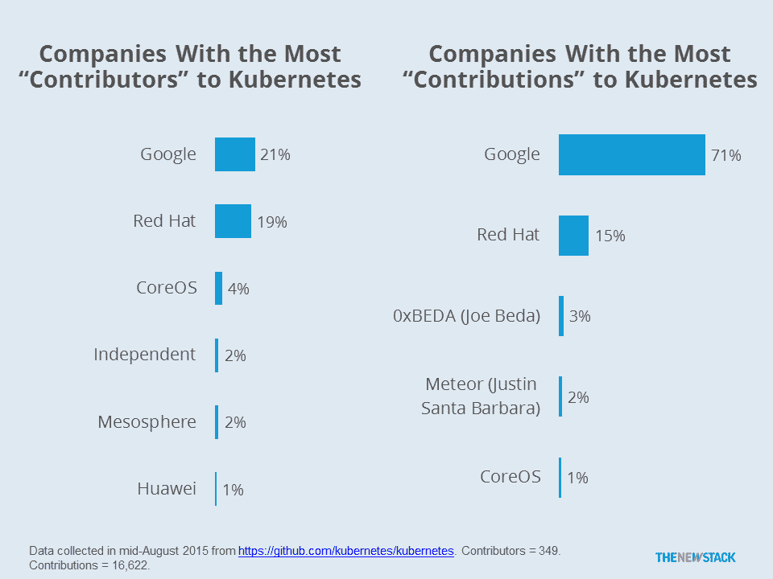

# CoreOS 首次推出一个商业 Kubernetes 发行版

> 原文：<https://thenewstack.io/coreos-debuts-tectonic-a-commercial-kubernetes-distro/>

CoreOS 已经将 Kubernetes 容器管理器的商业发行版[包装成](https://tectonic.com/blog/tectonic-general-availability/)结构，这是一个专注于企业使用的版本。

structural 可用于跨各种云服务或在组织自己的数据中心内运行基于容器的工作负载，也可用于在这些环境中转移容器。

CoreOS 首席执行官 Alex Polvi 表示:“architectural 为您提供了一个适用于任何环境的通用平台。

从某种意义上来说，这种分布可以在某种程度上为基础设施服务提供商铺平道路，至少对于那些转向基于容器的基础设施的客户来说是如此。

“谷歌、亚马逊和微软真的开始一决雌雄，第一次真正实现了计算商品化，”波尔维说。“你可以从他们中的任何一家获得服务器，这真的没有关系，在你实际运行和管理所有基础设施的过程中，价值会在链上向上移动一点，这就是我们正在与 structural 一起做的事情，”Polvi 说。

该公司在今年早些时候发布了《构造》[作为预览版](https://coreos.com/blog/announcing-tectonic/)。自那以后，该公司根据早期用户的要求增加了许多新功能。enterprisey 的一个新特性是单点登录(SSO)功能，它可以与组织的后台身份验证系统集成在一起。另一个是安全的集装箱注册，叫做[码头企业](https://tectonic.com/quay-enterprise/)。

在预览阶段，无论是面向公众的还是内部的，运行 Web 服务的组织都对构造感兴趣。“你会看到越来越多的公司建立自己的 API 和服务。这种用例似乎非常适合构造，”波尔维说。

当然，组织可以使用 [Kubernetes](https://thenewstack.io/kubernetes-v1-0-now-on-github-and-kubecon/) 本身来管理他们基于容器的工作负载。

Kubernetes[由谷歌开发，并作为开源软件发布，它提供了控制大量容器的方法，调度它们在指定的时间运行，并以一种最大限度利用组织的计算资源的方式协调它们，无论是在云中还是在本地。](http://kubernetes.io/)

谷歌的 Kubernetes。

然而，Polvi 说，直接使用 Kubernetes 有点像从零开始构建 Linux 发行版。不用编译内核，然后手动添加支持库，最后添加您需要的应用程序，您可以只安装一个包就万事俱备了。

“我们正在集成和安装运行 integrating 所需的所有开源组件，并将一些应用程序放在平台本身上，使其为企业立即开始消费做好准备，”Polvi 说。

尽管作为一家公司，CoreOS 的规模相对较小，但它已经是 Kubernetes 的主要贡献者之一(来源:新堆栈研究)。

无论是在云中还是在内部，只要能运行 core OS——该公司的 Linux 发行版——就可以使用 negative。该公司还为 AWS 提供了一个完整的安装程序。波尔维说:“当你推出一项服务，并希望将其公开在互联网上时，它实际上会在亚马逊上提供 ELB ( [弹性负载平衡](https://aws.amazon.com/elasticloadbalancing/))。

该发行版包括一个控制台，它提供了正在运行的集群的完整视图。它还包括 CoreOS 的 [dex](https://github.com/coreos/dex) 的一个改进版本，这是一个开源软件，提供集群范围的单点登录

Dex 基于 [OpenID Connect](http://openid.net/connect/) 标准，这是两个联合 Web 认证规范 [OAuth](http://oauth.net/) 和 [OpenID](https://openid.net/get-an-openid/what-is-openid/) 之间的混搭。

“在前端，Dex 谈到了一个非常现代的协议。Web 应用程序可以针对它进行编程。但在后端，Dex 与您的内部单点登录系统相集成，”Polvi 说。

结构分布是根据被管理的容器所使用的内存量来定价的。CoreOS 将于 12 月 2 日和 3 日在纽约市举行的公司[构造峰会](https://tectonic.com/summit)上演示如何更深入地使用构造技术。

CoreOS 是新堆栈的赞助商。

来自 CoreOS 的特征图像。

<svg xmlns:xlink="http://www.w3.org/1999/xlink" viewBox="0 0 68 31" version="1.1"><title>Group</title> <desc>Created with Sketch.</desc></svg>