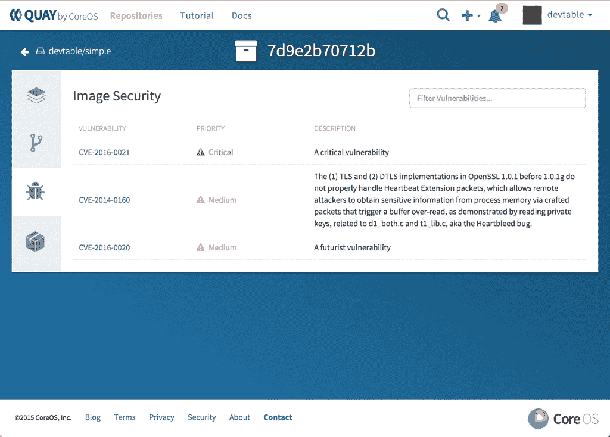

# CoreOS 引入了容器漏洞扫描

> 原文：<https://thenewstack.io/coreos-introduces-container-scanning-for-vulnerabilities/>

CoreOS 已经发布了开源技术，可以扫描容器的内容以发现安全漏洞。该公司还在其[Quay private container registry](https://coreos.com/blog/CoreOS-enterprise-docker-registry/)中添加了这一内部开发的功能，作为测试功能。

这款名为 [Clair](https://github.com/coreos/clair) 的软件将一个容器中的内容与多个特定于 Linux 发行版的 [CVE](https://cve.mitre.org/) 数据库(目前由 Red Hat、Ubuntu 和 Debian 维护)进行比较。然后，如果容器中的任何软件有已知的漏洞，它会提醒用户。它还有一组 API，允许将扫描服务整合到更大的自动检测和警报流程中。

CoreOS 软件工程师 Quentin Machu 在一封电子邮件中写道:“我们认为，提供影响容器的漏洞列表并在新漏洞发布后立即发送通知是一个重要的帮助，是朝着更好的安全性迈出的一步。”“使用这些特定于发行版的来源让我们相信 Clair 可以考虑所有不同的包实现和反向端口，而不会报告任何可能不准确的信息。”

容器中的漏洞是一个问题。例如，根据 CoreOS 的说法，臭名昭著的 [Heartbleed](http://heartbleed.com/) ，CVE-2014-0160，仍然存在于码头上存储的 80%的码头图片中。

请记住，Clair 还不能识别基于相互依赖的软件链的漏洞。“例如，只有安装并使用了易受攻击的 OpenSSL 包，Heartbleed 才会构成威胁。Clair 不适合这种级别的分析，团队仍应根据需要进行更深入的分析，”Machu 在发布新软件的博客文章[中写道。](https://coreos.com/blog/vulnerability-analysis-for-containers/)

还要记住，Clair 不会更新易受攻击的软件包。这项工作仍然是开发人员的责任。有趣的是，这种能力是可能的，尽管可能会造成严重破坏。马楚在电子邮件中写道:“Quay 可以在技术上修补这些容器，但这真的很微妙，因为只有开发者知道它们的包和依赖关系。”

无论如何，“对于容器维护者来说，更新是一个简单直接的步骤，”他写道。

用户现在可以在他们自己的仓库中测试这个名为 Quay Security Scanning 的功能，目前处于测试阶段。

【T2

CoreOS 软件工程师 Joey Schorr 在另一篇博客中写道:“实际上，每次图像被推送到 Quay，分析系统都会检查漏洞，在界面中标记它，并发送通知。”“它将包括漏洞级别(高、中或低)，以及描述和已安装的软件包。包含一个指向漏洞来源信息的链接，通常包括修补漏洞所需的步骤。

CoreOS 将展示 Clair，以及它在码头的使用，下周在巴塞罗那举行的 Dockercon 欧盟会议。

CoreOS 是新堆栈的赞助商。

特色图片 [via](https://pixabay.com/en/bowl-porcelain-glass-henkel-stack-714192/) Pixabay。

<svg xmlns:xlink="http://www.w3.org/1999/xlink" viewBox="0 0 68 31" version="1.1"><title>Group</title> <desc>Created with Sketch.</desc></svg>