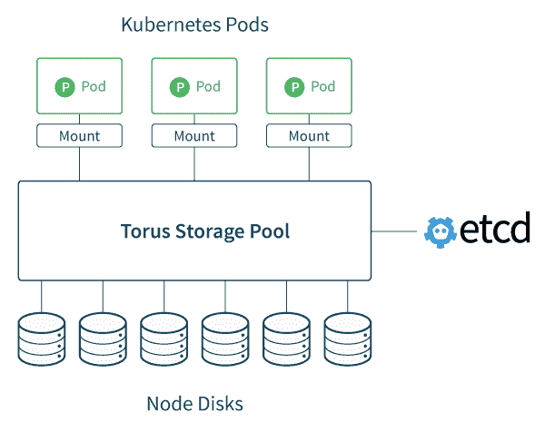

# CoreOS 发布了一个 Kubernetes 友好的存储系统:Torus

> 原文：<https://thenewstack.io/coreos-launches-kubernetes-friendly-storage-system-torus/>

继续在容器编排领域快速创新， [CoreOS](https://coreos.com/) 推出了一个开源项目，旨在为 Kubernetes 用户提供一个合适的存储系统来处理他们的 pod。

T2 Torus T3 的目标是为 Kubernetes 编排的容器集群提供可扩展的存储。

CoreOS 产品负责人[党微](https://www.linkedin.com/in/weiliendang)在接受 TNS 采访时说:“我们从 Kubernetes 用户那里听说，使用现有的存储系统很困难。“我们让运行 Torus 变得非常容易。它在一个容器中运行，可以与 Kubernetes 一起部署。它提供了一个分布式存储集群来管理微服务工作负载。”

Torus 解决了容器和微服务管理中最棘手的问题之一，即使用持久存储，根据 CoreOS 软件工程师 Barak Michener 的一篇介绍新技术的博客文章。尽管应用程序需要的数据必须可以在一致的位置访问，但是应用程序容器本身经常在节点之间启动、停止、升级和迁移。

“如果你在具有单独数据存储的容器中建立一堆微服务，管理每个单独的数据存储会变得非常具有挑战性，特别是如果你利用的现有存储系统不是为处理所有这些容器而设计的，”Dang 说。

Kubernetes 代表 Torus 跟踪集群中所有不同的资源。Torus 可以用来托管一个数据库系统，可以从其他微服务调用该系统，无论这些微服务或数据库本身在名称空间中改变位置的频率如何。

当然，有一整套成熟的产品来运行[分布式存储系统](http://searchvirtualstorage.techtarget.com/opinion/Debating-the-distributed-vs-centralized-storage-system)，它提供了将大型存储池分布在多个服务器上的优势。 [Red Hat](https://www.openshift.com/) 工程师一直在努力开发 [GlusterFS](https://thenewstack.io/google-cloud-offers-posix-compliant-file-storage-red-hat-gluster/) 和 [Ceph](https://thenewstack.io/converging-storage-cephfs-now-production-ready/) 开源文件系统，这两个系统都可以用来提供易于扩展的分布式存储。

麦切纳说，然而，它们可能很难使用，而且无法识别的错误会以惊人的速度迅速传播。

“这主要是回归简单，”Dang 说。“启动、运行和管理这些解决方案非常困难。它们并不是真正为大型集装箱基础设施而设计的。它们主要是为小型超大型机器集群设计的。”

就像它对其 [etcd](https://thenewstack.io/coreos-updates-etcd-large-scale-container-coordination/) 分布式键-值数据库所做的那样，该公司遵循[Google GIFEE](https://www.youtube.com/watch?v=juCQMnSfysQ)(Google infra structure for every one others)的方法构建了 Torus，该方法倡导高度可扩展的分布式基础设施供企业使用。该公司还提供了 Google Kubernetes 的商业支持版本，名为[constructive](https://thenewstack.io/coreos-debuts-tectonic-a-commercial-kubernetes-distro/)，用于容器编排。

Torus 非常适合分布式工作负载，这在很大程度上是因为它依赖 CoreOS 的 etcd 键值存储来协调文件或对象元数据。 [etcd](https://github.com/coreos/etcd) 数据库还为一致性算法提供了[坚实的支持](http://play.etcd.io/)，这些算法需要跟踪跨不同服务器的资源移动。Torus 是用 Go 编程语言编写的，并使用了 Google gRPC 协议，麦切纳希望这两者都能为构建第三方 Toris 客户端提供简单的可扩展性。

## 生效

Dang 说，Torus 可以将它权限内的所有磁盘作为一个存储池来管理，并且可以扩展到数百个节点。

一旦投入运行，Torus 允许 Kubernetes 用户动态地将卷附加到正在部署的 pod 上。“对于在 pod 中运行的应用程序来说，Torus 就像一个传统的文件系统，”麦切纳写道。Kubernetes 本身提供了部署 Torus 的方法，通过 Kubernetes 清单，允许管理员将 Torus 作为 Kubernetes 管理的应用程序运行。

目前，Torus 通过网络块设备(NBD)支持面向块的存储，尽管在将来，它可能也支持文件存储。数据可以加密，该软件提供了许多内置于当今文件系统中的现代功能，包括哈希、复制、垃圾收集和池重新平衡。

“如果你添加一个新的节点，Torus 将自动计算出如何放置和复制数据以适应这种情况，”Dang 说。" Torus 自动计算集群中所有节点的数据放置."

“在其核心，Torus 是一个带有界面的库，看起来像一个传统的文件，允许通过很好理解的基本文件操作进行存储操作，”Michener 解释说。“通过 etcd 的共识流程进行协调和检查，这种分布式文件可以以多种方式向用户应用程序公开。

CoreOS 并不是唯一一家满足集装箱生命周期新兴存储需求的公司。 [Docker](https://www.mirantis.com/software/docker/kubernetes/) 已经与 Hedvig 和 [BlockBridge](http://www.blockbridge.com/docker/) 合作，为其 Docker 数据中心扩展原生存储能力。EMC 提供了 [REX-Ray](http://rexray.readthedocs.io/en/stable/) ，旨在为基于 Docker 和 Mesos 的容器运行时提供持久存储访问。IT 咨询公司 [OpenCredo](https://opencredo.com/) 最近发布了 [KubeFuse](https://opencredo.com/introducing-kubefuse-file-system-kubernetes/) ，这是一个 Kubernetes 友好的文件系统，允许管理员执行诸如编辑服务和复制控制器等方便的任务。

CoreOS 希望其他人也能为这个开源项目做出贡献。对于旧金山地区的人来说，该公司将在 6 月 16 日的下一次 CoreOS meetup 上深入研究这项技术。

TNS 研究公司分析师劳伦斯·赫克特为本文做出了贡献。

CoreOS 、 [Docker](https://www.mirantis.com/software/docker/kubernetes/) 和 [Red Hat](https://www.openshift.com/) 是新栈的赞助商。

通过 Pixabay 的特征图像。

<svg xmlns:xlink="http://www.w3.org/1999/xlink" viewBox="0 0 68 31" version="1.1"><title>Group</title> <desc>Created with Sketch.</desc></svg>