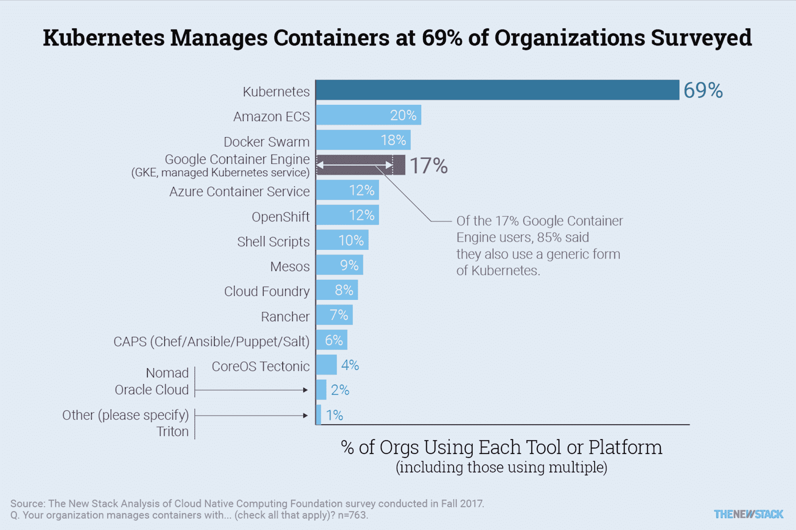

# CoreOS、Red Hat 和 Kubernetes 竞赛

> 原文：<https://thenewstack.io/coreos-red-hat-kubernetes-competition/>

让我们数一数红帽宣布收购 CoreOS 的意图可能会对容器生态系统的其他部分产生哪些影响。容器运行时开发将会继续，可能会更加强调 Kubernetes 容器运行时接口( [CRI-O](http://cri-o.io/) )项目。然而，Docker、CoreOS 和 Red Hat 的工程师继续为其他容器运行时项目做出贡献，如 [containerd](https://github.com/containerd/containerd) 、 [rkt](https://github.com/rkt/rkt) 和 [Atomic](https://github.com/projectatomic/atomic) 。CoreOS 的容器 Linux 似乎已经寿终正寝，取而代之的是 Red Hat 的产品。CoreOS -led etcd 和法兰绒已经是许多 Kubernetes 堆栈的核心组件，并且很可能会继续下去。Red Hat 也可能将集装箱注册码头与他们更大的集装箱产品捆绑在一起。

这让我们想到了 [OpenShift](https://www.openshift.com/) ，这是 Red Hat 基于 Kubernetes 的平台即服务软件，也是 CoreOS 自己的商业 Kubernetes 发行版的竞争对手——structural。这些当前和未来的市场采用率会受到怎样的影响？

我们对云本地计算基金会[调查](https://www.cncf.io/blog/2017/12/06/cloud-native-technologies-scaling-production-applications/)的分析提供了一些答案。在已确认的 34 个 CoreOS structural 用户中，有 5 个也使用 Red Hat 的 OpenShift。因此，合并后的实体仍然只有 14%的受访者使用它来管理容器。只有 4%的 Docker Swarm 用户表示他们也使用了 negative。

总体而言，69%的调查对象使用 Kubernetes，很少有具体的证据表明他们与一家公司的发行版绑定。尽管合作伙伴关系允许它在其他云提供商的环境中运行，但 OpenShift 将继续关注亚马逊网络服务、Azure 和谷歌如何以及在哪里部署 Kubernetes。在一个多云世界中，公司很可能会将应用程序部署到不止一个 Kubernetes 环境中。

Red Hat 通过收购获得了一些新客户和工程师，但 CoreOS 的加入是否会带来额外的协同效应仍有待观察。敬请关注。

云本地计算基金会(Cloud Native Computing Foundation)和 T2 的 CoreOS 和 T4 的 Red Hat 都是新堆栈的赞助商。

通过[去飞溅](https://unsplash.com/search/photos/containers?utm_source=unsplash&utm_medium=referral&utm_content=creditCopyText)上的[凸起](https://unsplash.com/photos/fN603qcEA7g?utm_source=unsplash&utm_medium=referral&utm_content=creditCopyText)的特征图像。

<svg xmlns:xlink="http://www.w3.org/1999/xlink" viewBox="0 0 68 31" version="1.1"><title>Group</title> <desc>Created with Sketch.</desc></svg>