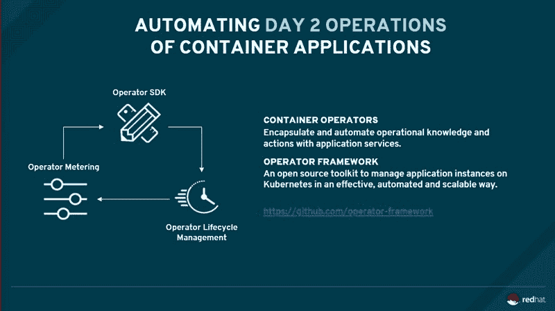
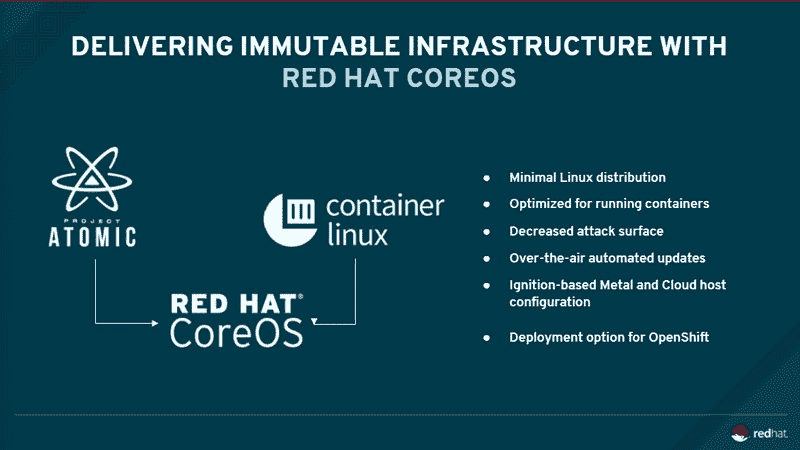

# Red Hat 表示，CoreOS 将帮助运营商引入 OpenShift

> 原文：<https://thenewstack.io/coreos-says-red-hat-will-help-introduce-openshift-to-operators/>

在 Red Hat 的 container infrastructure 的上下文中，术语“操作者”现在有两个并发的定义:显然，有一些用户专门从事开发软件的部署和维护——组合“DevOps”的“Ops”部分。然后是 Kubernetes 的“操作者”这一新兴概念:一个自动化应用程序部署的组件，该应用程序由 Kubernetes 集群管理或连接到该集群。

后者是一种应用程序或其他组件的自动化，如 Kubernetes orchestrator 试图管理的 Cassandra 数据库——一种“指导手册”,它将这些组件开放给来自 kubectl 命令行工具的指令。这是一个由 CoreOS 在 2016 年末发布的系统，它正准备由正式成为运营商框架，直到红帽在去年 2 月收购了 CoreOS。

该操作器是 CoreOS 的一个自动构造系统的衍生产品。另一个是[一个引擎盖下的空中(OTA)自动化系统](https://thenewstack.io/coreos-offers-self-hosting-kubernetes-new-tectonic-release/)，能够零点击实时更新其构造商业平台的 Kubernetes 核心。这就是 2015 年 [CoreOS 首席技术官 Brandon Philips 吹嘘的](https://thenewstack.io/red-hat-releases-container-focused-operating-system-rhel-7-atomic-host-competition-matures/)将整个 CoreOS 平台与 OpenShift 及其其他竞争对手区分开来的部分。

## 用无线电

现在，CoreOS 开发团队已经融入了红帽的组织结构图，正如红帽 [OpenShift](https://www.openshift.com/) 产品战略总监[Brian gracey](https://twitter.com/bgracely)告诉新的 Stack，正式赢得掰手腕比赛的是飞利浦。在 OpenShift 的未来版本中，来自 constructive 的 OTA 更新将取代基于 Ansible 的系统。

“首先，也是最重要的一点，构造控制台是为了感知库伯内特而设计的，”格雷斯承认道。“然而，当我们在过去采用其他工具时，他们会理解 Kubernetes 的某些概念，但有时并不像您可能需要的那样详细。我的集群启动并运行了吗？是的。第二、第三级运行状况检查，了解群集中实际发生了什么，节点的管理情况如何，以及诸如此类的事情，您将从构造控制台为您提供的内容中获得更多的粒度。

“CoreOS 和大地构造团队在使用普罗米修斯监测技术方面比我们在红帽公司走得更远，”Gracely 继续说道。几位最初的普罗米修斯团队成员已经加入了 CoreOS。他们因为对平台的监控而成为一等公民。我们在 OpenShift 中对普罗米修斯进行了监控，因此他们在收集数据、构建图表和展示信息方面的经验水平和深度比我们在 OpenShift 世界中的水平更高、更成熟。”

在本周早些时候的红帽峰会新闻发布会上，红帽的副总裁兼 OpenShift 总经理 [Ashesh Badani](https://www.linkedin.com/in/asheshbadani/) 告诉记者，OpenShift 的用户应该很快就会看到 structural 的 OTA 系统出现在他们的平台上。

“顾客。。。Badani 说:“我很高兴看到 negative 专注于这些无线升级、第二天的运营管理以及一些与监控和镜像相关的技术。“在接下来的六个月里，我们将利用所有这些优势，将其融合到 OpenShift 中，成为一个融合平台。”

## 操作员接管

正如前 CoreOS 首席技术官——现红帽工程师——[Brandon Philips](https://twitter.com/BrandonPhilips)所说，运营商技术仍在积极开发中。这将使 OpenShift 今后能够访问可能由 Kubernetes】编排但不直接由 it*管理*的组件，一旦飞利浦解释了正在发生的事情，这种差异就不那么微妙了。

“Kubernetes 很棒，因为你可以在它上面部署任何东西，”飞利浦说。“但是抽象就像一个虚拟机:谁知道那个容器里有什么？我们试图把它提升到另一个抽象层次。你得到了可见性——它不只是像‘哦，这里有一个豆荚，它碰巧包含 etcd。’这是一个类似 API 的 etcd 资源，这是与该资源相关的 pod。"

Philips 指出，以亚马逊的关系数据库服务(RDS)为例，用户要求系统启动 Postgres 数据库将触发后台 VM 的实例化。Postgres 数据库的功能通过 RDS 的本地 API 公开。操作员将通过 OpenShift 进行类似的工作，使外部组件的本机 API 的功能可以通过 Kubernetes 的控制功能(包括命令行)进行访问。

“如果你看看它，Ansible 与 OpenShift 的交互是 Ansible 在自动化方面做得非常好的成百上千件事情中的一件，”Red Hat 优雅地评论道。“在许多情况下，它自动化了底层网络，自动化了存储。我们还通过服务代理集成了调用任何可行剧本的能力。因此，Ansible 在整个故事中绝不会消失。在纯粹的 Kubernetes 意义上，Ansible 只是在一些地方不是最有效的技术。”

随着 Kubernetes 新的*部署*模型的优雅添加，orchestrator 最初缺乏的为自己旋转新节点的能力已经被原生添加。所以 Ansible 通过 OpenShift 提供的一些功能已经变得多余了。因此，Ansible 将专门为更新后的 Kubernetes 现在可以更好地独立运行或者运营商框架可以更直接提供的功能让路。可以想象，修订后的 Ansible 剧本可以在更高的层面上触发运营商，尽管这样做的方式可能尚未确定。

## 改变自我

一些更以操作者为中心的构造个性(个人类型的操作者，如“DevOps”)将在即将发布的 OpenShift 控制台版本中展现出来，作为为用户角色量身定制的仪表板和控制台元素——具体来说，无论她是开发人员还是操作者。

“在最基本的层面上，OpenShift 主要将你在平台上看到的东西集中在以应用程序为中心的东西上，”Red Hat 的 Gracely 说。“可见性更多的是关于您正在工作的项目和应用程序，您将如何部署它们，您将如何将服务连接在一起，等等。更以运营商为中心的事情——管理平台、管理集群——被委托给其他工具，如 [CloudForms](https://www.redhat.com/en/technologies/management/cloudforms) 和其他一些工具。但它们并不是 OpenShift 的本地一流产品。”

他说，起初这似乎没问题，因为操作员(人类)倾向于为自己选择自己的工具。与此同时，structural 正在向 Ops 进军，看起来他们越来越多地选择 structural 进行集群管理和高度定制的部署。

“我们发现——基本上是在收购后发现的，”格雷斯评论道，“我们会去与 CoreOS 和 OpenShift 的客户交谈，总有一种感觉，‘我希望我们拥有另一家拥有的东西。’因此，我们做的第一件事就是说，好吧，与其强迫人们使用一堆外部工具，不如让我们利用 CoreOS 在 constructive 中拥有的功能——非常集群级、操作级的功能——并将其嵌入到 OpenShift 中。"

今后，当你以开发人员的身份登录时，OpenShift 看起来会相当熟悉。但是作为一名集群管理员，您应该希望看到 Prometheus 输出的数据，以及为日志生成的最新事件。“我们的信念，”他说，“是我们要把运营商的最佳视角和开发者的最佳视角汇集到一套工具下。”

## 分裂原子

基于容器的 Linux 是由 core OS——可以说是推广了这一概念的公司——和 Project Atomic company 结合而成的，将被称为 Red Hat CoreOS。这是建立集装箱业的品牌之一将继续生存的地方。但从宣布收购的那一刻起，就有人担心谁的代码会留在内核中。这不仅仅是一个性能问题，而是一个贯穿自动化和法规遵从性的问题。

Brandon Philips 表示:“我们正在推出一款名为 Red Hat CoreOS 的新 Linux，它与 CoreOS Container Linux 类似。“它已经实现了从底层到底层的自动化操作。因此，当您运行 OpenShift 和 Red Hat CoreOS 时，无论您是在本地还是在云上，我们都将从根本上为您管理到操作系统的升级。”

飞利浦回应中的关键词是“相似”。Brian 优雅地说，就其核心而言，完全采用 Container Linux 实际上并不可行。

“最初的 CoreOS 的功能是建立在一个 [Gentoo 内核](https://www.gentoo.org/)上的，”他告诉我们，“这个内核来自 ChromeOS 技术。他们构建的更重要的部分是一个非常以容器为中心的、非常小的、具有空中自动更新的空间。这项技术真的是开创性的。”

Red Hat 的 Atomic 团队有效地减少了内核的占用空间，并采用了 CoreOS 方法，通过额外的容器集成附加功能。但是 Atomic 是建立在 Fedora/RHEL 内核上的，ISV 已经认证可以用于他们的应用程序。红帽不能简单地把一个操作系统内核换成另一个，并且让他们的认证意味着同样的事情。这就像签署一项条约，宣布该条约无效，然后声称该条约可以与所有其他缔约方重新谈判。换句话说，荒谬。

Gracely 说，Atomic 使组织能够将其现有的 Linux 应用程序迁移到容器化模型，而不必重新设计或重新认证它们。“因此，我们对 Red Hat CoreOS 所做的事情，”他继续说道，“是从 Atomic 中获取内核，这使我们能够立即兼容任何曾经是 Red Hat ISV 的人，并嵌入所有的 CoreOS 无线管理更新。我们采用了围绕 CoreOS 构建的操作模型，以及内核与 Atomic 的兼容性——这就是你将在 Red Hat CoreOS 中看到的情况。我们的 ISV 合作伙伴以及已经通过认证的客户不必担心重新认证。”

虽然红帽收购 CoreOS 的关键好处可能是它的天才工程师，正如我以前说过的，红帽的第二个项目很容易是它的自动化。红帽峰会的与会者被提醒期待今年 7 月第一个合并了 CoreOS 的 OpenShift 版本。

Red Hat 是新堆栈的赞助商。

<svg xmlns:xlink="http://www.w3.org/1999/xlink" viewBox="0 0 68 31" version="1.1"><title>Group</title> <desc>Created with Sketch.</desc></svg>