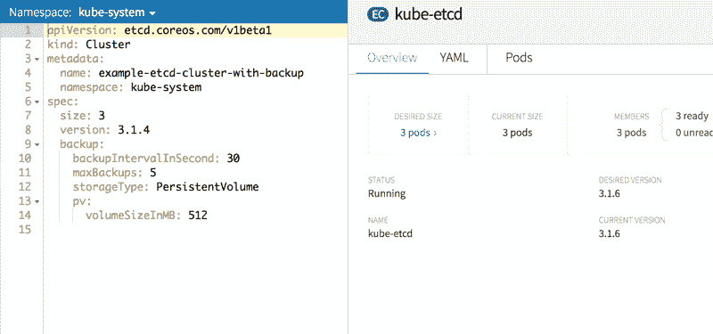
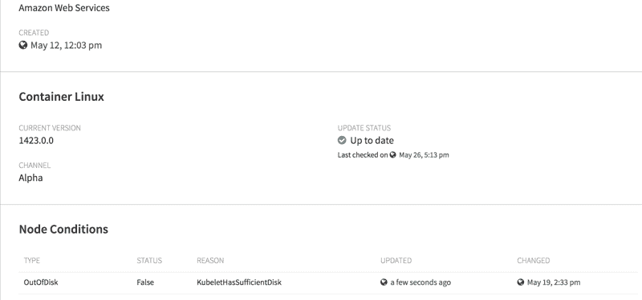

# CoreOS 承诺通过计划中的 Kubernetes 即服务产品实现云的可移植性

> 原文：<https://thenewstack.io/coreos-takes-cloud-portability-tectonic-release/>

CoreOS 希望在 Kubernetes 开源容器编排软件的帮助下，帮助企业将他们的云提供商视为商品供应商。

在本周于三藩市举行的 CoreOS Fest 用户大会上，该公司[展示了最新版本的](https://coreos.com/blog/coreos-brings-freedom-to-cloud)[构造](https://coreos.com/tectonic/)，这是其企业版 [Kubernetes](/category/kubernetes/) 。

CoreOS 正在开发一套新的服务，基于 structural，旨在帮助组织使用云服务，而不是被他们所束缚。用户可以依靠构造来管理操作，而不是使用特定于提供者的钩子。这种方法将允许组织轻松地将其云原生工作负载转移到任何提供最佳或最具成本效益的服务的提供商。

CoreOS 首席执行官 Alex Polvi[表示,](https://coreos.com/)[我们提供的软件缩小了自己运行这些东西和使用完全托管的云服务之间的差距。“通常情况下，服务总是与主机绑定在一起。但我们为您提供了开源软件的选择和自由，也为您提供了云提供商可以提供的完全托管的服务，但与基础设施无关。”](https://twitter.com/polvi)

在过去的几年里，企业已经开始对被亚马逊网络服务、微软 Azure 或谷歌云平台等云提供商的服务所束缚表示担忧。每个平台都提供了丰富的新功能和实用程序，尽管它们需要最终用户将他们的操作硬集成到特定的功能中，实际上使应用程序依赖于特定的云服务。

大约 71%的 Kubernetes 用户将该技术视为支持多云或混合操作的一种方式，[最近由 451 Research 代表 CoreOS 进行的一项调查发现](https://thenewstack.io/parity-check-bright-grey-container-prediction/)。

CoreOS 的方法不同于仅仅是用户自己建立构造或 KubernetesCoreOS 将作为软件的服务提供商，更新软件，并在出现问题时进行故障排除。Polvi 解释说，CoreOS 唯一没有提供的是托管:计算和存储可以由任何云提供商或内部数据中心处理。

尽管该公司距离为大地构造提供完整的云包还有一段路要走，但 CoreOS 正在准备其软件来实现这一目标。

作为第一步，structural 1 . 6 . 4 将提供分布式 [etcd 键值数据存储](https://github.com/coreos/etcd)作为完全托管的云服务。“首先提供它是合乎逻辑的，因为它是其他一切的基础，”Polvi 解释说。他说，数据存储“保证数据在非常特定的操作中处于一致的状态”，他指的是 etcd 对于数据库迁移等操作是多么重要。

“这是非常低级的，但它是构建任何高阶分布式系统所必需的。“上层的事情总是需要像 etcd 这样的东西才能做好，”Polvi 说。

为了将 Kubernetes 及其相关组件呈现为服务，CoreOS 依赖于 [Kubernetes Operators](https://coreos.com/blog/introducing-operators.html) ，这是一个由 CoreOS 开发的扩展，允许 Kubernetes 控制应用程序的动作。etcd Operator 作为测试版发布，可用于配置 etcd，无需手动扩展、从故障中恢复和更新软件。

通过这些操作员，管理员可以自动更新 Kubernetes 集群控制平面、工作节点操作系统和 etcd 服务实例。“运营商缩小了你只是部署软件本身和实际上把它变成一个管理服务之间的差距，”波尔维解释说。

在构造控制台中创建和查看 etcd 集群。

Polvi 说，etcd 运营商是未来多个运营商的第一步，这些运营商将涵盖运营“大地构造”服务的所有方面。此外，该公司还发布了一个容器 Linux 操作系统，它可以自动更新 [CoreOS Linux 发行版](https://coreos.com/products/container-linux-subscription/)，与 constructive 一起本地运行。CoreOS 让 structural 自己更新到上游 Kubernetes 的最新生产版本，由[云原生计算基金会](https://www.cncf.io/)管理。

在 Amazon Web Services 上运行的构造节点上的容器 Linux 细节。

Polvi 怀疑客户会在云提供商服务的基础上看到任何财政下降或性能延迟，而不是直接使用内部服务。他声称，由于其开放性，支持开源软件的市场将比专有云服务的市场更具竞争力，专有云服务的价格往往由提供商锁定。constructive 只需要来自每个提供商的原始虚拟机，而不需要任何上游服务。

[core OS architectural](https://coreos.com/tectonic)可免费用于多达 10 个节点，并针对大型部署按节点定价。要了解更多关于最新特性的信息，请加入 CoreOS [参加 6 月 22 日的网络研讨会](https://www.brighttalk.com/webcast/14601/263765)。

云本地计算基金会和 T2 的 CoreOS 是新堆栈的赞助商。

专题图片:CoreOS 的 Brian Redbeard 在 CoreOS fest 上发言。亚历克斯·威廉姆斯的照片。

<svg xmlns:xlink="http://www.w3.org/1999/xlink" viewBox="0 0 68 31" version="1.1"><title>Group</title> <desc>Created with Sketch.</desc></svg>