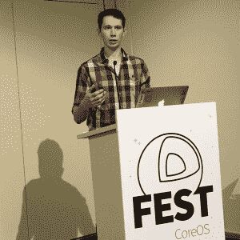
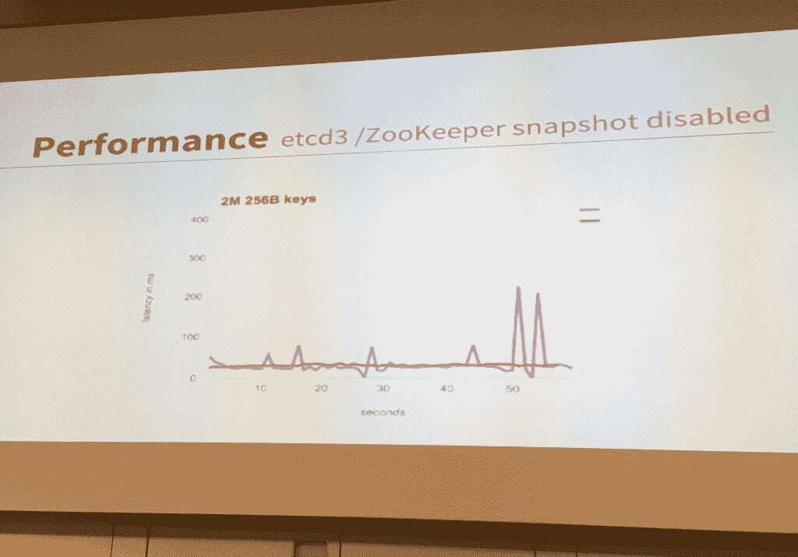

# CoreOS 为大规模集装箱协调更新 etcd

> 原文：<https://thenewstack.io/coreos-updates-etcd-large-scale-container-coordination/>

CoreOS 和一批外部志愿者正在更新开源的 etcd 分布式密钥服务，这样它就可以每秒处理成千上万的请求，大大提高了现有版本的吞吐量。

据创建 etcd 的 CoreOS 首席技术官 [Brandon Philips](https://twitter.com/BrandonPhilips) 称，这一改进使 etcd 版本 3[上周在 beta](https://github.com/coreos/etcd/releases/tag/v3.0.0-beta.0) 中发布，更适合帮助 Kubernetes 的生产规模部署，Kubernetes 依赖 etcd 协调大量容器之间的通信。

飞利浦在本周于柏林举行的 [CoreOS Fest](https://coreos.com/fest/#schedule) 的开幕主题演讲中表示，Etcd v. 3 采用了重新设计的存储引擎，其使用内存的效率是当前版本的十倍左右，并且更新了 API 以容纳更多的同步原语。

Brandon 说,[当前版本的 etcd](https://thenewstack.io/about-etcd-the-distributed-key-value-store-used-for-kubernetes-googles-cluster-container-manager/) 更多地是为存储和更新服务器配置信息而设计的，因此需要更少的吞吐量。在吞吐量方面，etcd 的第 3 版与 Apache Zookeeper 的性能相当，后者是一个类似的价值存储，为协调 Hadoop 服务提供数据。

由于使用了 [gRPC](http://www.grpc.io/) (谷歌远程调用程序)，该软件能够适应更大的流量。它现在提供增量快照，这将进一步提高其在高可用性部署中的可靠性。垃圾收集得到了改进，消除了以前版本中可能出现的延迟高峰。利用堆外存储，etcd v3 现在可以存储数百万个键，而不会受到垃圾收集的干扰。

飞利浦最初将 etcd 设计为一个简单的数据库，用于读取、写入和比较密钥。作为一个分布式系统，如果一个节点出现故障，其他节点可以[重组自己，继续提供服务](http://play.etcd.io/)。然而，飞利浦在后续的技术会议中表示，它在 Kubernetes 的使用需要更大的可扩展性。

CoreOS CTO Brandon Philips 说，Etcd 提供了比 Apache ZooKeeper 更一致的性能，这导致了垃圾收集延迟的峰值。

etcd v3 的测试版是该公司在此次活动中发布的众多技术公告之一。

该公司还推出了 [JWT 代理](https://github.com/coreos/jwtproxy)，这是一种专门为允许微服务相互通信而设计的服务对服务认证。一个服务可以直接与另一个服务进行身份验证，即使这两个服务是用不同的语言编写的。该公司还预览了名为 [quayctl](https://github.com/coreos/quayctl/releases) 的软件，用于使用 [BitTorrent](http://www.bittorrent.com/) 点对点文件共享协议提取 appc 和 Docker 容器图像。

CoreOS 是新堆栈的赞助商。

<svg xmlns:xlink="http://www.w3.org/1999/xlink" viewBox="0 0 68 31" version="1.1"><title>Group</title> <desc>Created with Sketch.</desc></svg>