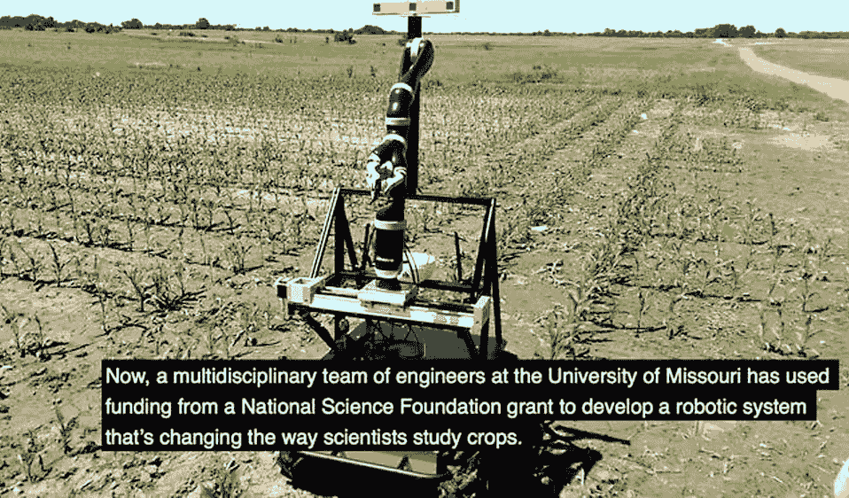
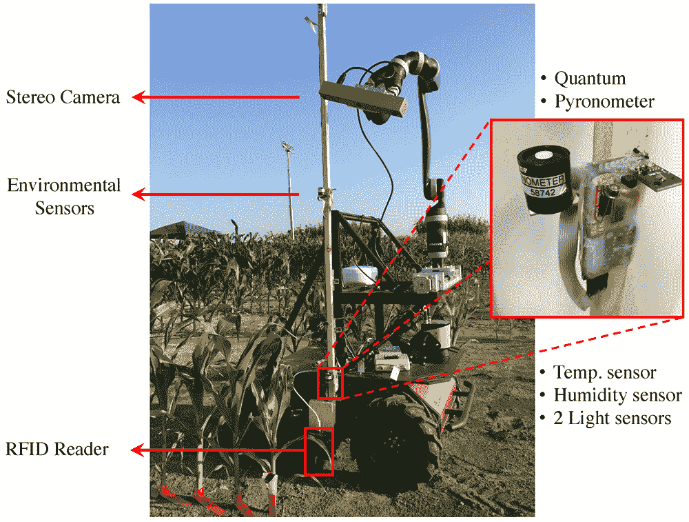
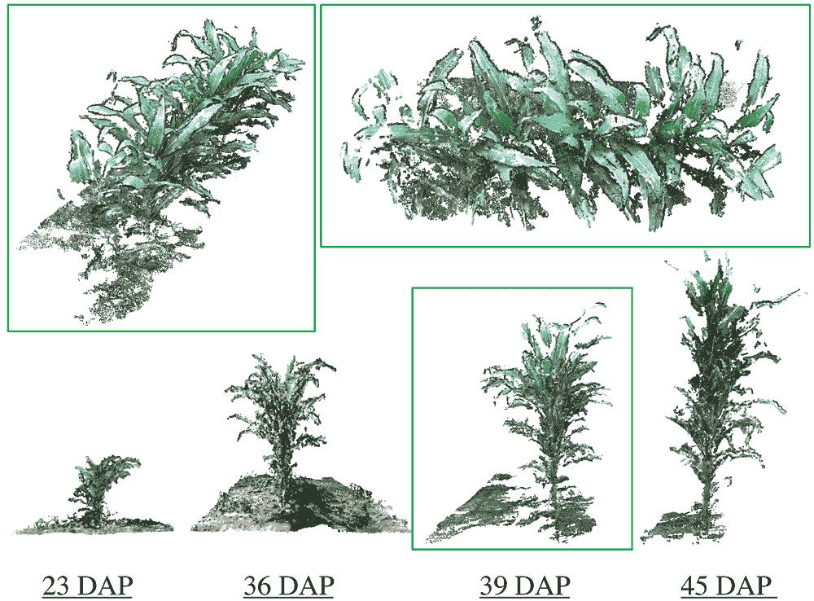

# 跟踪玉米的机器人可能会使我们在未来免于挨饿

> 原文：<https://thenewstack.io/corn-tracking-robot-may-save-us-starving-future/>

机器人能帮助我们摆脱全球气候变化导致的食物短缺吗？这很难说，但我们已经慢慢接受了在生活的几乎每个角落都有机器人的想法:工厂里有工业机器人，办公室里有 T2 协作机器人，甚至还有 T4 送货机器人。因此，机器人辅助农业的概念——或者至少是机器人辅助农业研究——并不是那么遥不可及。

怀着开发一种耐旱玉米品种的愿望，密苏里大学的研究人员正在使用一种自主机器人系统来研究玉米植物如何适应不断变化的气候条件，如气温升高或降雨量减少。观看这个玉米观察机器人的视频:

这个多学科团队由来自该大学[视觉引导和智能机器人](http://vigir.missouri.edu/) (ViGIR)实验室、[农业、食品和自然资源学院](https://cafnr.missouri.edu/)和非营利[丹佛斯植物科学中心](http://www.danforthcenter.org/)的研究人员组成。该团队的研究最近发表在期刊 *[Sensors](http://www.mdpi.com/1424-8220/17/1/214/htm)* 上，描述了自主机器人 Vinobot 和移动观察塔 Vinoculer 的开发，它们协同工作，从单个植物以及整个田地收集大量玉米生长数据。

与航空监控等传统数据收集方法相比，这种机器人平台的一大优势是可以全天候收集更多数据。研究人员还可以在舒适方便的实验室中启动系统并下载信息。借助配有 360 度机器人视觉系统的观察塔 Vinoculer，该团队可以确定该领域可能受到某些环境或生物压力影响的特定区域，并发送 Vinobot 进行近距离观察。

维诺博特

电气工程和计算机科学副教授、ViGIR 实验室负责人 Gui DeSouza 说:“从塔上获取的测量值可以提醒我们是否有任何植物处于压力之下，如高温或干旱。”。“然后，发射塔向移动机器人(我们称之为 Vinobot)发出信号，让它前往田地的特定区域，对单个植物进行数据收集。

Vinobot 有三组传感器和一个机械臂，可以收集玉米植株上三个不同高度的温度、湿度和光照强度。这被称为植物表型，它通过将这些与植物的生理和形状相关联来评估生长、发育、产量和项目，如对环境压力的耐受性和抗性。"

维诺博特

[表现型](https://en.wikipedia.org/wiki/Phenotype)是指在任何生物体内发现的可观察特征的组合，在这里是指植物，它们是其基因组成的表达，但会受到环境因素的影响，如温度变化或水位下降。通过监测这些环境因素以及它们如何影响植物的生长，研究人员能够利用这些信息潜在地开发更耐寒的主食作物品种，如玉米。

当然，这种选择性育种并不新鲜:农民在农业中已经实践了数千年，通常是通过缓慢的试错过程来逐渐增强植物的理想性状。但是，随着今天的数字工具和机器学习的结合，以帮助分析收集的大量数据，这个过程可以细化，变得更加有效。此外，像本研究中涵盖的自动化平台允许从一个工厂或一组工厂的选定部分收集信息，这是常规空中监测无法做到的。

对于 DeSouza 和他的同事来说，这种机器人平台的开发代表了早期专注于 3D 成像技术的研究的延伸。

“我一直在与 CAFNR 合作，协助他们进行实验，我们在实验室中帮助创建根系生长的 3D 图像，”DeSouza 说。“现在，我们正在创造机器人技术，以帮助创建田间玉米苗生长的图像。”

与其他自动化现场监控系统相比，Vinobot 平台有几大优势。与通常在温室等结构化环境中表现最佳的同类产品不同，Vinobot 和 Vinoculer 旨在收集更多的野外数据，同时最大限度地提高准确性。与新兴农业自动化行业中类似但昂贵得多的系统相比，该系统的架构还最大限度地减少了成本和停机时间。

虽然自动化正在成为仍有助于将人类与土地联系起来的最后几项活动之一，这看起来似乎有些矛盾，但开发更具弹性的粮食作物的真正紧迫性无疑将有助于强化机器人可能成为农业中必要工具的观点——至少目前如此。

图片:密苏里大学

<svg xmlns:xlink="http://www.w3.org/1999/xlink" viewBox="0 0 68 31" version="1.1"><title>Group</title> <desc>Created with Sketch.</desc></svg>