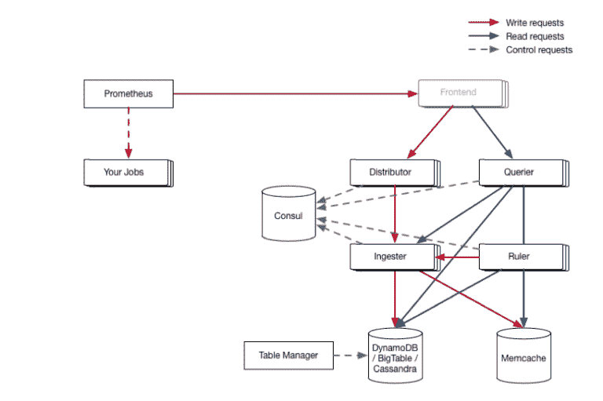

# Cortex:多客户端的有状态 Prometheus 监控

> 原文：<https://thenewstack.io/cortex-stateful-prometheus-monitoring-for-multiple-clients/>

虽然云原生社区中的许多人称赞 [Prometheus](https://prometheus.io/) 监控工具易于使用，但它并不是为了永久存储运营数据而设计的，也不能用于多个客户端。现在，来自 Weaveworks 的一个名为 [Cortex](https://github.com/weaveworks/cortex) 的项目将 Prometheus 打包以解决这一问题，为数据提供长期分布式存储，并为希望提供 Prometheus 即服务的服务提供商提供多租户服务。

上周，云原生计算基金会(CNCF) [将 Cortex](https://www.cncf.io/blog/2018/09/20/cncf-to-host-cortex-in-the-sandbox/) 纳入 CNCF 沙盒，这是早期阶段和不断发展的云原生项目的家园。

Weaveworks 最初开发 Cortex 是为了支持自己的商业云产品， [Weave Cloud](https://cloud.weave.works/login?next=%2Flogin%3Fnext%3D%252Finstances) 。Prometheus 是一个监控和警报工具包，用于[收集、显示和分析从 it 资源收集的](https://thenewstack.io/prometheus-2-0-bulks-local-storage/)时间序列数据。

最初，该公司通过 Kubernetes ReplicaSets 部署了多个 Prometheus 副本，尽管这种方法有许多局限性。“我们没有为长期储存做准备。如果普罗米修斯坠毁了，我们会丢失时间序列数据。如果我们升级普罗米修斯的版本，我们会丢失时间序列数据。如果我们改变我们的警报规则，我们将失去我们的时间序列数据，”Weaveworks 工程副总裁乔纳森·兰格在一篇博客文章中解释道。

Weaveworks 营销副总裁 Sonja Schweigert 说，Cortex 可以被视为提供“Prometheus 即服务”的一种方式。

Cortex 为 Prometheus 查询(使用 PromQL) 提供了完全兼容的 API，可供多个客户或业务部门针对各自的工作负载使用。它可以横向扩展，这意味着单个部署能够管理来自许多系统的成千上万的指标。这种方法避免了为每个客户维护一个单独的 Prometheus 副本的管理麻烦。

此外，与 Prometheus 本身不同，Cortex 通过定期捆绑性能样本并定期将它们写入分布式存储后端(如 DynamoDB、BigTable 或 Cassandra)来提供数据的长期保留，使用的方法受[亚马逊 Dynamo 架构](https://www.allthingsdistributed.com/files/amazon-dynamo-sosp2007.pdf)的启发。

除了 Weaveworks 本身，Grafana Labs、FreshTracks、EA 也使用 Cortex。

[https://www.youtube.com/embed/9Uctgnazfwk?feature=oembed](https://www.youtube.com/embed/9Uctgnazfwk?feature=oembed)

视频

云计算原生计算基金会是新堆栈的赞助商。

<svg xmlns:xlink="http://www.w3.org/1999/xlink" viewBox="0 0 68 31" version="1.1"><title>Group</title> <desc>Created with Sketch.</desc></svg>