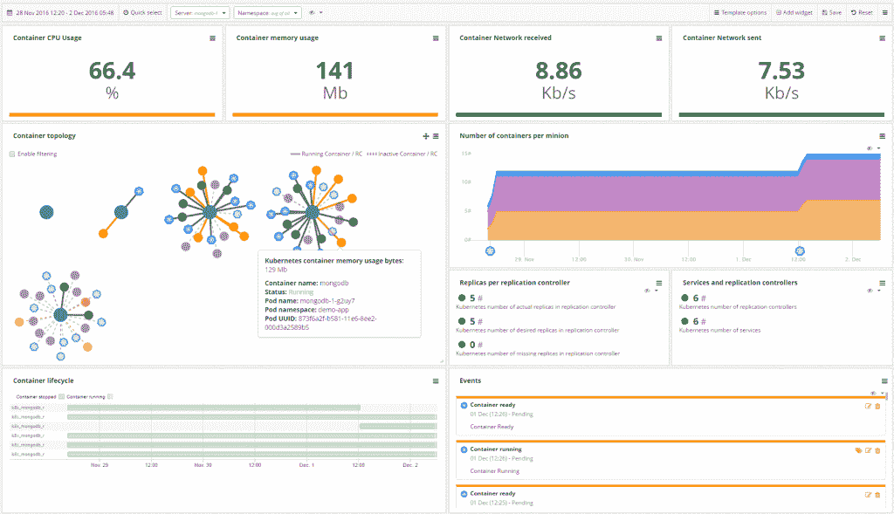
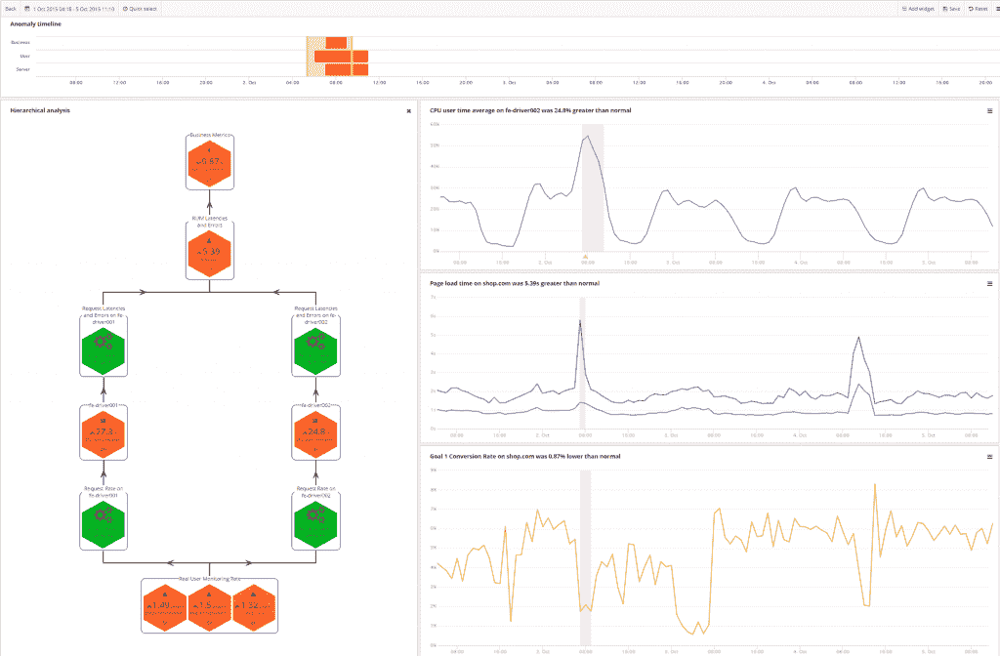

# CoScale 为容器和微服务提供全栈监控

> 原文：<https://thenewstack.io/coscale-offers-full-stack-monitoring-containers-microservices/>

“对于开发人员来说，[容器]是一项非常酷的技术——在很多方面都很容易。但对于运营工程师来说，要在他们的基础设施或云中支持和管理这些容器，就需要额外关注管理、流程编排、安全性、可用性和监控，”CoScale 的产品和营销经理 Peter Arijs 说。“这就是我们关注的焦点——当您迁移到这些容器环境时，提供正确的生产保证。”

[容器](https://thenewstack.io/containers-microservices-two-peas-devops-pod/)引入了额外的抽象层，打破了传统的监控工具，他说。如果您想要全栈可见性，您必须了解哪些容器正在运行，它们正在使用哪些资源，以及它们如何与特定服务相关联，这些服务在容器中的行为以及最终对最终用户的影响。

环境是动态的，容器来来去去都很快，这给检测这些容器带来了挑战。如何从他们那里获得相关的性能指标？如何设置有效的警报规则？

并且监控提供了来自每个主机的许多容器的大量数据。有不同的应用程序组件，每个组件都有自己的度量标准，这使得人类几乎无法处理这些组件。

CoScale 首席执行官 [Stijn Polfliet](https://twitter.com/spolfliet) 描述了在两个底层主机上运行 100 个容器的[集群有超过 10，000 个指标需要跟踪。](https://thenewstack.io/monitoring-reset-containers/)

[Russ McKendrick](https://twitter.com/russmckendrick) 在 New Stack 的《Docker 和 Container 生态系统》[电子书](https://thenewstack.io/identifying-collecting-container-data/)中详细介绍了一些新的监控方法，包括 IBM 的[无代理系统爬虫](https://github.com/cloudviz/agentless-system-crawler)；开源项目 [Prometheus](https://prometheus.io/) ，从主机上的数据点抓取数据；和 Dynatrace 的容器内代理。

CoScale Docker 监控。

根据 Arijs 的说法，一种流行的方法，在每个容器中放置一个代理，产生了太多的开销，破坏了不变性和在容器中只运行一个进程的概念。

相反，CoScale 使用一个用 Go 编写的轻量级代理，它可以在主机上或特权容器中自动识别容器中的图像，不仅可以与容器和编排平台的 API 对话，还可以为容器内运行的特定应用程序(如 Nginx 或 Reddis)启动插件。It 部门可以在此基础上增加一层来衡量性能对最终用户的影响。

当进行扩展以提供额外的上下文时，它与不同的容器编排器集成，如 Kubernetes 或 Docker Swarm 借助配置管理工具，如厨师、木偶和部署事件上的[盐栈](https://saltstack.com/)；还有电子商务追踪工具，如[、谷歌分析](https://www.google.com/analytics/)和 Magento。

## 秘密武器

CoScale 注重服务水平，但也注重抑制不必要的噪音。该软件使用[机器学习](/category/machine-learning/)，旨在自动检测异常以发出警报，并关联异常以提供关于环境的上下文。

“我们了解一项服务的正常行为，并根据历史数据预测今天的正常行为。我们使用的另一种异常检测是异常值检测。我们有几组行为相同的实例。如果一组容器是同一服务的一部分或者是执行相同功能的一组容器。我们需要一段学习时间，但我们结合不同的技术，以获得基于每个用例的最佳算法，”他说。

异常检测的可视化。

“我们从一般的异常检测技术开始，但我们发现我们必须在 CPU 使用等方面建立一些领域知识，以检测特定的模式，并将其纳入算法中。”

## 拥挤的场地

它加入了基础设施监控市场日益拥挤的领域。[大熊猫](https://bigpanda.io/)、 [Dynatrace](https://www.dynatrace.com/) 、 [IBM Bluemix](https://www.ibm.com/cloud-computing/bluemix/) 、 [Netsil](http://netsil.com/) 和 [SignalFx](https://signalfx.com/) 只是使用人工智能识别模式和检测异常的公司中的少数几家。Elastic 还通过收购 Prelert 增加了行为分析整合。

CoScale 成立于 2013 年，主要专注于欧洲市场。然而，它最近与马里兰州的咨询公司 Boxboat Technology 合作，以扩大其在美国的业务。该公司有 25 名员工。

最初只专注于工程，该公司最近一直在建立其合作伙伴生态系统，包括 Docker 和 Red Hat OpenShift，微软和惠普企业。

它的客户包括 SAP、约会网站 Twoo 和最近的英国政府。Arijs 表示，虽然其大多数客户使用容器中的微服务，但它也可以支持虚拟机上运行的微服务和容器中运行的单片应用程序。它提供本地和 SaaS 版本的软件。

“CoScale 在保持我们集装箱平台的积极服务水平方面发挥着至关重要的作用。我们评估了几种监控解决方案，但只有 CoScale 为我们提供了灵活性，将我们的技术和业务指标集成到一个工具中，使我们能够全面了解我们的运营情况，**[Maarten Verwaestm](https://twitter.com/maartenverwaest)数字视频制作网站 [Limecraft](http://limecraft.com/) 的首席执行官兼创始人。**

 **据数据中心和基础设施经理[游里·贝伦斯](https://www.linkedin.com/in/joeribeirens/)称，它将赌场和体育博彩网站 [Napoleon Games](https://www.napoleongames.be/) 的监控成本降低了 50%。

Arijs 说，展望未来，它的目光超越了性能原因的监控，包括调度，提高资源利用率和利用收集的数据来创建算法，以便在公司增长时提出提高效率的建议。

特征图片:[温度](https://www.flickr.com/photos/58881263@N02/10846891214/in/photolist-hwv9RL-n9gEnu-8BVV7U-6jsHt4-9qkqVu-dFLPQr-kDunTU-b7CkZt-tzFRo8-MSimHo-whMRf-Rmk4EC-4oJGPM-bjPyrz-iiye5P-6Gvfse-8sZyde-5NsUfd-7gJAnF-2bfx2E-8nVUN1-pcKw75-4vx2Mn-7brcN7-7uTPwg-qFYiJt-RnVg6N-eLQSDa-4ef71p-nouefQ-sCehLv-e2FZ1b-q4zepy-9mY6bv-wm3Qer-7kb3QT-4oxH9G-6owaBS-mJSzLD-F38Q7-65PYwT-s1jHGR-52dZ8X-hKwdXx-iTunwA-9KH2pC-8QZiUy-c4Ry4q-8ehnGD-hKwe8n)由[真理子加藤](https://www.flickr.com/photos/58881263@N02/)制作，授权于**CC BY-SA 2.0T19。**

<svg xmlns:xlink="http://www.w3.org/1999/xlink" viewBox="0 0 68 31" version="1.1"><title>Group</title> <desc>Created with Sketch.</desc></svg>**