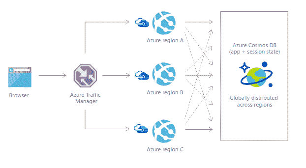

# Cosmos DB:微软 Azure 的一体化分布式数据库服务

> 原文：<https://thenewstack.io/cosmos-db/>

微软最近发布的 Cosmos DB 是一个全球分布的 NoSQL 数据库服务，它允许你选择和混合你最喜欢的数据模型和数据库 API，并且仍然获得标准事务数据库提供的一致性。

[Cosmos DB](https://azure.microsoft.com/en-us/services/cosmos-db/) 于今年早些时候在微软 Build 用户大会上首次亮相，是 Azure DocumentDB 服务的升级版，超越了该服务最初作为 JSON 文档存储的根基。

NoSQL 系统通常伸缩性很好，但是没有丰富的查询体验；数据库模式有丰富的查询选项，但是伸缩性不好。Cosmos DB 中数据模型和 API 的结合意味着您可以选择一个中间点，减轻处理模式的负担，但不会以查询为代价。

Cosmos DB 提供了一个全球分布式数据库，具有弹性规模、Pb 级存储、有保证的单数字毫秒级延迟，不需要模式或索引管理。它可以处理多种数据模型和数据 API，并提供多种一致性模型，为您提供一些全新的方法来构建分布式系统。

“SQL 服务器针对过去二十年的工作负载进行了读取和查询优化，但世界已经发生了变化，”微软杰出的工程师兼 Cosmos DB [Dharma Shukla](https://twitter.com/dharmashukla) 的创始人说道。“物联网”设备需要快速的数据传输速度；大量数据以高速率生成，您需要一个能够支持大量快速写入并仍能提供查询服务的引擎。”

云计算为全球分布式应用搭建了舞台。然而，许多组织将分布前端，但是将后端数据库留在一个位置。使用 Cosmos DB，数据与应用程序同步分发。

Cosmos DB 是增长最快的 Azure 服务之一，尽管微软不能说出一些使用它的最大客户的名字。微软对如何使用这项服务本身也有点谨慎，但所有微软的账单，包括所有的商店交易，都要经过它。

Cosmos DB 是为全球分布的关键任务应用程序而创建的。

## 任何模式、任何模型、任何 API

Cosmos DB 有一个写优化的、无闩锁的数据库引擎，具有自动索引功能。“我们可以让数据库始终保持同步，而且我们可以在全球范围内部署它，而不用担心模式版本；因为它是模式不可知的，所以没有模式版本，”Shukla 说。由于不需要考虑版本控制，开发者可以快速迭代他们的应用。

Cosmos DB 中的数据库引擎支持多种数据模型和 API。“没有数据是天生相关的，”微软 Cosmos DB 架构师 [Rimma Nehme](https://twitter.com/rimmanehme) 告诉我们；"不管它被创造成什么形状或结构，它生来就是肮脏和凌乱的."

DocumentDB 已经支持 JSON 文档、键值对、柱状和图形数据；DocumentDB APIs 包括 SQL 和 JavaScript 存储过程、用户定义的函数和事务。Cosmos DB 仍然支持所有这些 API 以及 MongoDB APIs。所以本地开发可以在 MongoDB 中完成，代码可以在 Cosmos DB 上运行。

Nehme 建议，未来的更新将增加对 Cassandra 的支持，也许还有亚马逊网络服务的 DynamoDB 和其他数据库存储。"我们对 API 或数据模型并不武断."

Shukla 告诉我们，相同的底层数据库引擎处理所有这些数据模型。“我们没有托管不同的数据库引擎(针对不同的模型)，而是创建了一个引擎，它是模式不可知的，是写优化的，可以支持多种数据模型，并且是 API 中立的。”

图形支持也是如此，它基于 [Apache TinkerPop](https://thenewstack.io/tinkerpop-growing-graph-database-popularity/) 。“图层非常一般化。Gremlin 是一种查询语言，但我们也将向 DocumentDB SQL 添加图形操作符，MongoDB 有图形操作符，因此我们将支持这些操作符。图形很有意思；物联网场景很多。微软内部围绕图形的势头很大，客户一直在要求它。”

NoSQL 不是唯一的可能性；Shukla 建议完整的 ANSI SQL 语法的“重要部分”也可以映射到 Cosmos DB 数据模型。

Cosmos DB 可用于物联网驱动的应用。

## 选择你的一致性

关于 Cosmos DB 令人兴奋的事情是它给你的一致性模型是真正新的。大多数用户要么选择强一致性，要么选择最终一致性；其他分布式数据库提供的标准模型，也是大多数 Cosmos DB 用户选择的模型。其余的人在这两个极端之间选择三种一致性模型中的一种:有界过时、会话和常量前缀。

Nehme 将这些选项描述为“一个滑块，允许 Cosmos DB 像关系数据库或 NoSQL 数据库一样工作。”

Nehme 说:“实现任何分布式系统都涉及到一方面它向用户提供的一致性程度，另一方面它的可用性和响应时间之间的权衡。一些客户需要足够的一致性，以至于他们愿意为此支付性能费用；另一个极端是 NoSQL 速度，但没有一致性保证。

有限陈旧性意味着读取可以落后于写入，但仅落后一个固定的量(以秒或操作数计),并且写入顺序是有保证的；这非常适合游戏或需要监控传感器并在出现读数问题时采取行动的情况。基于会话的一致性保证了会话中顺序的单调读写；延迟优于有限陈旧，但全局排序可能不是。

“如果您的设备具有本地缓存的数据，会话一致性可以在很大程度上解决在(网络)边缘拥有唯一数据的问题；当设备上线时，缓存必须进行聚合，”Shukla 解释道。对于使用该服务的开发人员来说，这是最受欢迎的模型。“会话之所以是最佳选择，是因为它支持所有这些场景，而无需您做出选择。”

最新的模型是一个一致的前缀，保证你不会得到差距。“如果你在一个版本接一个版本地操作一个记录，你就不会在这些版本中出现间隙。如果你看到一条记录的第一个版本，那么你会依次看到第二、第三和第四个版本；你不会看到第四版到来，然后又回到第一版，接着是第七版，”舒克拉解释道。“这是比最终一致性更严格的保证，但您可以获得高可用性和低延迟。”

Shukla 说，一致前缀“非常适合构建消息传递和排队系统”。

Cosmos DB 不是唯一具有可变一致性级别的分布式数据库服务。

[Google Spanner](https://cloud.google.com/spanner/) 最近增加了有界和精确陈旧，最大陈旧时间为一小时。然而，Spanner 的一致性模型目前仅覆盖一个地区。这将在 2017 年晚些时候增加到三个数据中心。相比之下，Azure 在其所有 38 个数据中心提供所有一致性模型。

根据微软的说法，Cosmos DB 是 Azure 中的一项“零环”服务，因此随着新的 Azure 区域的推出，Cosmos DB 将永远出现在可用服务的列表中。您可以从一个或多个区域开始，并且可以添加和删除您希望数据可用的区域，而无需任何停机时间。如果您受法规保护，您还可以使用策略将数据地理围栏到特定区域。

该团队使用图灵奖获得者[莱斯利·兰波特](http://www.lamport.org/)创造的 [TLA+规范语言](http://lamport.azurewebsites.net/tla/tla.html)来指定不同的一致性模型。

“一致性不再是理论上的东西；这是开发者面临的现实，”舒克拉指出。如果您的客户遍布世界各地，并且您想要快速的性能，您必须分布您的数据库，这意味着处理一致性。

Shukla 将为分布式数据存储定义这些一致性模型与关系数据库模型创建的编码隔离级别进行了比较；现在你知道你在做什么样的权衡了。他指出，“与强一致性相比，选择这三个中的任何一个都可以节省很多钱。”

Cosmos DB 可用于为应用程序添加个性化。

## 业绩和承诺

Cosmos DB 服务水平协议(SLA)对承诺的延迟、吞吐量和可用性进行了定价。Nehme 解释说:“开发人员需要可预测的性能来满足不可预测的需求。

SLA 表示，在同一个 Azure 区域中，从 Cosmos DB 读取 1KB 的时间不到 10ms，索引写入不到 15 ms——但这是最糟糕的情况，根据 Nehme 的说法，中间结果实际上分别不到 2ms 和 6ms，而且这是在静态数据加密的情况下。因为您可以将数据分布到多个区域，所以您可以在世界上任何需要的地方获得低延迟。将数据库分发到另一个 Azure 区域的 SLA 是 30 分钟，但是同样，数据移动比服务上的数据移动要快。

Cosmos DB 可以弹性地扩展存储空间(Shukla 称这是一个相对容易的问题，“因为表增长到 1pb 或删除数据需要时间”)和吞吐量。您可以在代码中更改每秒的事务数，或者根据一天中的时间设置不同区域的不同吞吐率。“处理延迟和吞吐量迫使您创建一个受资源控制的堆栈。这是一个非常困难的分布式系统问题。”

目前，Cosmos DB 按小时收费。但是如果你在发布一个新的在线服务或游戏的当天就为高峰使用做准备，你会想要更多的粒度，所以微软引入了每分钟请求单位。您可以选择希望数据库每分钟处理多少请求，如果请求超过了您设置的限制，Cosmos DB 不会放弃请求，而是从您的预算中借用一小时来处理突发事件。

除了这些 SLA 之外，还有手动和自动故障转移选项，因为要查看一致性是否有效，就要看当不可避免的网络故障发生并对数据库进行分区时会发生什么。当您在门户中创建 Cosmos DB 区域并用数据填充它们时，您可以设置不同区域的优先级，如果发生故障转移，它将遵循该顺序。

除了区域内和跨区域的本地持久化和复制，Cosmos DB 还进行定期备份；如果你不小心删除了数据，你可以联系 Azure 支持来恢复数据(有一个 API 可以让你自己恢复数据)。

通过 Pixabay 的特征图像。

<svg xmlns:xlink="http://www.w3.org/1999/xlink" viewBox="0 0 68 31" version="1.1"><title>Group</title> <desc>Created with Sketch.</desc></svg>