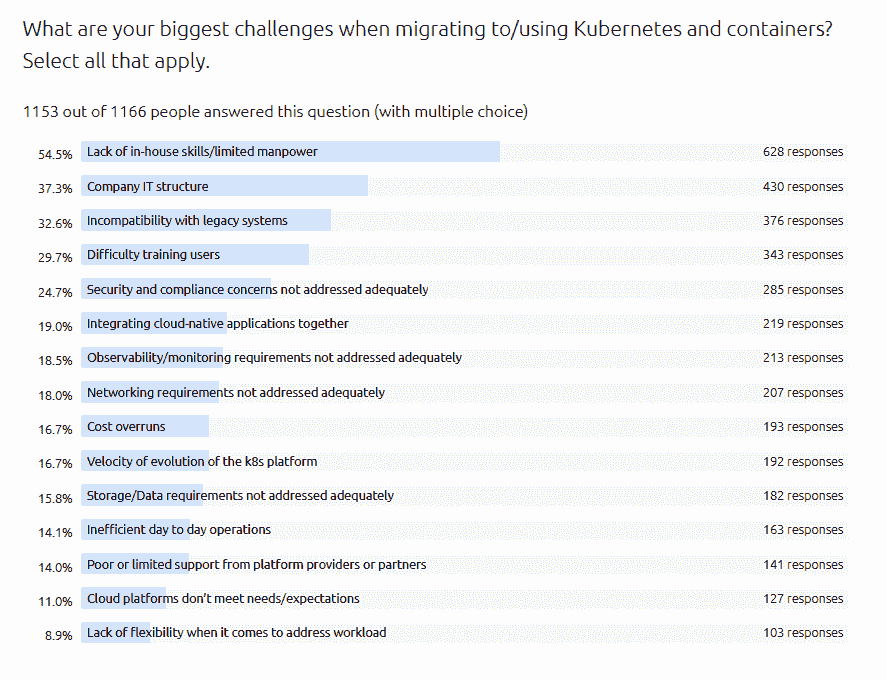

# 成本超支在 Kubernetes 和 Containers 的挑战列表中排名较低

> 原文：<https://thenewstack.io/cost-overruns-rank-low-on-list-of-challenges-for-kubernetes-and-containers/>

尽管您可能听说过，成本超支并不是管理 Kubernetes 部署的公司面临的最大问题。没有。根据最近一次典型调查的 1200 多名受访者，55%的研究人员认为他们在使用或迁移到 Kubernetes 和 containers 时面临的最大挑战之一是缺乏内部技能或人力有限。只有 17%的人提到成本超支。这有什么关系？

一份来自[云本地计算基金会](https://cncf.io/?utm_content=inline-mention)和 [FinOps 基金会](https://www.finops.org/introduction/what-is-finops/)的[报告](https://www.cncf.io/blog/2021/06/29/finops-for-kubernetes-insufficient-or-nonexistent-kubernetes-cost-monitoring-is-causing-overspend/)称，缺乏 Kubernetes 成本监控导致超支。超过 90%的成本来自计算或内存资源。此外，只有 24%的人根本不监控 Kubernetes 的支出，44%的人只依赖估算。然后它推断，用于监控 Kubernetes 支出的工具的低采用水平可以解释为什么只有 38%的受访者可以在 10%的误差范围内预测他们的每月云账单。

看看 [Canonical](https://canonical.com/) 调查，告诉我们你的想法。这似乎是我们所看到的库伯内特斯的真实写照。

来源:Canonical 的《2021 年 Kubernetes 和云原生运营报告》

<svg xmlns:xlink="http://www.w3.org/1999/xlink" viewBox="0 0 68 31" version="1.1"><title>Group</title> <desc>Created with Sketch.</desc></svg>