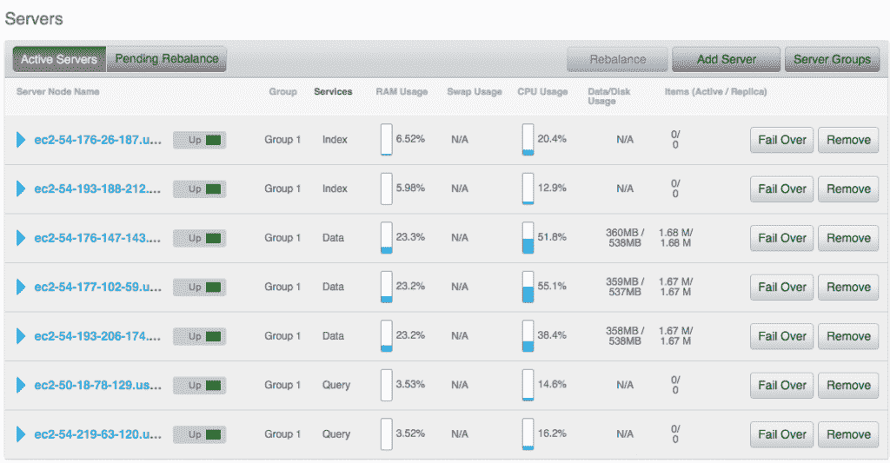
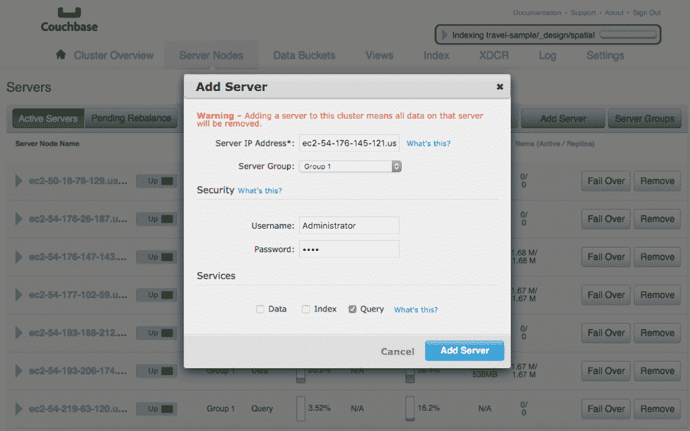
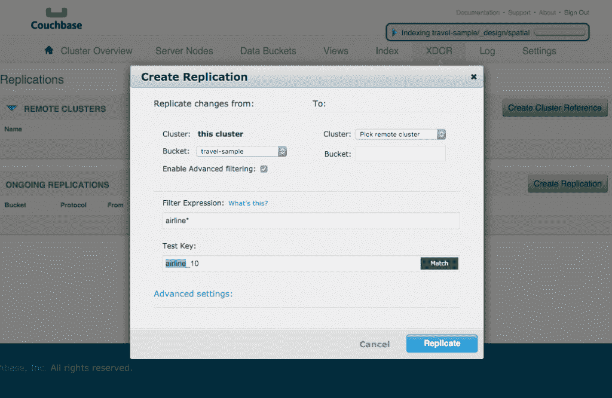

# Couchbase 4.0 有一种新的查询语言

> 原文：<https://thenewstack.io/couchbase-4-0-offers-new-technology-todays-database/>

随着应用程序开发的不断发展，数据库管理领域也在不断发展。MySQL 和 NoSQL 数据库在不断变化的软件开发世界中不断适应和发展，转向基于云的数据存储、更快、更有效的查询，以及不仅支持大规模运行的应用程序，还支持开发中的应用程序。

Couchbase 就是这样一个数据库，随着昨天上午 Couchbase 4.0 产品的发布，它改变了传统 NoSQL 数据库管理和操作的模式。Couchbase 是更流行的基于容器的 NoSQL 选项之一，它为敏捷开发团队提供了一个可靠的选项，尤其是那些在 OSS 和企业领域的团队。Couchbase 4.0 带来了三个功能集，帮助它从竞争中脱颖而出。

## 1.多维标度

Couchbase 4.0 带来了多维扩展，允许开发人员从运行数据库的系统中获得更多能力，即使该系统是基于 VM 或云的。典型的数据库执行三种功能:读写数据、建立索引和运行查询。每项功能都依赖单独的服务器资源来完成，每项功能对服务器硬件的要求都不同。读取或写入数据可能不需要太多的 CPU 资源，但使用 Couchbase 4.0，用户可以将内存放在专门为完成读取/写入而定制的机器上，因为这通常会大量读取内存。

Couchbase 多维扩展——在不同硬件上运行的单个服务以及每个服务的性能。

索引和查询都是 CPU 密集型的，需要多个内核同时运行，以便大规模高效处理数千个复杂的查询字符串。 Couchbase 4.0 消除了在同一台服务器上运行所有三个功能的需要，允许开发人员选择使用特定的机器来设置集群，以更高效地完成每个常见的数据库任务。通常，索引和查询会占用大量系统资源，这会影响读/写时间的性能。这是任何开发团队在使用他们的 NoSQL 数据库时都不想经历的事情。Couchbase 首席执行官 Bob Wiederhold 指出:

> 使用 Couchbase 4.0，您可以继续在相同的服务器上运行所有功能，但是您可以选择，例如，使用六台服务器进行读/写，而另外两台服务器运行索引，最后两台服务器运行查询

Couchbase 4.0 允许不同的服务器强调和突出 NoSQL 数据库的每个核心功能，使敏捷、快速的开发更加简单。例如，您可以设置更大的服务器来处理更多内核的查询。这使得开发人员可以灵活地配置他们的底层数据库结构，以支持他们的产品在开发、测试和生产中的需求。

## 2.新的查询语言 N1QL

N1QL 是 Couchbase 的新查询语言，它符合 sequel，迎合了不熟悉 sequel 的开发人员、分析师和数据安全团队的需求，以及那些过去使用过 sequel 的人的需求。N1QL 与 sequel 兼容将降低目前不在 NoSQL 工作的开发团队迁移到 NoSQL 数据库的障碍。在现代开发环境中运行 SQL 数据库极大地限制了一个团队，尤其是当一个团队专注于进入企业级时。NoSQL 能够获取在任何时候编写的动态模式，并在需要时将它们合并到现有的数据库中，并保留列为空白。SQL 在这方面仍然很严格，每个模式都需要精确的信息，每个列都需要完整的数据才能运行。

在运行时添加的服务器，分配了特定的工作负载。

N1QL 具有多种查询功能:它支持连接，这对于开发人员建模数据至关重要。连接意味着开发人员可以连接来自两个不同 JSON 文档的数据，而不是将所有数据放在一个文档中。在 NoSQL 圈里也有其他公司提供这种特殊功能，比如 PlayOrm 和 [Starcounter](http://www.starcounter.com/in-memory-application-platform/) 。两者都允许开发者在他们的文档中使用连接，PlayORM 支持其他数据库，如 [Cassandra](http://cassandra.apache.org/) 、 [MongoDB](https://www.mongodb.org/) 和 [HBase](http://hbase.apache.org/) 。

N1QL 也使用 JSON 中的嵌套和非嵌套来建模数据。这使开发人员能够使用数组和其他复杂的结构，尽管报告或业务工具需要以平面格式查看数据。您可以在报告之前取消嵌套数据，一旦报告了数据，它将嵌套在 N1QL 中。

## 3.跨数据中心复制

随着越来越多的公司在全球范围内开发软件，远程软件团队以及使用产品或服务的客户对数据中心的访问有着明显的需求。传统上，那些大规模工作的人通常会将数据中心靠近客户，以避免客户访问数据时的延迟问题。这通常是通过在团队遍布全球的数据库中心之间镜像数据来实现的。威德霍尔德还指出，

> 在某些情况下，可能无法镜像整个数据集，例如在公司无法跨境传输敏感数据的国家

在这种情况下，Couchbase 4.0 使用过滤器来屏蔽无法镜像或传输的数据部分，同时镜像那些可以镜像的部分。过滤有助于选择要镜像的数据，Couchbase 4.0 为其跨数据中心复制功能添加了使用过滤来确保数据被安全镜像或传输的能力。

跨数据中心复制过滤

Couchbase 的这些变化提供了一个独特的机会来突出 NoSQL 数据库管理的好处。随着当今企业和大规模应用程序需求的不断增长，许多公司已经从传统的 SQL 数据库方法迁移到 NoSQL 数据库方法。随着越来越多的技术转向基于容器的工作流，同时处理数千个集群，快速开发和高效存储大量客户数据的需求也在不断增长。

随着应用程序不断成为标准，基于容器的工作流程流水线转向满足这一需求，无论是在 OSS 中工作还是为私营部门公司工作。NoSQL 提供了传统 RDBMS 无法实现的可伸缩性、性能和易用性。关系数据库需要一套结构、工作流程和典型用法，而 NoSQL 是为了满足在敏捷 web 开发、物联网和移动环境中运营的团队的需求而创建的。NoSQL 是数据库管理团队的选择，他们希望以多种方式使用他们的数据，而不必改变他们的整个数据库。

Feature image: “[Scraping the Sky](https://www.flickr.com/photos/seeminglee/8720979546)” by [See-ming Lee 李思明](https://www.flickr.com/photos/seeminglee/) is licensed under [CC BY-SA 2.0](https://creativecommons.org/licenses/by-sa/2.0/).

<svg xmlns:xlink="http://www.w3.org/1999/xlink" viewBox="0 0 68 31" version="1.1"><title>Group</title> <desc>Created with Sketch.</desc></svg>