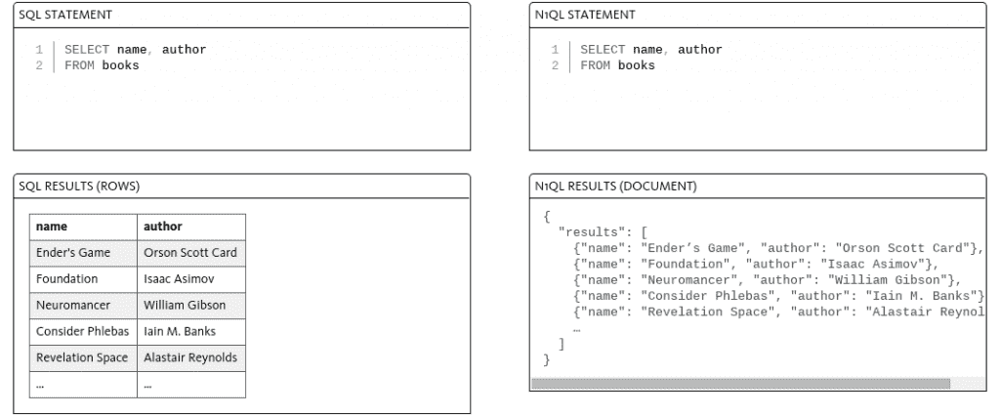
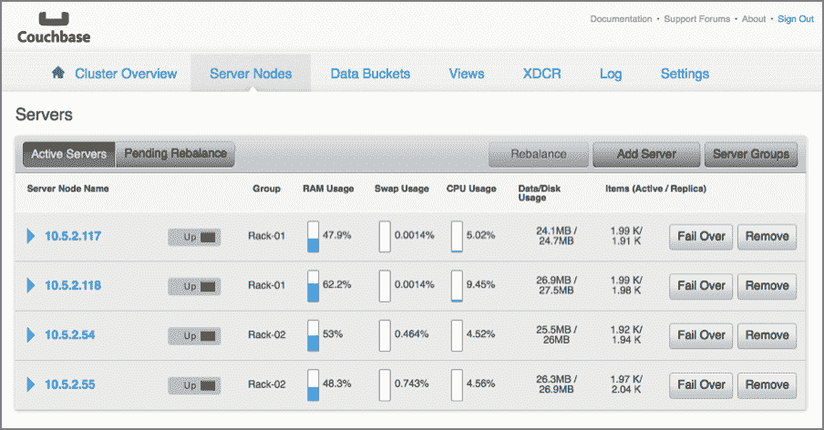

# Couchbase Server 4.1 面向企业采用 SQL

> 原文：<https://thenewstack.io/couchbase-server-4-1-shakes-sql/>

NoSQL 不是未来的科技。事实上，它已经存在了相当一段时间。作为标准 SQL 数据库的替代，NoSQL 由于其易于扩展而迅速成为新的标准。随着越来越多的公司开始开发依赖于海量数据收集的基于网络的应用程序，NoSQL 在一秒钟内解析成千上万个查询的敏捷性和灵活性可能意味着成功与失败的区别。

Couchbase 是 NoSQL 领域的众多参与者之一。该公司刚刚更新了其文档存储管理软件 [Couchbase 服务器](http://www.couchbase.com/nosql-databases/couchbase-server)。新发布的版本 4.1 对其查询语言进行了性能改进和增强，使其更适合企业市场。

## 真的有什么区别吗？

对于许多企业来说，从关系数据库向 NoSQL 的过渡迫在眉睫。然而，浏览各种可用的 NoSQL 平台并了解每个平台如何处理查询和操作会很快变得很麻烦。建立在传统 SQL 的基础上，NoSQL 的灵活性和易用性标志着数据库平台即服务(DBaaS)的兴起。

这导致了各种各样的查询语言被提供来更好地为这些数据库平台的用户服务，比如 [Couchbase 的 N1QL](http://www.couchbase.com/n1ql) 。其他选项包括[基于 ACID 的事务方法](http://searchsqlserver.techtarget.com/definition/ACID)，而 MarkLogic 使用 XQuery，MongoDB 利用 [CRUD](https://docs.mongodb.org/manual/crud/) 操作。

左图:SQL 查询与右图:N1QL 查询

利用 JSON 的力量是 NoSQL DBaaS 提供商脱颖而出的最重要方式之一。MongoDB 和 Couchbase 都使用 JSON 文档来扩展 SQL，使其超越传统的严格限制。

Couchbase 的 N1QL 是一种敏捷的声明式查询语言，它为企业提供了“在熟悉的 SQL 界面中开发应用程序的速度，同时获得了 NoSQL 的性能优势，”Couchbase 产品和工程高级副总裁 Ravi Mayuram 说。

Couchbase 4.1 现在支持 CRUD 以及传统的 SQL 特性，比如合并、插入和删除。MongoDB 也采用了这种方法，通过添加“严格模式”来扩展 JSON，允许 MongoDB 用户解析包含在 [JSON RFC](http://rfc7159.net/) 中的信息。由于 JSON 的结构与许多编程语言的数据结构非常相似，对于那些大规模开发基于浏览器的应用程序的人来说，拥有 JSON 的 NoSQL 数据库提供商是一个理想的选择。

## 把所有的放在一起

通过改善用户体验，Couchbase 进一步简化了其 Couchbase Server 4.1 产品，通过加快查询速度优化了性能。该平台的可扩展性和集群管理依赖于基础数据库技术。Couchbase 4.1 的系统编排和管理由 erlang 提供支持，而函数习惯用法用 C 编写，数据访问用 Go 编写。

该平台还为 SQL 数据库能够理解的标准接口提供了驱动程序，允许用户在从关系设置迁移时获得即插即用的体验。除了允许开发人员在 Spring 或他们首选的平台上工作之外，Couchbase 还为开发人员提供了使用他们最熟悉的语言进行编码的灵活性。

Couchbase Server 4.1 还提供 SDX 语言支持。我们的客户使用的主要语言是 Java，其次是。网络和节点。JS，”Mayuram 说。它还提供了对 Ruby、Rails 和 Go 的语言支持。为了进一步提高性能，Couchbase 引入了预处理语句，允许用户避免在遇到重复查询解析时经常遇到的瓶颈。

图为:Couchbase 服务器节点

对于那些考虑使用 NoSQL 数据库来更好地分析客户数据的人来说，Couchbase 与 Tableau、Looker 和 Informatica 等报告软件相结合。这些程序可以远程访问存储在 Couchbase 4.1 中的数据，或者用户可以选择将其存储在关系系统中。对于那些完全在云中或混合环境中工作的企业，许多数据库都可以在 Docker Hub 上作为映像使用，而企业也可以通过选择付费订阅模式将软件下载到他们的系统中。

无论用户选择部署和管理他们的 NoSQL 数据库解决方案，从关系数据库和僵化的数据结构中迁移的痛点现在都可能成为过去。

由[马特·本森](https://unsplash.com/mattgyver)通过 [Unsplash](https://unsplash.com/) 制作的专题图片，获得[知识共享协议 CC0](https://unsplash.com/license) 的许可。

<svg xmlns:xlink="http://www.w3.org/1999/xlink" viewBox="0 0 68 31" version="1.1"><title>Group</title> <desc>Created with Sketch.</desc></svg>