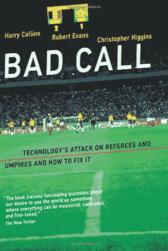
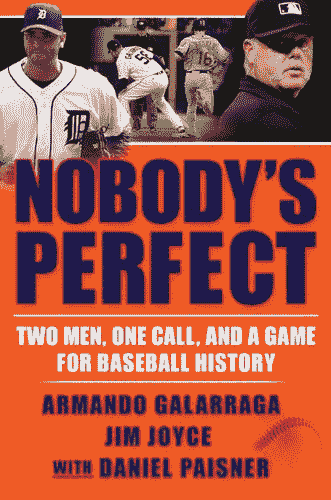

# 职业体育会转向机器人裁判吗？

> 原文：<https://thenewstack.io/could-professional-sports-switch-to-robot-referees/>

复杂的数据分析正在渗透到更多的人类活动中，甚至渗透到职业体育运动中。但是，当数据技术人员努力将人类运动转换成二进制决策树的度量时，一些酒吧哲学家已经在问，是否有技术不应该去的领域。

其中一个领域是裁判运动。

根据惠普企业博客上的一篇文章[，一些运动已经至少部分由技术来管理。自 2006 年以来，职业网球锦标赛一直通过一个人工智能系统输送高清视频，该系统可以对球是否出界做出有约束力的判断。“这项技术并不能辅助裁判。它*就是*裁判。”它的精确度在 3.6 毫米以内(不到四分之一英寸)。](https://www.hpe.com/us/en/insights/articles/kill-the-robot-ump-1806.html)

然而，人类仍然在网球比赛中做出其他裁决——例如，对你的对手大喊大叫是否越界成为干扰——并且*每项*运动都有一个人类官员必须判断球员意图的时刻*。“曲棍球运动员的碰撞是犯规还是越位？当篮球运动员盖帽的时候，她的胳膊伸得太长了吗？这个足球运动员是有意绊倒他的对手，还是他去捡球时不小心把他绊倒了？”*

 *最近的一本书《[糟糕的判断:技术对裁判和裁判员的攻击以及如何解决它](https://www.amazon.com/Bad-Call-Technologys-Referees-Technology/dp/0262534444/)》探讨了技术现在如何进入我们的其他运动——尽管它的三位作者仍然持怀疑态度。他们对板球比赛中使用的“轨迹估计器”没什么意见(轨迹估计器预测一个球在没有被击中的情况下应该走的路线)。但有些人也提出了足球的“球门线技术”，监测球是否完全进入球门。这本书的介绍认为这将对比赛结果产生最小的影响——而且它甚至不会开始解决每个赛季 100 多个糟糕的判罚。这表明有一个更简单的方法来改善游戏:让人类裁判审查视频回放。

然而，一些极客仍然期待有一天所有的体育裁判都是自动化的。

## 人类参与进来

但同样耐人寻味的是那些持不同意见的人的观点。“体育是一项人类活动，”威尔士卡迪夫大学 72 岁的社会科学教授哈里·柯林斯说，他是《错误的决定》一书的合著者。他在惠普企业博客上分享了自己的个人哲学。“人类是不完美的；没关系。每个人都知道有时候裁判会犯错。几百年来都是这样。”

在这本书的导言中，柯林斯记得和他的孩子一起观看了一场足球比赛，利物浦击败了曼城，赢得了梦寐以求的英超冠军，多亏了没有吹的点球。“我们用不正当的手段赢了比赛，我们会难过吗？不——我们在欢呼！首先，因为足球迷喜欢以任何方式取胜。但更重要的是，因为这抵消了赛季初发生的事情…我们在这种情况下看到的是机会给了我们正义…

“就像他们说的，‘最终都会达到平衡。’"

当这些机器出现在全美棒球运动中时会发生什么？据美国职业棒球大联盟(MLB)的专员罗布·曼弗雷德说，本垒板后面的机器人裁判员现在是一种现实的可能性。“我认为我们比一年前更接近于拥有实际呼叫攻击区的技术能力……”他[在五月](https://theathletic.com/373342/2018/05/30/in-an-exclusive-qa-commissioner-rob-manfred-discusses-pace-of-play-expansion-betting-sorry-pete-and-more/)告诉大西洋体育博客。“准确度大大提高了，比一年前好得多。技术在继续发展……而且实际上比我想象的要快一点。”

在 2017 年美联社体育编辑会议上，曼弗雷德[承认](https://www.sporttechie.com/robot-umpires-advocated-chicago-cubs-ben-zobrist/)这只是时间问题。“迟早，我们将拥有足够准确和快速的技术来呼叫计算机化的打击区域。”

虽然即使在 2017 年，他还是[加了一个警告](http://www.chicagotribune.com/sports/columnists/ct-rosenthal-sports-media-commissioners-spt-0721-20170720-column.html)。“在这一点上，你必须问自己一个问题，是否要把人的因素从游戏中剔除，用一台机器取而代之。”

2006 年，每个 MLB 体育场都配备了一个名为 PITCHf/x 的基于摄像机的系统来观察投球——不仅仅是计算它们是否是球和好球(精确度在半英寸之内),还可以观察它们的速度和方向。这些信息实时显示在 [MLB](https://www.mlb.com/) 的网站上，在“GameDay”网络广播中播放详细的游戏信息。但这些信息没有提供给官员；只对粉丝。

所以球迷们现在可以对裁判大喊大叫，同时用数据来支持他们的异议。

“很快有一天，你将能够说某些裁判的确很差劲，”Slate 打趣道。“哪个裁判比其他人更差劲。一般来说，如果他们个子高，吮吸就少一些。”

https://Twitter . com/drive line bases/status/877045973901496322

但是我们能信任我们的机器吗？去年，MLB 引进了一种叫做 Statcast 的新系统，它使用摄像机和雷达完成了同样的壮举。“理论上，Statcast 是一个不可思议的飞跃，”棒球专栏作家[在 fivethirtyeeight](https://fivethirtyeight.com/features/baseballs-new-pitch-tracking-system-is-just-a-bit-outside/)写道，并补充道，“当它起作用时，它是惊人的。但到目前为止，它一直在努力测量 PITCHf/x 已经掌握的投球基本要素……”

他们采访了凯尔·博迪(Kyle Boddy)，他是一个名为 Driveline Baseball 的数据驱动球员发展计划的创始人，他记得美国职业棒球大联盟是如何利用协作来微调 PITCHf/x 的。“这些数据是开源的，需要来自公共领域的大量工作来按摩和纠正。”博客作者戴夫·卡梅隆甚至用比赛日的数据来解释为什么西雅图水手队的投手菲利克斯·埃尔南德斯在比赛初期放弃了这么多分。根据[Slate](http://www.slate.com/articles/sports/sports_nut/2007/08/baseballs_particle_accelerator.html)上一篇关于卡梅隆传奇博客帖子的文章，赫尔南德斯在比赛开始时显然投了太多快速球。”教练打印出帖子，递给埃尔南德斯。下一次出局时，投手投出了快速球，并投出了八局未得分球。”

去年，found FiveThirtyEight 抱怨说，在新系统下，MLB“现在很少提供有关 Statcast 内部运作的细节”

随着时间的流逝，人类棒球官员做出了另一个让步。2014 年,[MLB 游戏增加了一条新规则](https://en.wikipedia.org/wiki/Instant_replay_in_Major_League_Baseball#Changes_for_2014),允许管理者挑战每场游戏的有限次数，之后将从所有可用的摄像机角度进行审查。如果没有别的，这可以让裁判们免受做出一个真正糟糕的判罚的痛苦。

这不是假设的情况。2010 年，裁判 Jim Joyce [含泪道歉](https://www.youtube.com/watch?v=-XpFzDGYh8o)，因为他在第九局错误地裁定一名跑垒员在第一回合是安全的——从而剥夺了 28 岁的投手 Armando Galarraga 宝贵的最后出局机会，否则他将会给[在美国职业棒球大联盟历史上第 21 场“完美比赛”](https://www.youtube.com/watch?v=eddsu-YjPyk%20)。这位年轻的投手跑向第一位以进入决赛，但裁判[裁定跑垒员安全](http://content.usatoday.com/communities/dailypitch/post/2010/06/detroits-armando-galarraga-3-outs-from-another-perfect-game/1)——后来当他观看录像回放时认识到自己的错误。

但在体育运动中最真实的人性时刻之一，投手加拉亚加优雅地原谅了裁判乔伊斯，说可怜的裁判“可能比我感觉更糟”。没有人是完美的。每个人都是人。我明白。”加拉亚加和乔伊斯甚至[联手写了一本 257 页的书](https://www.amazon.com/Nobodys-Perfect-Call-Baseball-History-ebook/dp/B0051QH32G/)。

人类对加拉亚加的记忆让这个故事变得真实。Galarraga 透露，他真的认为裁判在开玩笑。“我亲眼知道我刚才看到了什么。不仅仅是我的眼睛。我听着就知道。我知道我的脚何时触底。我知道击球手何时触垒。我能感觉到这些事情，因为我是其中的一部分……”

当面对更大的事情时，裁判的召唤消失了:Galarraga 玩游戏的快乐。“我对我的投球方式太满意了，我一直到比赛结束都没有让克利夫兰的击球手上垒。这是一个如此快乐的时刻，没有什么能让我悲伤。这是一个完美的，完美的游戏，我意识到没有什么可以改变这个完美的，完美的游戏的真相。我后来告诉人们，他们不相信我…我心里知道，我现在已经完成了我的完美游戏。当我的脚触到一垒时，我知道这一点。

“这是要和我父亲分享的东西。这是要告诉我的孩子和孙子的事情。这是委内瑞拉人民将永远铭记的事情。”

Galarraga 承认很难专注于下一个击球手。“我在想，我有很多幸福，有很多理由去微笑。我太高兴了，所以我不能太悲伤…

“我在想，阿曼多，如果你继续像这样投球，会有更多机会打出完美的比赛…

* * *

## WebReduce

<svg xmlns:xlink="http://www.w3.org/1999/xlink" viewBox="0 0 68 31" version="1.1"><title>Group</title> <desc>Created with Sketch.</desc></svg>*