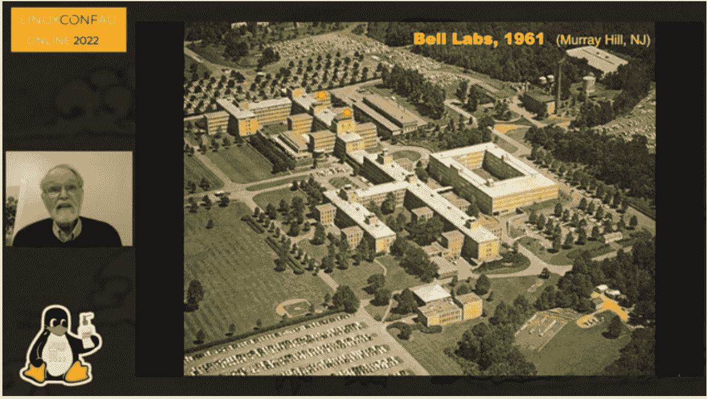
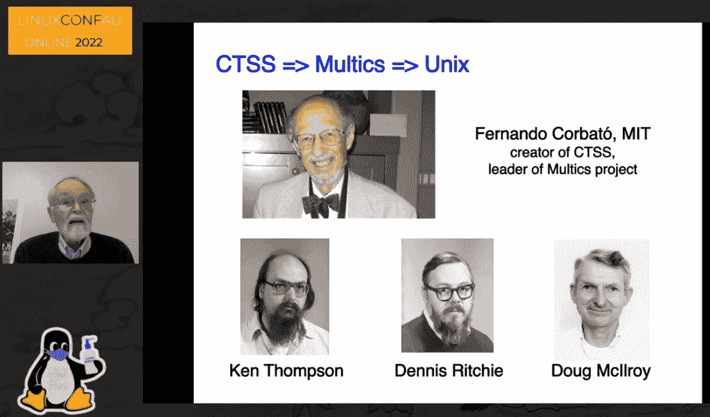
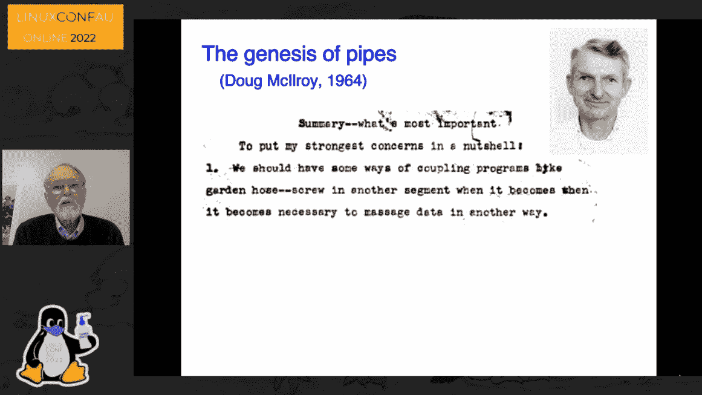

# Unix 今天会实现吗？布莱恩·柯尼根回头看...向前

> 原文：<https://thenewstack.io/could-unix-happen-today-brian-kernighan-looks-back-and-forward/>

随着受人爱戴的 Unix 先驱 Brian Kernighan 接近他的 80 岁生日，他在今年的澳大利亚 Linux 大会上特别露面。在一月份的传统活动上——实际上是连续第二年举行——Kernighan 回忆了 20 世纪 70 年代和“贝尔实验室 Unix 的早期”，总是小心翼翼地承认其他人以及在他之前的开发人员的贡献。

Kernighan 还利用这个机会反思了从 Unix 操作系统的历史、从 C 编程语言、甚至从微软对 Unix 的入侵中应该吸取的教训——最终提出了一个尖锐的问题:类似 Unix 的现象是否会再次发生。

最后，Kernighan 还展望了未来，并表示真诚地希望这次谈话可以“或许教会我们一些如何有效地进行软件开发的事情，或许教会我们如何管理人员和过程，以使他们尽可能地富有成效。”

[https://www.youtube.com/embed/ECCr_KFl41E?feature=oembed](https://www.youtube.com/embed/ECCr_KFl41E?feature=oembed)

视频

## 令人鼓舞的研究

根据会议主席 Miles Goodhew 对他的讲话的简要介绍，年轻的 Brian Kernighan 于 1969 年从普林斯顿获得了博士学位，然后在贝尔实验室传奇的计算科学研究中心工作到 2000 年。Goodhew 开玩笑说 Kernighan 现在是普林斯顿的计算机科学教授，“在那里他写短程序和长书。”

Kernighan 开始他的演讲时列举了一些实验室最重要的发明——晶体管、激光光纤——并指出该实验室至少有八位诺贝尔奖获得者。(或者多达 12 个，“看你怎么数了。”)

红点显示的是二号楼，大部分计算科学研究中心(包括 Kernighan)的办公室都在五楼。下点:Kernighan 1967 年实习办公室。上点:1968-2000。

实验室有一个有利于研究的环境。“人们会聚集在走廊里谈论想法，”Kernighan 曾在 2018 年告诉采访者[。"人们会在午餐时见面，谈论类似的事情。"这最终导致了有用但也出乎意料的发展。虽然 Unix 的第一个版本是用汇编语言编写的，但到第四个版本时，丹尼斯·里奇已经开发出了更易读的“高级”语言 C——并用它来编写整个操作系统的代码。](https://www.youtube.com/watch?v=QFK6RG47bww&list=PLzH6n4zXuckqZ90zLyy36qjO5YIn1RulG)

这是一个教训。Kernighan 告诉他的观众，Ritchie 正在利用他在早期操作系统 MULTICS 上的经验，MULTICS 是由贝尔实验室、通用电气和麻省理工学院共同开发的。

Unix 的几个重要特征——不仅仅是它的分层文件系统和可编程外壳，还有它是用一种易读的“高级”语言编写的这一事实——可以说来自于 MULTICS。Unix 并不是凭空出现的。MULTICS 有大量的好想法，并很好地展示了其中一些想法的可行性，这些想法在某些方面经过简单的改编和简化，也可以在 Unix 中使用。”

另一方面，Unix 的“管道”特性——使用一个程序的输出作为另一个程序的输入的能力——似乎是 Unix 独有的，并最终将操作系统引向一组强大的工具(以及 Unix 对正则表达式模式匹配的支持)。所以该表扬就表扬。

Kernighan 的一张幻灯片将 Unix 描述为“骑在摩尔定律的曲线上”，他指出，硬件越来越便宜的持续周期也为 Unix 操作系统创造了一个天然的受众。所以“技术进步助长了大量的这种现象。”

最终，Unix 流行的一个关键因素是它的易移植性——这最终通过 Ritchie 的高级语言成为可能。C 语言导致了 Kernighan 所记得的“应用程序的爆炸”，包括与语言相关的工具，如编译器 yacc 和 lex。至关重要的是，它还被用于斯蒂夫·约翰森的 pcc“可移植 C 编译器”，Kernighan 记得这个工具“导致了操作系统本身的可移植性”因为如果一个新系统可以运行 C 编译器，假设它可以编译 Unix 操作系统。

> Unix”不是计划中的。这是一大堆因素的偶然组合！”

除此之外，正是这种操作系统的可移植性——及其所有有用的工具——导致它在新兴市场上被 Sun Microsystems 和 MIPS(后来成为 SGI)等公司用于商业工作站。

Kernighan 回忆道，事实上，在 20 世纪 80 年代早期，可移植性最终将 Unix 一路带到了 IBM 个人电脑上，甚至一家名为微软的年轻公司也有了自己的 Unix 版本，名为 Xenix。在 20 世纪 80 年代的一段时间里，“微软是 Unix 操作系统的最大经销商”。

“我一直在想，如果微软没有退出 DOS，而是推出 Unix，世界会变成什么样？谁知道会发生什么？”

## 曾经和未来的 Unix

Kernighan 的下一张幻灯片题为“剩下的都是历史”，引用了[声称](https://hostingtribunal.com/blog/linux-statistics/)世界 500 强超级计算机中的 100%、前 25 强网站中的 23 个、世界前 100 万服务器中的 96.3%以及所有云基础设施中的 90%都使用了 Linux。

但是可以说更有趣的是*如何*发生的。Kernighan 强调，回顾早期，Unix“不是计划中的。这是一大堆因素的偶然组合！”

在他列出的因素中，排在首位的是“两个极具创造力的人”，肯·汤普森和丹尼斯·里奇。Kernighan 特别承认他们作为开发人员的“特别好的品味”,发现“最小”的机制仍然干净利落地完成了很多工作。(柯尼根后来称赞他们“找到共性”的能力。)

他补充说，贝尔实验室还提供了“各种方式的良好支持”，称赞其管理层，他记得是“技术人才，通常非常非常友好”。它不是，'这是你必须做的，每个季度告诉我们你做了什么。'这更像是，'哦，天啊，你在这么做？听起来真的很有趣！为什么不坚持做下去，只要好看。"

或者，正如 Kernighan 在 2018 年对一位采访者[说的，“这是一个奇妙的地方，因为有大量真正优秀的人在做真正有趣的事情，没有人告诉你该做什么……”当他回顾 Unix 的 50 年时，Kernighan 回忆说贝尔实验室“特别适合这种事情”但他也记得这是他今天不常看到的东西。"环境本身是不可思议的，合作的，学院式的，充满乐趣."](https://youtu.be/QFK6RG47bww?list=PLzH6n4zXuckqZ90zLyy36qjO5YIn1RulG)

这就引出了 Kernighan 的最后一张幻灯片，他问道:Unix 会再次发生吗？

理由是:“首先，显然总有好人……”此外，克尼根补充道，“尽管有呆伯特漫画，但也有好的管理者。”他认为今天的硬件“非常便宜”，而且还有很多免费的开源软件。

但是 Kernighan 也看到了另一种类似 Unix 现象的可能性。“在这种无拘无束的环境中，人们不再被束缚，不再被告知去做他们想做的有趣或有用的事情。在工业界很难做到这一点，因为事情往往是短期的。在大学里很难做到这一点，因为——钱。但原则上，它可能会再次发生——因为某些原因。”

然后 Kernighan 引用已故的 Dennis Ritchie 的一段优美的话来结束他的演讲，他在 1984 年说 Unix 不仅仅是为了建立一个良好的编程环境，“而是一个可以围绕其形成友谊的系统”。我们从经验中知道，公共计算的本质[……]不仅仅是在终端而不是在键盘上输入程序，而是鼓励密切的交流。”

Kernighan 将这种希望总结为提供一个社区，“一个开发软件的温暖和受欢迎的地方”，记得在 Unix 的早期，人们“喜欢他们的工作，他们喜欢与他们一起工作的人”，创造了一种良性循环，为每个人带来了一个富有成效的环境。

“所以我认为我们今天想做的是同样的事情，我们有社区意识，我们一起努力，尝试做一些事情，以某种方式让世界变得更好。”

<svg xmlns:xlink="http://www.w3.org/1999/xlink" viewBox="0 0 68 31" version="1.1"><title>Group</title> <desc>Created with Sketch.</desc></svg>