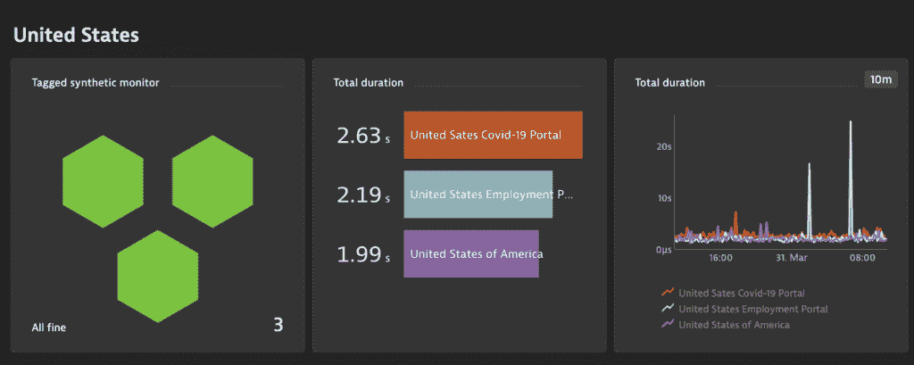
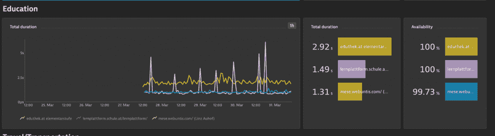
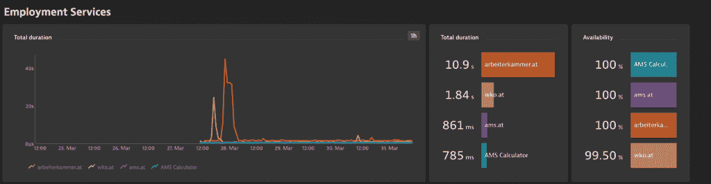
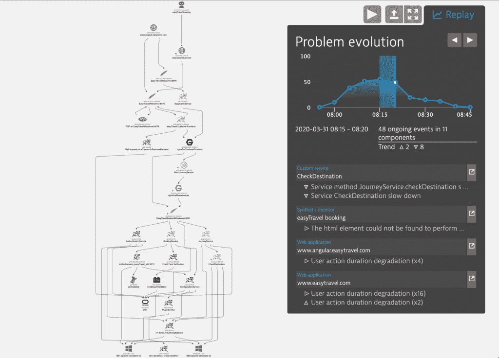
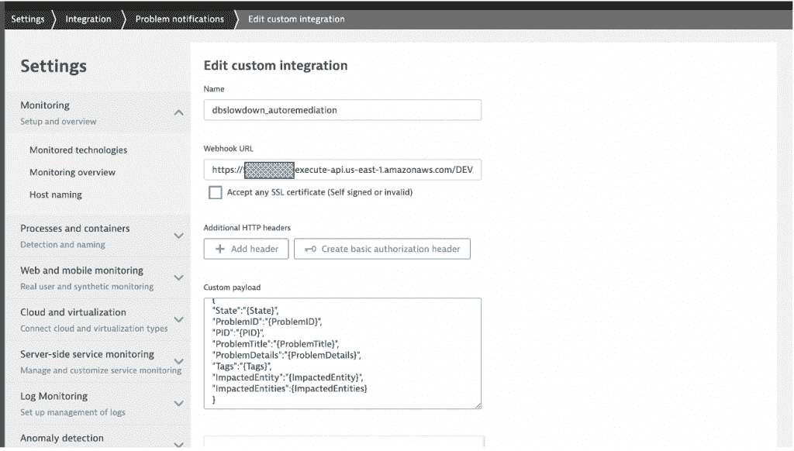
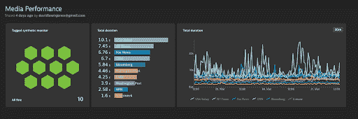

# 新冠肺炎和数字服务:意外事件的行动计划

> 原文：<https://thenewstack.io/covid-19-and-digital-services-an-action-plan-for-the-unexpected/>

[Dynatrace](https://www.dynatrace.com/) 赞助了这篇文章。

 [阿洛伊斯·赖特鲍尔

Alois 是 Dynatrace 的副总裁兼首席技术策略师。凭借在应用性能管理、技术联盟、SaaS 和产品管理方面多年的专业知识，Alois 是 Dynatrace 技术、服务和解决方案的热情传播者。他专门从事早期产品创新、新技术解决方案的业务验证，以及与应用架构师、工程师和客户一起制定战略。](https://www.linkedin.com/in/aloisreitbauer/) 

新冠肺炎疫情的影响之一是以前所未有的规模走向数字服务。一些企业正试图通过转向在线活动来弥补失去的收入来源。其他组织也在争先恐后地支持在线用户的大幅增长。所有这些都给 IT 系统和应用程序带来了很大的压力。

虽然大多数政府机构和商业企业都部署了数字服务，但当前的使用量(包括关键就业、医疗和零售/电子商务服务的流量)已经达到了许多组织从未见过或测试过的水平。

组织需要为预期的和意外的需求做好准备，不仅为他们的客户和用户今天所依赖的服务做好准备，也为明天所开发的服务做好准备。

有一些行之有效的策略可以解决这个问题。在本文中，我将分享一些最佳实践，以帮助您了解当前的情况并在当前的情况下生存下来，同时也为您的应用程序和基础架构在未来几个月或几年内可能出现的类似情况提供未来证明。

## 步骤 1:了解流量模式和潜在峰值；移除团队孤岛

黑色星期五期间，电子商务网站的负载量说明了流量峰值的影响。短时间内用户的大量涌入会使系统开始变慢，然后可能会返回错误。零售网站通常为这些高峰做好了充分准备，因为它们知道高峰何时到来。其他网站，包括电子学习服务，也经历了季节性或基于时间的使用模式，他们可以做好准备(见图 1)。

然而，许多网站最近在新冠肺炎爆发时经历的情况是前所未有的——大量、突然的流量爆发，没有明确的模式，也不知道下一次爆发将在何时发生。例如，政府就业门户网站的流量高峰有时是由与 COVID 相关的新闻公告引起的(图 2)。

图 1:教育网站上网页的总加载时间峰值与定期增加的用户活动相关。

图 2:美国就业门户网站中流量激增对响应时间的影响。

对于组织来说，领先于潮流的最佳方式是重新思考其 IT 团队的结构，这样他们才不会因在线活动的突然和意外激增而措手不及。吸取过去的经验并整合未来事件的数据有助于确保您的团队不会再次遭遇类似的意外。实现这一点需要组织中的业务和技术团队步调一致；沟通、协调并为可能发生的事情做准备。我们称之为 [BizDevOps](https://www.dynatrace.com/solutions/bizdevops/) 战略。

为了支持 BizDevOps，组织必须在团队之间建立更紧密的协作。他们必须建立以最终用户数据为中心的集成通信方法。根据需要，团队应该要求每天召开会议或站立会议来回顾前一天发生的事情，为当天做计划，并展望接下来的日子。每个人都在看同样的数据，朝着共同的目标努力会更容易。由于每个人都在同一个页面上，当意外发生时，组织准备好快速行动——比如说，由疫情引起的在线活动的突然激增。

## 第二步:了解要准备什么

仅仅看到或预测交通高峰并不能解决问题。您的系统仍将超负荷运行，问题将继续影响您的用户。下一步是了解你的系统什么时候会崩溃。

如图 3 中的仪表板示例所示，历史使用模式不能满足这个目的。这个仪表板反映了 2020 年 3 月下旬奥地利经济商会网站的流量，从人们开始提交与新冠肺炎有关的政府财政支持请求时开始。网站经理知道这一事件即将发生，但他们没有为随之而来的巨大流量做好准备。

图 3:由于流量激增，奥地利商会和工人协会网站的总加载时间增加。

那么你怎么知道要准备什么呢？

由于数字时代的情况无法与当前的疫情相比，这可能很难评估。但通常最好的策略是进行压力测试。要做到这一点，只需增加基础设施的流量，直到您开始看到对响应时间或其他错误的负面影响。

理想情况下，您将拥有一个专用的环境。如果不是这样，那么在对用户的影响最小的时候，对您的实际系统进行测试。

一旦你知道了你的系统所能处理的极限，你就为下一步做好了准备。

## 第三步:理解系统崩溃的原因

仅仅知道系统何时崩溃并不能帮助你为用户提供更好的服务。根据您运行的系统类型，修复可能不明显。这可能像添加新服务器一样简单，也可能像更改特定应用程序行为一样复杂，比如从动态内容切换到静态内容，或者在高负载下禁用某些功能。

一旦您开始达到压力测试确定的临界点(步骤 2)，利用自动化根本原因分析(参见图 4)来确定哪些组件损坏以及它们损坏的确切原因*。这将使你的团队找到解决问题的方法。*

图 4:使用基于人工智能的分析对问题的根本原因进行自动化分析。

## 步骤 4:实时验证修复

一旦您理解了问题的根本原因，您将需要您的团队进行修复，这些修复也可以快速部署到您的实际环境中。因此，必须实时监控这些修复对系统整体健康状况的影响。有时，在一个地方修复问题会导致在其他地方出现问题，这可能意味着您需要回滚修复或者修复它导致的任何新问题。

不过，重要的是一次只专注于解决一个问题，并验证这些修复的效果。团队应该修复小的、原子的问题，并根据需要将它们结合在一起，而不是试图修复涉及许多相互依赖的复杂过程。

## 步骤 5:自动化修复并使其可重复

完成第 4 步后，您将有一个可以单独应用的小修复列表。你可能会想写下如何执行它们。文档是好的。然而，可重复的实现要好得多。

在脚本中提供修复有好处，尤其是当您需要对意外情况做出快速反应时。首先，任何人都可以立即运行它们，无需了解任何细节。运行自动化脚本总是比手动执行这些步骤要快得多。它也更不容易出错。

## 步骤 6:自动化工作流程

到目前为止，所有步骤都需要有人来积极推动该过程。虽然这在工作时间可能行得通，但它不能让你为正常工作时间之外的意外事件做好准备。

幸运的是，在这一点上，您已经具备了自动化流程并向我们称之为 NoOps 的方向前进所需的所有要素。本质上，这意味着不需要手动操作任务来执行明确定义的操作步骤。

在这一步中，我们将根本原因分析与适当的补救措施联系起来(参见图 5)。有了这一点，就可以根据需要自动触发动作。

图 5:根据检测到的问题自动调用补救措施来解决问题。

您可能想知道为什么不总是让您的系统达到最大容量，或者启用所有的补救功能和步骤。

首先，运营基础设施需要资金。如上图(图 5)所示，许多站点都面临非常短暂的容量短缺高峰——通常在半小时到一小时之间。一直满负荷运转会导致不合理的高成本。

第二，缓解行动不是免费的。一些缓解措施将对您的业务产生影响。例如，让我们看看新闻/媒体网站(图 6)。第三方服务，如提供给新闻网站的广告，可能是系统在流量高峰期变慢的一个原因。缓解措施可以是从现场临时移除这些组件。

显然，这将导致广告收入的损失。也可能是因为移除第三方广告组件对改善用户体验没有影响。即使确实有影响，广告收入也可能有助于支付升级基础设施的费用，这可能会对用户体验产生更大的影响。

图 6:媒体网站上第三方组件导致的总加载时间峰值。

## 帮助开始

我们知道，传统上不必应对影响用户体验的流量激增的组织可能不准备实施所有这些措施。在 Dynatrace，我们通过提供一些免费服务来帮助您的组织响应新冠肺炎。从我们的[免费试用](https://www.dynatrace.com/trial/)开始是一个很好的方式。

通过 Pixabay 的特征图像。

<svg xmlns:xlink="http://www.w3.org/1999/xlink" viewBox="0 0 68 31" version="1.1"><title>Group</title> <desc>Created with Sketch.</desc></svg>