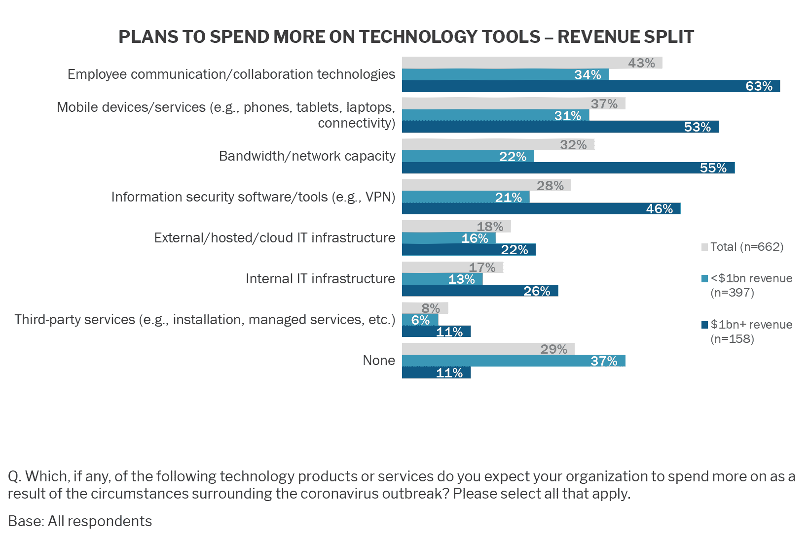

# 新冠肺炎:IT 支出正处于十字路口

> 原文：<https://thenewstack.io/covid-19-it-spending-at-a-crossroads/>

本文更新于 2020 年 4 月 10 日。

IT 支出会因为新冠肺炎经济放缓而增加还是减少？它会受到宏观经济状况的影响，还是会从远程工作中受益？答案每天都在变化。我们今天的评估是，支持在家办公(WFH)的安全、云和软件的短期和长期支出将抵消裁员和经济不景气造成的下降。

面对经济衰退，公司收紧支出，加速裁员，尤其是那些没有长期资金保障的科技初创公司。上周，IDC 预测今年的 IT 支出将下降 2.7%，原因是新项目支出推迟以及电脑更新周期结束。另一家公司在三月份对 IT 高管[进行的调查预测，与他们最初的 IT 预算相比，IT 预算将下降 4%。在这种情况下，2020 年的总体 IT 支出可能持平，因为这种下降平衡了几个月前预测的大幅增长。](https://siliconangle.com/2020/04/02/coronavirus-fallout-cios-now-expect-budgets-fall-4-2020/)[蒂莫西·普里克特·摩根](https://www.nextplatform.com/author/tpmn/)总结了这一情景，他说 [IT 部门能够经受住疫情风暴](https://www.itjungle.com/2020/04/06/the-it-sector-could-weather-the-pandemic-storm/)。

传统智慧实际上已经转向对增加的技术支出的估计。事实上，标准普尔全球 451 Research 在 3 月份对 IT 决策者的调查发现，由于冠状病毒爆发，34%的人预计将在 IT 资源和资产上花费更多，只有 4%的人认为会下降。在这项研究中，最大的公司预计在特定类型的技术工具上的支出增加最多:在收入超过 10 亿美元的公司中，63%的受访者预计在员工沟通/协作上的支出会增加，46%的受访者预计在 VPN 等信息安全工具上的支出会增加。

许多其他调查也预测，支持在家工作的技术支出将会增加。根据技术同行审查网站 trust radius 3 月 18 日和 19 日进行的一项调查，40%的软件购买者/用户预计软件支出会因为新冠肺炎而增加，而只有 18%的人预计会下降。初级员工更有可能对支出持积极态度，而更有经验的受访者更有可能持观望态度。其竞争对手 G2 对“B2B 工作人员”的调查发现，47%的人预计雇主的软件支出会因新冠肺炎而改变，只有 12%的人预计会减少。在这两个网站上，人们评估远程工作相关工具的流量都显著增加。我们必须对这些网站的数据持保留态度，因为受访者更有可能狭隘地关注他们最近对 Zoom 及其许多虚拟会议替代品的评估。

由于冠状病毒，63%的大公司增加了员工沟通/协作方面的支出。这几乎是 34%的小型企业(收入 10 亿美元)在这方面增加支出的两倍。来源:451 Research 的《企业之声:数字脉动，冠状病毒快闪调查》。

来自 Pixabay 的 Manfred Antranias Zimmer 的专题图片。

<svg xmlns:xlink="http://www.w3.org/1999/xlink" viewBox="0 0 68 31" version="1.1"><title>Group</title> <desc>Created with Sketch.</desc></svg>