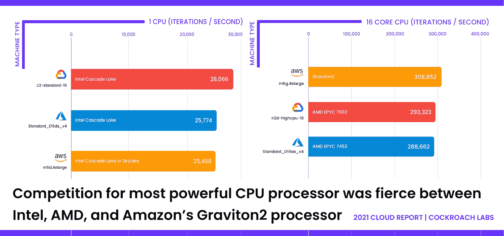
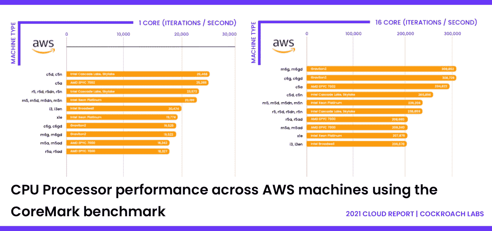
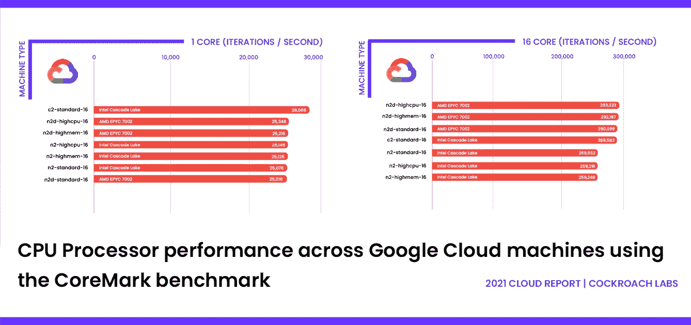
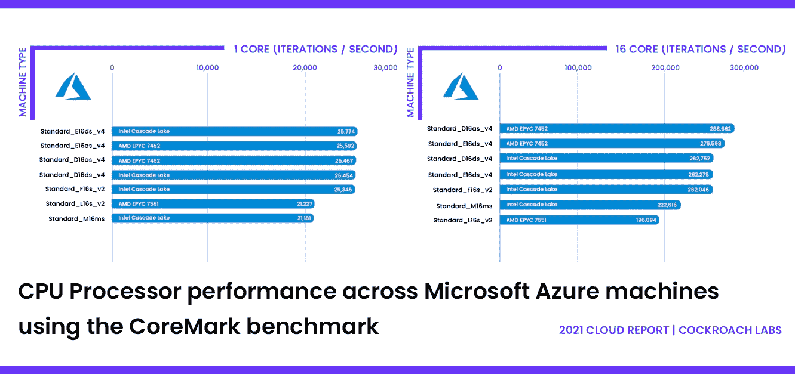

# 云提供商的 CPU 性能指标评测:英特尔、AMD 和亚马逊基于 Arm 的 Graviton2

> 原文：<https://thenewstack.io/cpu-benchmarks-for-cloud-providers-intel-vs-amd-vs-amazons-arm-based-graviton2/>

 [约翰·肯德尔

约翰是蟑螂实验室的产品经理，他在那里为现代云应用和企业创建解决方案。约翰在进入产品管理部门之前，曾在 Amazon.com 和微软公司担任软件工程师。他拥有麻省理工学院的 MBA 学位和密歇根大学的计算机科学学士学位。](https://www.linkedin.com/in/jrkendall/) 

有效的基准测试为各种类型的系统提供了有价值的、可重复的性能洞察。由蟑螂实验室制作的 [2021 云报告](https://www.cockroachlabs.com/blog/2021-cloud-report/)基于 12 个开源基准，评估了云提供商的机器如何以对 cockoroadb 工作负载最重要的方式运行。我们从 CPU、网络、存储 I/O 和应用程序级 OLTP 基准来衡量性能。虽然该报告主要关注云提供商，但我们也在三大 CPU 处理器中发现了一些有趣的东西:英特尔、AMD 和亚马逊基于 Arm 的 Graviton2。

《2021 年云报告》是我们的第三份年度报告，着眼于三大云提供商的表现:亚马逊网络服务(AWS)、谷歌云平台(GCP)和微软 Azure。该报告基于反映现实世界应用和工作负载的基准，旨在帮助应用构建者了解每种云在哪些方面性能最佳，哪些最适合他们的使用情形。

## **英特尔擅长单核，但无法扩展**

CPU 基准测试考察了每个云提供商(AWS、Azure 或 Google)在单核和 16 核 CPU 基准测试中的表现。当我们跨三种云测试几十台机器时，很快就发现每台机器内部的东西很重要。英特尔在单核处理方面大获全胜，但当增加更多处理单元时，它却步履蹒跚。

在单核 CoreMark 测试中，*所有胜出的机器都运行英特尔处理器。当我们观察 16 核 CoreMark 基准性能时，*没有一台获胜的机器运行英特尔处理器。相反，AWS 定制的 Graviton2 处理器使用 64 位 ARM 架构，仅领先于 GCP 和 Azure 的获奖机器——这两款机器都运行 AMD 处理器。**

这对英特尔来说是个坏消息，因为行业倾向于越多越好的理念。虽然单核性能对于某些类型的应用非常重要，但复杂的应用——尤其是基于云的应用——可以从多核 CPU 中获益。随着应用程序的功能越来越丰富，这就产生了额外的需求，因此这一点尤其有价值。结合 AMD(和 ARM)CPU 功耗更低的事实，主要云供应商在 AMD 产品上投入大量资源就不足为奇了。

## **用 CoreMark 对 AWS、Azure 和 GCP 进行基准测试**

我们使用[CoreMark 1.0 版基准测试](https://github.com/eembc/coremark)评估了每个云的 CPU 性能。CoreMark 专为 CPU 基准测试而设计，它会产生一个单一数字的分数，分数越高，性能越好。

我们之所以选择 CoreMark，是因为它是开源的、云无关的，并且比 stress-ng 更能代表 CPU 的一般性能。例如，CoreMark 针对各种现实工作负载进行测试，如列表排序和搜索。

CoreMark 基准测试可以限制在单个 vCPU 上运行，或者在多个 vCPU 上并行执行工作负载。我们在两种模式下运行 CoreMark 十次，并报告了单核和 16 核结果的平均每秒迭代次数。

## **CPU 整体性能**

### **GCP 在单核上获得最高分，而 AWS 在多核上与 Graviton2 一起扩展**

我们发现单核上的 CoreMark 性能是原始吞吐量性能的有效指标。在这方面，GCP 一马当先，取得了最高的 CoreMark 分数，比 AWS 和 Azure 中性能最佳的计算优化机器高出 10%。

作为原始吞吐量而非单性能的指示性指标，16 核 CoreMark 强调了每台机器扩展到多个内核的能力。亚马逊的 Graviton2 引领了这一趋势。

运行在 ARM 上的 AWS Graviton2 处理器使性能最佳的 m6g . 4x 大型机器能够实现比其他机器更好的多 CPU 扩展。AWS 的 m6g.4xlarge 每秒迭代 308，852 次，而 GCP 和 Azure 的机器分别产生了 5%和 7%的较低分数。

### **#AWS CPU 性能**

注意:在 AWS 机器表现出最小可变性的地方，结果已经按类型和处理器分组以提高可读性。

虽然采用英特尔处理器的机器在单核 CPU 性能上优于其他机器，但运行 AMD EPYC 7002 处理器的 c5a 系列是一个明显的例外，采用 Graviton2 处理器的 AWS 机器在 16 核处理器上一直优于所有其他 AWS 机器(实际上，也优于该领域的所有其他机器)。这些机器也是 AWS 最便宜的。

### **#GCP CPU 性能**

【T2

GCP 的计算优化机器(c2 标准)展示了 GCP 机器中最佳的原始 CPU 性能。除了 c2-standard 机器之外，在测试的机器中单核性能指标评测的差异很小，因为 N2 机器具有相同的处理器，只是 vCPU 与内存的比率不同。

这同样适用于 N2D 机器。在 16 核基准测试中，采用 AMD EPYC 7002 处理器的 N2D 机器和 c2-standard-16 机器领先于所有其他 GCP 机器。

### **#Azure CPU 性能**

与 AWS 上的单核基准测试一样，采用 AMD 处理器的 Azure 机器的性能与采用英特尔处理器的 Azure 机器相当。与 AWS 和 GCP 一致，在 16 核基准测试中，采用 AMD 处理器的 Azure 机器的表现优于采用英特尔处理器的 Azure 机器。

值得注意的是，内存优化的 Standard_M16ms 机器和存储优化的 Standard_L16s_v2 机器在这两个指标上都是 Azure 机器中表现最差的。

有关完整结果，包括每个云在 CPU、网络、存储 I/O 和 OLTP 基准测试中的表现，请下载 [2021 年云报告](https://www.cockroachlabs.com/guides/2021-cloud-report/)。

<svg xmlns:xlink="http://www.w3.org/1999/xlink" viewBox="0 0 68 31" version="1.1"><title>Group</title> <desc>Created with Sketch.</desc></svg>