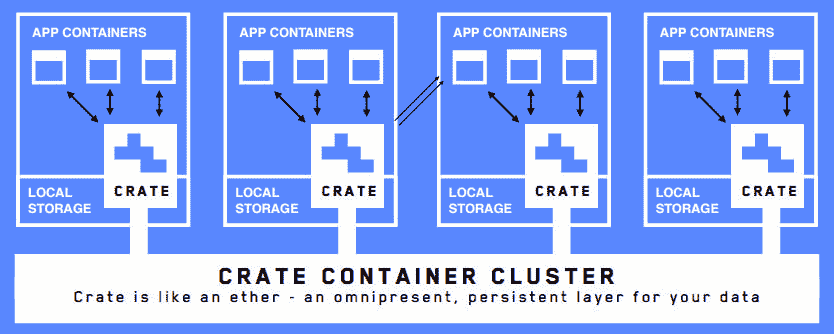
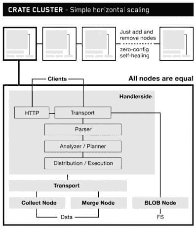

# Crate 构建了一个分布式 SQL 数据库系统在容器中运行

> 原文：<https://thenewstack.io/crate-addresses-database-speed-scaling-standard-sql/>

[Crate Technology](https://crate.io/) 设计了一个支持 Docker 容器和微服务的数据库系统。该技术强调易用性、速度和可伸缩性，同时保留对超大型数据集使用 SQL 的能力。

Crate 首席执行官 Christian Lutz 表示，Crate 是为在短暂的环境中运行而设计的。这是 Docker 注册表中的第九个官方 Docker 图片，在过去的六个月中已经被下载了超过 35 万次。它可以通过 Docker 工具、Kubernetes 或 Mesos 来管理。

“我们相信微服务架构一定会赢，”Lutz 说。“你对已经在生产中的应用程序容器所做的事情将很快产生对数据库(在容器中)的需求。如果你没有这样的架构，你就不能在容器中以可伸缩的方式运行。您可以使用一个在容器中不工作的数据库—显然，SQL 在容器中工作—但您有一个节点和一个卷，但您不能添加数百个节点。这就是为什么我认为当人们开始将数据库放入容器时，这将非常重要。”

Docker 的创始人兼首席技术官所罗门·海克斯(Solomon Hykes)是该公司的投资者之一；它刚刚从黎明资本(Dawn Capital)筹集了 400 万美元(T4)，并获得了太阳石资本、DFJ 思捷环球和 Speedinvest 的额外投资。有了这笔投资，它计划在旧金山/硅谷和欧洲开设办事处。

“当人们运行一个可扩展的开源大数据后端时，我们看到了这一挑战，这需要您将一系列必须保持同步和管理的技术结合起来。你需要丰富的经验和优秀的人才来经营和扩展，”卢茨说。

该体系结构不部署大多数关系数据库中使用的主/从配置，从而为将数据库系统作为分布式系统运行奠定了基础。它旨在允许公司维持其在 SQL 上的现有投资，同时通过使用商用硬件和廉价的云服务来避免昂贵的专有硬件和许可费用。

“我们采用名为‘无共享’的架构，这意味着你没有任何主人。任何节点都可以成为主节点，”他解释道。“这使它变得非常快，因为您不必等待主设备的确认，并且它使扩展变得非常容易，因为您可以添加 10 台、100 台机器来横向提高您的速度和性能。通常，标准 SQL 无法实现这一点。”

它的设计在很大程度上是自我配置和自我修复的，因此如果一个节点出现故障，它会自动故障转移到另一个节点。“我们想要一个永不停机的数据库，”Lutz 说。

Crate 汇集了许多开源组件，包括 451 Research 的分析师 Jason Stamper 所说的 [Elasticsearch](https://www.elastic.co/) 搜索和分析引擎、脸书的 [Presto](https://prestodb.io/) SQL 解析引擎、 [Lucene](https://lucene.apache.org/) 索引和搜索技术以及 [Netty](http://netty.io/) 异步事件驱动网络应用框架。

斯坦普说，虽然公司可以自己将这些元素放在一起，但这需要大量的工作，即使这样，数据平台也将难以处理实时写入，而不仅仅是读取，并且缺乏 Crate 的分布式查询引擎。

该公司于 2013 年由 Lutz，Bernd Dorn，Jodok Batlogg 创立，他是前德国脸书首席技术官。当 Stamper 在 2014 年 9 月与这家德国公司会面时，它将分布式数据库定位为最适合存储和分析时序数据，如物联网中使用的传感器或机器产生的数据。然而，在 2015 年，该公司开始将数据库定位为 Docker 的完美补充。

斯坦普指出了一些可以和 Docker 一起使用的数据库。 [Couchbase 服务器](http://blog.couchbase.com/2015/june/running-couchbase-server-under-docker-on-joyent)可以使用 Joyent 的 Docker 容器服务 [Triton](http://blog.couchbase.com/2015/june/running-couchbase-server-under-docker-on-joyent) 在 Docker 下运行。并且 [MariaDB](https://mariadb.com/) 也支持 Docker 容器。Lutz 认为，PostgreSQL、MySQL、Redis 和 MongoDB 都可以容器化，尽管它们并不容易在容器中配置和运行。

该公司在过去的一年里一直在处理与生产中使用板条箱相关的客户问题。他说，早期客户包括旅行预订服务公司 AVUXI，该公司每天使用 Crate 分析 2000 万次地理定位事件，以及云安全供应商 [Skyhigh Networks](https://www.skyhighnetworks.com/) ，该公司每天运行 40 至 50 亿条记录。

Skyhigh 的首席科学家和联合创始人 Sekhar Sarukkai 表示，Crate 的实时 SQL 聚合、简单的可扩展性和高可用性使其成为他公司堆栈的关键元素。

他在客户中看到的一个趋势是运营数据和分析数据的融合，而不是为两者使用单独的数据库。“我认为运行面向批处理的报告已经不够了。这是关于实时了解你的数据发生了什么，”卢茨说。

Lutz 表示，Crate 是物联网和高增长移动和网络应用客户的理想选择——“必须同时存储大量数据的公司允许数万或数十万并发用户使用这些数据。”

他喜欢把板条箱比作跑道。

“如果你用 Cassandra 设计数据存储，你可以决定你在做什么样的查询，有多少将同时运行，以及所有这些参数，这是一个跑道，在这里你可以快速高效地运行查询数据。但是当你改变事情的时候，噩梦就开始了，”他说。

“Crate 允许您进行临时更改。你不必已经知道你要搜索什么。您可以在开发应用程序时更改模式。您可以随时添加列和索引，这使它成为一个非常灵活且易于使用的产品。”

数据库市场正在快速增长，涌现出一批新的进入者，包括 SQL database[cocroach db](https://thenewstack.io/cockroachdb-unkillable-distributed-sql-database/)、NoSQL [Riak KV](https://thenewstack.io/riaks-nosql-database-and-its-new-fit-with-apache-mesos/) 等。被 CenturyLink Cloud 收购的 Orchestrate 的首席执行官兼联合创始人 Antony Falco 与新的 Stack 谈论了最近数据库的激增。

Lutz 表示，许多数据库都是围绕特定的用例构建的，企业看不出它们之间的区别。他表示，尤其是对 NoSQL 公司而言，挑战之一是让自己与众不同。

Docker 和 Joyent 是新堆栈的赞助商。

特征图片:[和](https://www.flickr.com/photos/70554893@N00/)的[机箱](https://www.flickr.com/photos/70554893@N00/6064339667/in/photolist-aeTjUt-9ErJpq-ncdEkn-9oT9WN-5U5R5D-gMeQ5-e22Aqk-8CvXLm-e21PmM-63xASH-7NYu62-nRXCPy-7eS6Ab-fzKVQ7-ofxSWD-kghfoP-8i3rbp-6L7VgV-fqwLQK-9kUyDA-c5F1yQ-6V3bRG-68CeE6-nJwZ8-cpAh6d-4kSvsc-7GmUHh-6WHF6Z-7eNcTk-68CgfH-68gGoZ-ptqqsp-fg9kpA-brGmEQ-7mBMds-pcdkKW-bVysvY-fA2L4h-cU924j-C9hsh-eG3Qh3-qiWBy5-75GvCe-66zaEm-baW75n-5bPXGg-c1UcQ7-cudFCy-4J2hXb-4J2i7C)，授权**和 [CC BY-SA 2.0](https://creativecommons.org/licenses/by/2.0/)** 。

<svg xmlns:xlink="http://www.w3.org/1999/xlink" viewBox="0 0 68 31" version="1.1"><title>Group</title> <desc>Created with Sketch.</desc></svg>