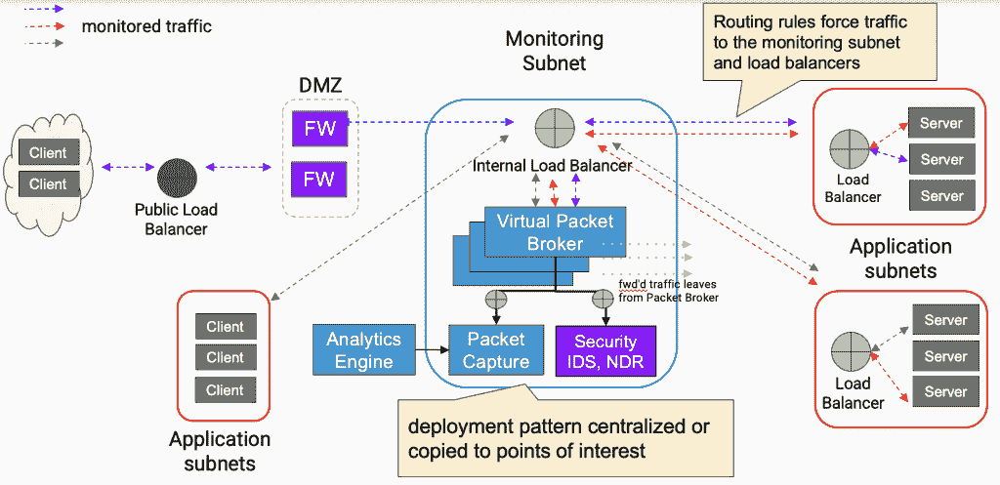
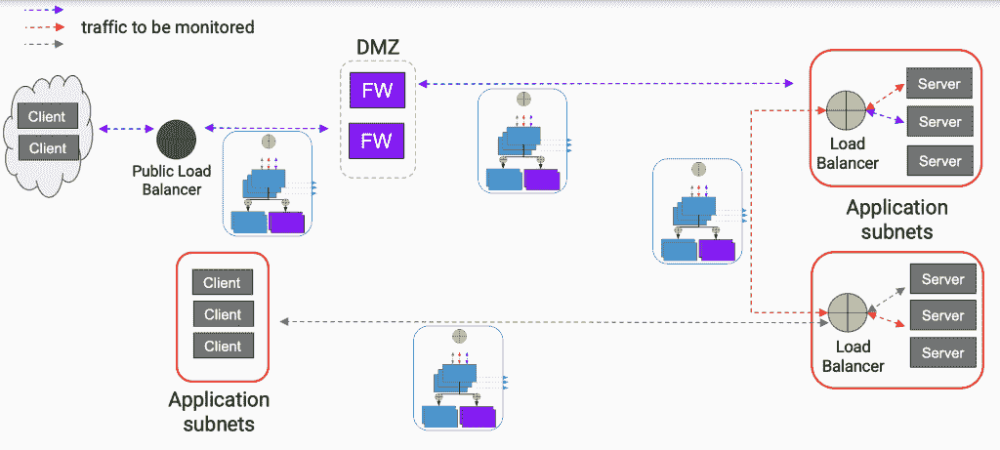

# 在 Microsoft Azure 中创建一个监控子网来提供安全堆栈

> 原文：<https://thenewstack.io/create-a-monitoring-subnet-in-microsoft-azure-to-feed-security-stack/>

 [安迪·伊德辛加

安迪·伊德辛加是 cPacket Networks 的云工程经理和高级云解决方案架构师。自 1994 年以来，Andy 一直是赛门铁克、英特尔和其他技术公司的软件工程师和架构师。他致力于智能手表和 RFID 收发器芯片组的固件，并领导一个团队开发了一种新的智能手环，作为英特尔内部创业孵化器的一部分。他住在俄勒冈州波特兰市。](https://www.linkedin.com/in/andyidsinga/) 

《2021 年威瑞森[数据泄露调查报告](https://www.verizon.com/business/resources/reports/dbir/2021/masters-guide/)发现，73%的网络安全事件涉及外部云资产；这是第一年针对云的攻击多于内部攻击。随着企业和政府云迁移和攻击的加速，这些组织中的 IT 团队经常会不愉快地意识到，他们的安全工具不再能够访问公共云中的流量，对此他们感到非常不舒服。

如果无法访问最深层、最纯粹的网络数据(即数据包数据)，入侵检测系统(IDS)、入侵防御系统(IPS)或网络检测和响应(NDR)等安全工具的效率就会大大降低，保护云中的应用程序和敏感数据免受恶意行为者的攻击也会变得更加困难。

直到 2019 年年中，每个主要的公共云平台在网络可见性方面都是一个“黑匣子”。IT 部门的网络运营(NetOps)团队无法使用他们在云中久经考验的工作流来提供足够的可见性，以服务于他们自己以及他们的应用程序和安全同行。

值得安全运营(SecOps)团队庆幸的是，随着公共云提供商开始提供 VPC 流量/数据包镜像等功能来提供对原始网络流量的访问，这种情况已经发生了变化。与这些功能相结合的虚拟 tap(vTAP)和虚拟分组代理(vPB)解决方案也已经进入市场。它们共同提供了一种重新了解云的方法。

但是设计云本地网络可见性或监控设置可能会很复杂。这篇文章将介绍如何在 Microsoft Azure 中创建一个监控子网，以捕获数据包数据并将其提供给下游的云原生安全工具。这些数据还可以用于故障排除或性能监控，或者保存在云存储中供以后进行取证分析，但我们在这里将重点关注安全用例。可以在其他云中创建类似的监控设置，但是每一个都有自己的特点。

上图是一个基本的监控子网(蓝色圆圈)。箭头代表网络流量，红圈代表应用子网。监控子网包括(a)一个内部负载平衡器，(b)三个虚拟数据包代理，(c)虚拟安全工具和(d)数据包存储/分析工具。让我们来看看如何设置它，以及它如何适应整个网络的可见性。

## 窃听防火墙流量

该子网的目标是监控云中虚拟设备之间的流量，以及来自公共互联网的外部流量。首先，子网需要接收来自防火墙和入侵防御系统(IPS)的数据包。

为此，监控子网需要被防火墙和 IPS 解决方案设置为“下一跳”,要么使用带 IP 转发的第 3 层，要么使用带直接 UDP 或 TCP 连接的第 4 层。Azure 指定用户定义的路由的能力允许它强制所有从“DMZ”防火墙子网出来的流量必须通过监控子网中的负载平衡器。

## 让所有东西都通过中心

应用程序子网之间的流量通过内部负载平衡器路由，它成为所有网络流量到达目的地之前必须经过的枢纽。负载平衡器必须启用足够的端口，以允许同时平衡所有端口上的所有协议流。然后，负载平衡器在三个虚拟数据包代理之间分配流量，这是保持高性能和弹性所必需的。

接下来，虚拟数据包代理将数据包转发到目的地，同时向下游安全工具发送一份副本。如果需要，还可以在代理和下游工具之间使用负载平衡器。请注意，虚拟分组代理可以两种模式部署:数据链路或端点。

在数据链路模式下，代理将使用路由或负载平衡器规则将数据包转发到其目的地，并制作副本以转发到下游安全、数据包分析或存储工具，如上所述。这是本示例子网中使用的模式。在其他情况下，如 AWS 部署，端点模式可以与亚马逊 VPC 流量镜像结合使用，以访问云流量。

请记住，始终在三个集群中部署数据包代理，以防止单点故障并保持高可用性。事实上，根据场景和预期的网络负载，使用三个以上的代理可能是必要的。

还要考虑数据包代理的总吞吐量除以它拥有的连接数，因此如果一个单元将数据包复制到两个下游安全工具，每个连接(将数据包传送到目的地的主以太网连接和将这些数据包的副本传送到安全工具的两个 VXLAN 连接)的吞吐量将是机器理论最大值的三分之一。在选择和调整虚拟数据包代理时，必须考虑吞吐量要求。

## 连接到安全工具

当然，所有这一切的目的是将数据包从云中取出，交给一堆安全工具。虚拟数据包代理可以将数据包直接提供给实时运行的工具，如 IDS 或 NDR。然后，这些传感器可以与其他更详细的安全分析工具进行通信。

也可以向数据包捕获和存储解决方案发送单独的数据包流，然后在糟糕的一天使用它进行安全取证和事件响应。

如果检测到威胁，该设置将允许 SecOps 回顾过去几天或几小时的情况，以了解威胁是如何进入网络的，以及它可能影响了哪些端点。

## 在需要的地方复制/粘贴

可以复制整个监控子网，并将其放置在网络的不同位置(部署通常可以自动进行)，如下图所示。

这使它能够对特定数据包进行取证分析，例如两台特定设备之间的流量，并比较网络中特定点的延迟。例如，在上面的示例中，可以在防火墙隔离区之前和之后测量延迟。这有助于确定故障点，尤其是在大型或复杂的环境中——毕竟许多企业有数千个单独的子网。

总体而言，这种云原生网络可见性设置为 NetOps、SecOps 和 CloudOps 提供了对云流量和应用程序的充分可见性，并降低了攻击的风险。

这种监控子网不仅将数据包数据提供给重要的安全工具，还允许 NetOps 团队测量关键性能指标(KPI ),如网络延迟，并且根据虚拟数据包代理的能力，可能跟踪其他有用的安全指标，如 DNS 主机和请求时间。

我敦促 NetOps 和 SecOps 团队不要忽视他们的新云基础设施——因为攻击者肯定不会。

<svg xmlns:xlink="http://www.w3.org/1999/xlink" viewBox="0 0 68 31" version="1.1"><title>Group</title> <desc>Created with Sketch.</desc></svg>