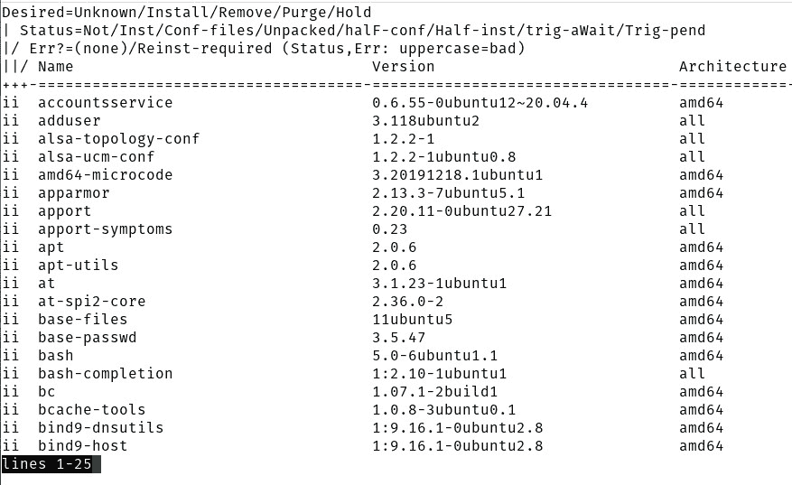
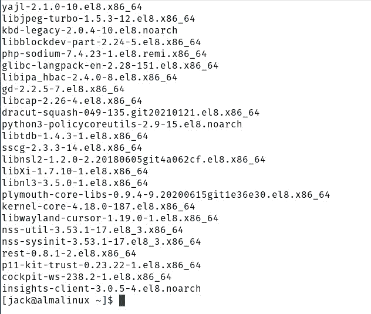
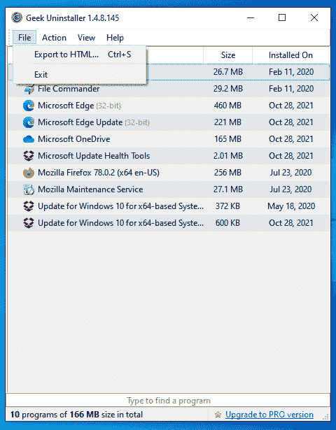
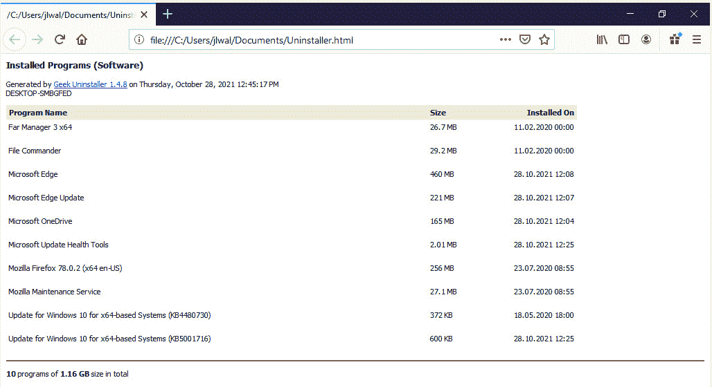
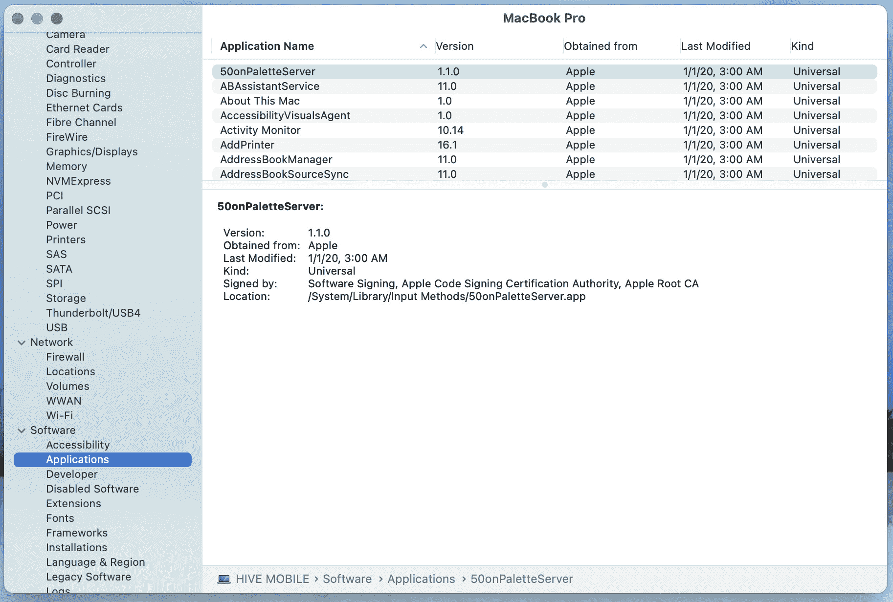
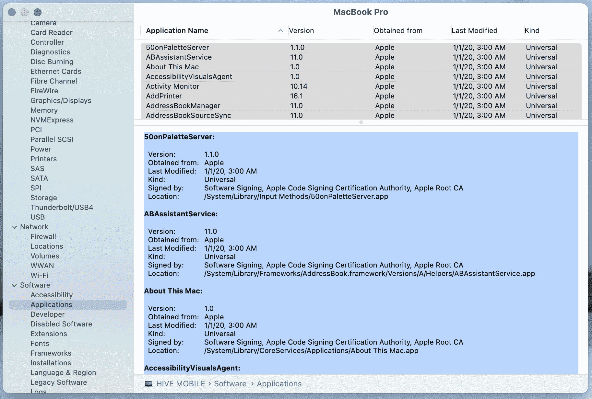

# 为您的操作系统创建软件材料清单

> 原文：<https://thenewstack.io/create-a-software-bill-of-materials-for-your-operating-system/>

软件材料清单(SBOM)已成为一份至关重要的文档，它可以帮助企业和开发人员遵守安全策略，并确保他们不会使用或构建在充满漏洞的平台之上。

在之前的教程中，我已经介绍了如何用 Syft 为[容器图像构建 SBOM。这一次，我们将对您的操作系统做同样的事情。你为什么要这么做？最好的答案是知道所有安装的东西以及所有安装的东西的版本号。有了这些信息，您就可以发现您系统上的任何软件包是否包含漏洞。](https://thenewstack.io/generate-a-software-bill-of-materials-for-a-container-image-with-syft/)

听起来有点多余，不是吗？考虑一下这个。您的操作系统会定期接收更新。当这种情况发生时，你应用那些更新——如果没有，那么你应该养成这样做的习惯。一旦安装了这些更新，您的计算机就更安全了，对吗？对吗？也许吧。这完全取决于漏洞是否已被修补。如果你是一个 Linux 用户，这些漏洞很有可能会在被发现后很快被修补。不幸的是，Windows 和 macOS 用户处于两个专有操作系统的发布周期之下，所以漏洞可能需要更多的时间来修补。

重要的是，你——用户、开发者、IT 管理员等等。—能够意识到问题。

那么你是如何做到这一点的呢？让我展示给你看。

## 在 Linux 上生成 SBOM

首先，我们将在 Linux 上这样做，因为开源操作系统提供了最简单的方法。

让我们从一个基于 Ubuntu 的发行版开始。我会在 [Pop 上演示！_OS](https://pop.system76.com/) ，基于 Ubuntu 20.10。要生成 SBOM，请打开终端窗口并发出命令:

`dpkg --list`

该命令的输出将列出系统上已安装的每个软件包(图 1)。

图 1:列出 Pop 上已安装的软件包！_OS。

当然，您可能需要在一个文本文件中使用它，这样您就可以在审计中使用它。为此，只需发出以下命令:

`dpkg --list > sbom.txt`

然后，您可以查看 sbom.txt 文件或将其发送给任何可能需要它的人，以便他们可以将其与已知漏洞列表进行比较。

让我们在基于 RHEL 的发行版上做同样的事情，比如 AlmaLinux。为此，命令应该是:

`rpm -qa`

您应该看到已安装的每个包的完整列表(图 2)。

图 2:我们在 AlmaLinux 上安装的所有包的列表。

同样，要将列表导出到文件中，命令应该是:

`rpm -qa > sbom.txt`

## 在 Windows 上生成 SBOM

这一点也不容易。曾几何时，您可以在 PowerShell 或 cmd 工具中，或者使用 psinfo 来完成这项工作。但出于某种原因，从 Windows 10 开始，我无法让这些工具列出除 Windows 版本信息之外的任何信息。

幸运的是，有一个简单的工具可以帮助我们。这个有问题的应用叫做[极客卸载程序](https://geekuninstaller.com/download)。安装后，运行该工具，然后单击文件>导出到 HTML(图 3)。

图 3:使用 Geek 卸载程序在 Windows 10 上创建 SBOM。

这将生成一个 HTML 文件，然后您可以在默认的 web 浏览器中浏览它(图 4)。

图 4:由 Geek 卸载程序生成的 SBOM。

如果您确实需要已应用于 Windows 的更新列表，请使用管理员权限打开 cmd 工具，并发出以下两个命令:

`wmic`

`output:C:\list.txt product get name, version`

最后一个命令将生成 list.txt 文件，其中包含 Windows 10 的更新版本。

## 如何在 macOS 上生成 SBOM

在 macOS 上解决这个问题的最好方法是通过 GUI。这是你需要做的。点按苹果菜单，然后点按“关于这台 Mac”。在出现的窗口中，单击系统报告，这将打开另一个窗口。在左侧导航中，单击 Applications(在 Software 下)，这将生成一个机器上安装的所有软件的完整报告(图 5)。

图 5:生成 macOS 上软件的完整列表。

这里有一个技巧，你不能通过 GUI 将列表导出到一个文件中。但是，如果您首先单击列出所有软件的右上窗格，然后使用键盘快捷命令+A 选择每个列表，然后单击右下窗格。现在应该列出了所有的细节(图 6)。然后单击键盘快捷键 Command+A，再单击 Command+C，您就已经复制了列出的每个条目。

图 macOS 上安装的所有应用程序列表。

现在，您可以将剪贴板的内容粘贴到文稿中，这样您就可以扫描 Apple 笔记本电脑或台式机的整个 SBOM。

## 结论

现在，您可以将这些列表用作您所使用的操作系统的软件材料清单。这是一个需要养成的好习惯。请记住，当您更新应用程序或操作系统时，您会想要重新运行命令，或重新使用 GUI，以重新生成新的 SBOM，因此您总是最新的。将已安装的软件与您的 CVE 选择列表进行比较，您将更有能力在漏洞游戏中保持领先。

<svg xmlns:xlink="http://www.w3.org/1999/xlink" viewBox="0 0 68 31" version="1.1"><title>Group</title> <desc>Created with Sketch.</desc></svg>