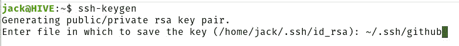
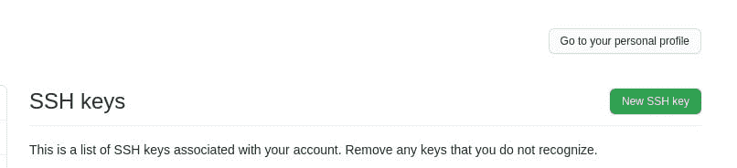
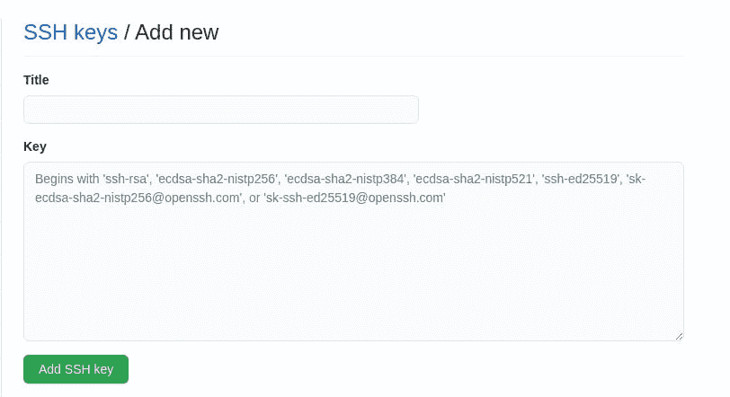

# 为第三方集成创建和管理 SSH 密钥

> 原文：<https://thenewstack.io/create-and-manage-shh-keys-for-third-party-integration/>

最近，GitHub 使得标准用户名/密码登录不再适用于远程登录。安全外壳密钥和访问令牌取代了这种陈旧的身份验证形式。SSH 密钥认证使用户可以克隆和使用私有存储库(至少是他们可以访问的存储库)。

GitHub 并不是唯一需要 SSH 密钥认证的服务。您可能有 Linux 服务器(在您的内部数据中心或来自云托管服务)，并且管理员已经关闭了密码验证。

不管是哪种服务，您都需要理解并能够使用 SSH 密钥认证。我相信很快大多数服务将会脱离传统的密码认证。在这种情况下，您别无选择，只能使用 SSH 之类的键。

但是怎么做呢？

尽管大多数 Linux 用户都非常熟悉 SSH 密钥的使用方法，但并不是每个人都如此。为此，我想向您介绍创建和管理 SSH 密钥的过程，这样您就可以准备好将它们用于第三方集成。

## 什么是 SSH 密钥认证？

在我们开始之前，让我们先解释一下我们在谈论什么。SSH 密钥认证是对用户进行帐户认证的一种更安全的方式。它不使用用户名和密码，而是将密钥对与用户相关联。该密钥对包括私钥(`id_rsa`)和公钥(`id_rsa.pub`)。

私钥保存在用户的本地存储器上(通常在`~/.ssh directory`)，不与任何人共享。然而，公钥是共享给其他用户、服务和服务器的。

当用户尝试使用 SSH 密钥登录时，会比较公钥和私钥。如果这些密钥匹配，则允许用户访问服务器。

这种身份验证的一个最重要的问题是用户从不共享他们的私钥。任何拥有私钥的人都可以访问包含公钥的帐户。这也是`id_rsa`键只对所有者有读/写权限的原因之一。

说了这么多，让我们用 SSH 键来弄脏我们的手指。

## 如何生成 SSH 密钥

首先，我使用 Linux。这是我日常使用的主要操作系统。我也和 macOS 一起工作。好消息是，在这两个系统上使用 SSH 非常相似，在 Windows 上也是如此。您将在下面看到的命令在 Linux、macOS 和 Windows 上是相同的。更好的是，SSH 客户端安装在所有三个平台上(开箱即用)。

所以应该没什么需要安装的。

您必须做的第一件事是生成您的 SSH 密钥对。为此，登录到您的机器，打开一个终端窗口，发出命令:

`ssh-keygen`

默认情况下，SSH 将使用 RSA 作为密钥类型。如果您有理由使用其他选项(dsa、ecdsa、ecdsa-sk、ed25519 或 ed25519-sk)，您可以像这样使用-t 选项:

`ssh-keygen -t TYPE`

其中 TYPE 是要生成的密钥的类型。

在密钥创建过程中，系统会提示您键入并验证密钥的密码。不要只按回车键输入空密码。使该密码具有挑战性。尽管 SSH 密钥对比传统的身份验证方法更安全，但是如果您选择避开密钥对的密码，那么一旦有人窃取了您的私钥，他们访问与密钥对相关联的帐户就不会有任何问题。

您可能有理由生成多个 SSH 密钥对。为什么？您可能希望对不同的服务使用不同的密钥对(比如一个用于 GitHub，一个用于您的 Linux 数据中心服务器)。为此，您只需要在创建过程中给新生成的密钥对一个不同的名称(图 1)。

图 1:给新的 SHH 密钥对起一个特定的名字，用于 GitHub。

创建了密钥对之后，现在让我们看看如何管理它。

## 如何使用您的 SSH 密钥对

我将向您展示的第一件事是如何查看您的公钥。这很简单。在 Linux 或 macOS 上，您只需发出以下命令:

`cat ~/.ssh/id_rsa.pub`

这将显示一长串字符，以 ssh-rsa 开头，以 USER@HOSTNAME 结尾(其中 USER 是您的用户名，HOSTNAME 是计算机的主机名)。

你可以复制那个密钥，然后把它粘贴到任何需要的地方。例如，对于 GitHub，您可以执行以下操作:

1.  登录您的 GitHub 帐户。
2.  点击右上角的个人资料图片。
3.  从下拉列表中，选择设置。
4.  在左侧导航栏中，单击 SSH 和 GPG 键。
5.  在出现的窗口中(图 2)，单击 New SSH key。

图 2:向 GitHub 帐户添加 SSH 密钥很简单。

然后，给这个键起一个名字，并将`id_rsa.pub`的内容粘贴到键部分(图 3)。

图 3:将新生成的 SSH 密钥的内容粘贴到这里。

然后添加 SSH 密钥。

这就是向 GitHub 添加 SSH 密钥的全部内容。此时，您应该能够更容易地与服务进行交互。其他服务以类似的方式处理这个过程，所以请确保了解如何将 SSH 密钥用于您使用的其他基于云或服务器的帐户。

但是如何将 SSH 公钥复制到众多 Linux 服务器中的一个呢？这就更容易了。登录装有 SHH 密钥对的计算机，打开终端，发出命令:

`ssh-copy-id USER@SERVER`

其中，用户是远程用户名，服务器是远程服务器的 IP 地址或域。

将公钥复制到远程服务器后，您可以使用以下命令登录:

`ssh USER@SERVER`

其中，用户是远程用户名，服务器是远程服务器的 IP 地址或域。

系统将提示您输入 SSH 密钥对密码(不是用户密码)。成功登录后，您将被允许访问服务器。然而，有趣的是(直到你的本地钥匙串删除缓存的密码)，你下次登录时不需要输入 SSH 密码。当然，这将取决于本地操作系统及其如何配置来缓存密码。如果下一次您试图 SSH 到远程机器时，您没有被要求输入密码，请不要感到惊讶。

这让我们想到了一个非常重要的问题。当您设置了 SSH 密钥认证后，您不能让您的本地机器处于无人看管的状态。考虑一下我上面刚刚提到的。缓存了 SSH 密钥密码之后，任何人都可以发出 SSH 命令登录到远程服务器并获得访问权限，而不必担心密码问题。

因此，当你离开办公桌时，应该锁好你的桌面。一些桌面操作系统会在关闭终端窗口或注销时刷新特定的缓存。因此，在做出任何假设之前，请确保对此进行测试。

## 结论

这就是如何创建和管理供第三方使用的 SSH 密钥。这并不具有挑战性，但这可能是您需要的一项新技能，以便成功地通过任意数量的服务进行身份验证。用不了多久，大多数第三方服务都会要求使用 SSH 密钥认证(或类似的东西)，所以最好抢先一步。

<svg xmlns:xlink="http://www.w3.org/1999/xlink" viewBox="0 0 68 31" version="1.1"><title>Group</title> <desc>Created with Sketch.</desc></svg>