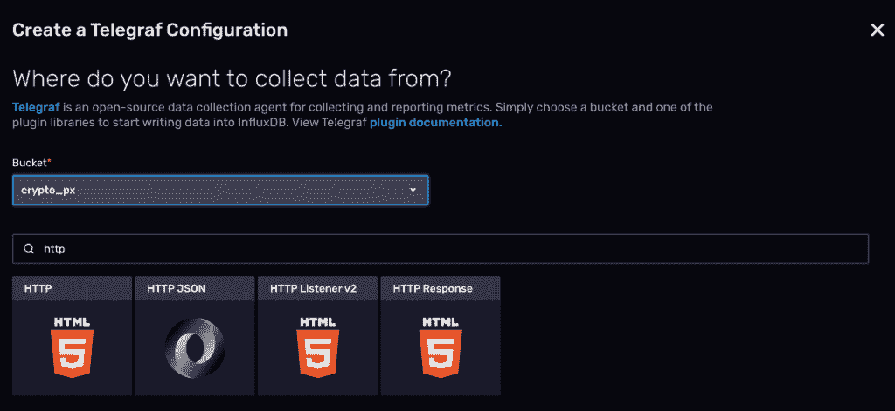
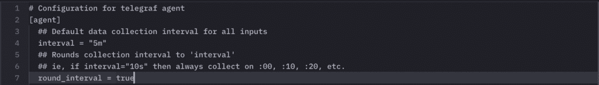
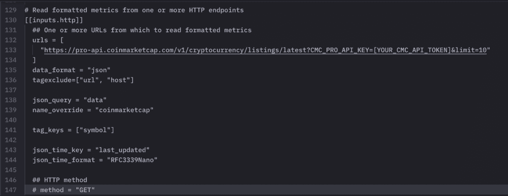
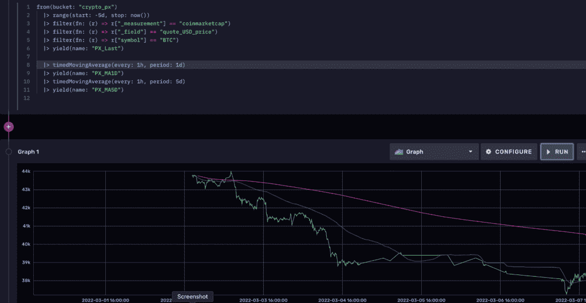
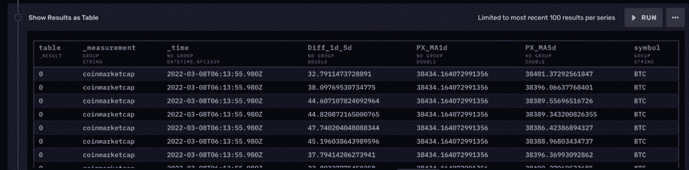
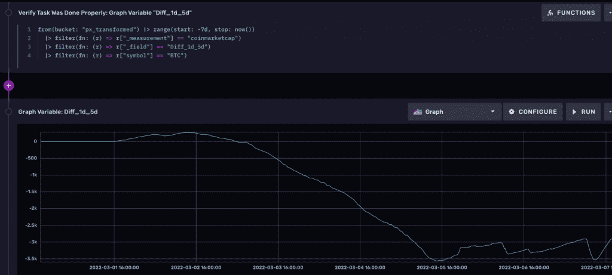
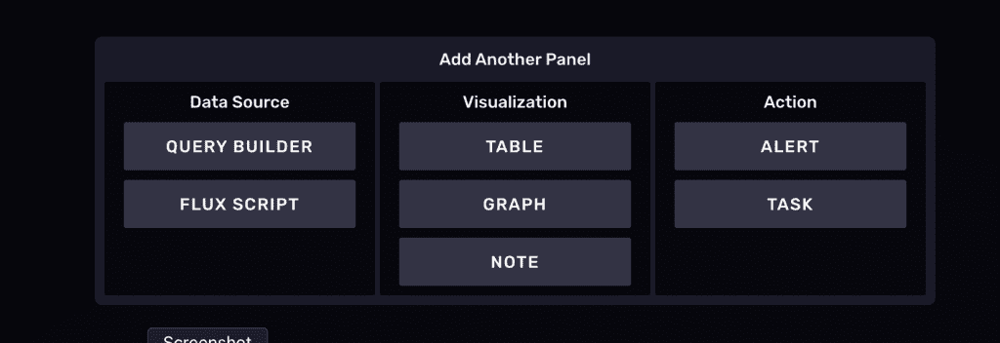
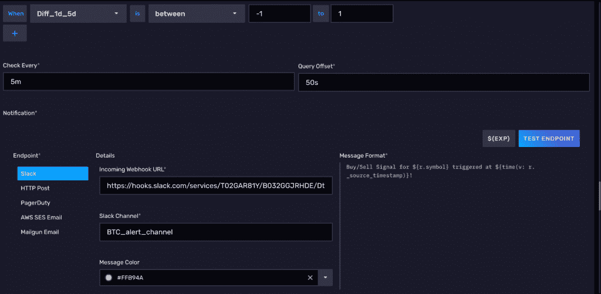
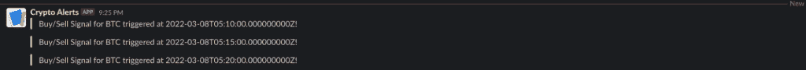

# 使用 InfluxDB 创建比特币买卖提醒

> 原文：<https://thenewstack.io/create-bitcoin-buy-and-sell-alerts-with-influxdb/>

鉴于比特币价格的波动性，自动报警系统对于保持我们的注意力和理智是有价值的。只有价格动作有意思，我们才能关注比特币。动量，即购买过去表现良好的资产，一直是最持续有效的交易策略之一——参见 [Clif Asness:“价值和动量无处不在”](https://onlinelibrary.wiley.com/doi/abs/10.1111/jofi.12021)和 [Tzouvanas (2019)](http://sro.sussex.ac.uk/id/eprint/86820/1/Tzouvanas_paper.pdf) 。

[](https://www.linkedin.com/in/grace-ma-965a292b)

我们可以使用 InfluxDB 来帮助我们计算一个简单的动量信号，并在这个信号指向“买入”或“卖出”时提醒我们

在本教程中，我选择了一个常见的动量信号——短期/长期交叉。当一日移动平均线比特币价格(1 日均线)穿过五日移动平均线(5 日均线)时，信号就会出现。当 1 日均线从下方穿过 5 日均线时，这是买入信号。当它从上方穿过时，是卖出信号。

在步骤上，我们需要首先使用 [Telegraf](https://www.influxdata.com/time-series-platform/telegraf/?utm_source=vendor&utm_medium=referral&utm_campaign=2022-04_spnsr-ctn_influxdb-bitcoin-buy-sell-alerts_tns) 从 CoinMarketCap API 中获取比特币价格并存储到 InfluxDB 中，然后使用 InfluxDB 的自定义语言 Flux，使用存储的比特币价格计算动量信号，然后根据动量信号的值设置警报。

## **初始设置**

1.登录 InfluxDB 云应用(或者在此创建一个[账号)。](https://cloud2.influxdata.com/signup/?utm_source=vendor&utm_medium=referral&utm_campaign=2022-04_spnsr-ctn_influxdb-bitcoin-buy-sell-alerts_tns)

2.创建一个 bucket，它是数据集单位，称为`crypto_px`。我们会把比特币的价格存储在这个桶里。

```
[Load Data  >  Buckets  >  Create Bucket]

```

3。创建流入 API 令牌。

```
[Load Data  >  API Tokens  >  Generate API Tokens]

```

4。在您的机器上安装 Telegraf。[ [指令](https://portal.influxdata.com/downloads/?utm_source=vendor&utm_medium=referral&utm_campaign=2022-04_spnsr-ctn_influxdb-bitcoin-buy-sell-alerts_tns)

5.创建一个 CoinMarketCap API 令牌。[ [指令](https://coinmarketcap.com/api/documentation/v1/?utm_source=vendor&utm_medium=referral&utm_campaign=2022-04_spnsr-ctn_influxdb-bitcoin-buy-sell-alerts_tns)

## **使用 Telegraf 拉比特币价格**

Telegraf 是 InfluxDB 的代理，从各种不同的来源收集数据，包括 API。它通过终端在我们的收集机器(我们的笔记本电脑)上本地运行，并将数据发送到中央 InfluxDB 桶中。

现在我们可以设置我们的 Telegraf 代理，在这个例子中，它将收集 HTTP 数据并将数据存储在我们刚刚创建的`crypto_px`桶中。[Go to Load Data>tele graf>Create configuration】

一旦打开 Telegraf HTTP 模板，它看起来会有些令人生畏。但是我们实际上只需要定制几个部分。

首先，在[agent]部分，我们想要指定 Telegraf 在什么时间间隔调用 API。这里，间隔设置为“5m”或 5 分钟。



接下来，我们需要更改[[inputs.http]]部分，以指向正确的 CoinMarketCap API 地址。



输入配置说明:

**网址**

CoinMarketCap API url 的格式为:

https://pro-API . coinmarketcap . com/v1/cryptocurrency/listings/latest？CMC_PRO_API_KEY=

```
[YOUR_CMC_API_TOKEN]&limit=10

```

`CMC_PRO_API_KEY`必须填入您的 CoinMarketCap API 令牌。
限制变量是有多少加密资产需要提价。在这里，我们拉出前 10 名加密硬币，其中将包括比特币。

**json_query**

由于 CoinMarketCap API 返回一个嵌套的 JSON 对象，我们可以使用`json_query`字段来指定和查询加密价格数据实际所在的 JSON 键。对于这个 JSON 对象，键被称为“数据”

**tag_keys**

我们可以指定标签，在概念上类似于分类变量。在这里，将加密资产符号作为标签是很有用的，这样我们就可以过滤特定的加密资产，比如“BTC”

CoinMarketCap API 返回 json，因此我们将`data_format`改为“JSON”。

由于 InfluxDB 是一个时序数据库，所以我们必须有一个时序列。为此，`json_time_key`被称为“last_updated”，它的`json_time_format`在“RF3339Nano”中(你可以在这里查找你的时间格式[。)](https://www.geeksforgeeks.org/time-formatting-in-golang/)

## **开始运行 Telegraf 代理**

一旦我们正确设置了 Telegraf 配置文件，我们就可以使用终端在我们的收集机器(在本例中是我的笔记本电脑)上运行 Telegraf。

我们可以从云中或本地副本运行 Telegraf 配置文件。在本例中，我下载了 Telegraf 配置文件，并将其保存为“coinmarketcap_api.conf”。

要运行 Telegraf，请在终端中键入以下命令:

```
telegraf  --config  [YOUR_CONFIG_FOLDER]/coinmarketcap_api.conf

```

— config 告知配置文件的位置。

注意:您可以通过只运行一次来测试您的配置文件是否正确:

`telegraf --once --config [YOUR_CONFIG_FOLDER]/coinmarketcap_api.conf`

## **检查我们的数据是否已经存储**

现在 Telegraf 正在工作，我们应该每隔五分钟捕捉一次比特币价格，并将这些数据存储在我们的`crypto_px`桶中。我们可以通过可视化“笔记本”选项卡中的数据来进行检查。(注意[笔记本](https://docs.influxdata.com/influxdb/cloud/notebooks/?utm_source=vendor&utm_medium=referral&utm_campaign=2022-04_spnsr-ctn_influxdb-bitcoin-buy-sell-alerts_tns)功能和 Jupyter 笔记本一样，是存储和测试 Flux 代码的有用地方)。

我们使用 Flux 来查询我们的`crypto_px`桶。价格存储在`_field`“报价 _ 美元 _ 价格”中，我们将`symbol`标签过滤为“BTC”，以检索比特币价格。

```
from(bucket:  "crypto_px")
|>range(start:  -5d,  stop:  now())
|>filter(fn:  (r)  =>  r["_measurement"]  =="coinmarketcap")
|>filter(fn:  (r)  =>  r["_field"]  =="quote_USD_price")
|>filter(fn:  (r)  =>  r["symbol"]  =="BTC")
|>yield(name:  "PX_Last")

```


## **使用通量计算动量信号**

Flux 语言允许我们做许多基本的[时序转换](https://www.influxdata.com/time-series-analysis-methods/?utm_source=vendor&utm_medium=referral&utm_campaign=2022-04_spnsr-ctn_influxdb-bitcoin-buy-sell-alerts_tns)。为了计算我们的动量信号(1 天/ 5 天均线交叉)，我们需要计算均线，然后取它们之间的差。

为了快速可视化移动平均线的样子，我们可以将它们添加到我们之前的查询中，即创建图表的查询中。

```
from(bucket:  "crypto_px")
|>range(start:  -5d,  stop:  now())
|>filter(fn:  (r)  =>  r["_measurement"]  =="coinmarketcap")
|>filter(fn:  (r)  =>  r["_field"]  =="quote_USD_price")
|>filter(fn:  (r)  =>  r["symbol"]  =="BTC")
|>yield(name:  "PX_Last")

// Add Moving Average Lines
|>timedMovingAverage(every:  1h,  period:  1d)
|>yield(name:  "PX_MA1D")
|>timedMovingAverage(every:  1h,  period:  5d)
|>yield(name:  "PX_MA5D")

```



为了绘制移动平均线，我们使用了 [timedMovingAverage](https://docs.influxdata.com/flux/v0.x/stdlib/universe/timedmovingaverage/?utm_source=vendor&utm_medium=referral&utm_campaign=2022-04_spnsr-ctn_influxdb-bitcoin-buy-sell-alerts_tns) 函数。我们以一小时(每:1h)的间隔计算一天的平均值(周期:1d)。

我们可以使用 [`yield`](https://docs.influxdata.com/flux/v0.x/stdlib/universe/yield/?utm_source=vendor&utm_medium=referral&utm_campaign=2022-04_spnsr-ctn_influxdb-bitcoin-buy-sell-alerts_tns) 函数来命名图上这条计算出的线`PX_MA1D`。

接下来，将这些移动平均值保存为 new _fields 需要更多的 Flux 代码。

首先，我们可以创建另一个名为`px_transformed`的存储桶来保存新计算的移动平均值。

然后，我们必须将通量计算保存为一个循环[任务](https://docs.influxdata.com/influxdb/cloud/process-data/get-started/?utm_source=vendor&utm_medium=referral&utm_campaign=2022-04_spnsr-ctn_influxdb-bitcoin-buy-sell-alerts_tns)。一个任务定期计算这些流量，并将结果保存到我们的`px_transformed`桶中，比如每五分钟一次。

我们转到云应用程序侧栏中的任务，安排一个新任务，并将其命名为“加密像素移动平均计算”

我们将调度它每五分钟运行一次，偏移 20 秒(任务每次在 mm:20 秒开始)。它从任务开始的 20 秒开始。

然后，我们将通量转换放入任务代码面板。

```
// Task Options
option task  =  {name:  "Crypto PX Moving Average Calculations",  every:  5m,  offset:  20s}
option  v  =  {timeRangeStart:  -30d,  timeRangeStop:  now()}
data1  =from(bucket:  "crypto_px")
|>range(start:  v.timeRangeStart,  stop:  v.timeRangeStop)
|>filter(fn:  (r)  =>  r["_measurement"]  =="coinmarketcap")
|>filter(fn:  (r)  =>  r["_field"]  =="quote_USD_price")
|>filter(fn:  (r)  =>  r["symbol"]  =="BTC")
|>pivot(
rowKey:["_time"],
columnKey:  ["_field"],
valueColumn:  "_value")
|>timedMovingAverage(column:  "quote_USD_price",  every:  5m,  period:  1d)
|>rename(columns:  {quote_USD_price:  "PX_MA1d"})
data2  =from(bucket:  "crypto_px")
|>range(start:  v.timeRangeStart,  stop:  v.timeRangeStop)
|>filter(fn:  (r)  =>  r["_measurement"]  =="coinmarketcap")
|>filter(fn:  (r)  =>  r["_field"]  =="quote_USD_price")
|>filter(fn:  (r)  =>  r["symbol"]  =="BTC")
|>pivot(
rowKey:["_time"],
columnKey:  ["_field"],
valueColumn:  "_value")
|>timedMovingAverage(column:  "quote_USD_price",  every:  5m,  period:  5d)
|>rename(columns:  {quote_USD_price:  "PX_MA5d"})
data3  =join(
tables:  {t1:  data1,  t2:  data2},
on:  ["_time",  "symbol",  "_measurement"],
)
|>keep(columns:  ["_time",  "_measurement",  "symbol",  "PX_MA1d",  "PX_MA5d"])
|>map(fn:  (r)  =>  ({  r  with Diff_1d_5d:  r.PX_MA1d  -  r.PX_MA5d  }))
|>to(
bucket:  "px_transformed",
fieldFn:  (r)  =>  ({"Diff_1d_5d":  r.Diff_1d_5d,  "PX_MA1d":  r.PX_MA1d,  "PX_MA5d":  r.PX_MA5d}),
)

```

## **通量代码的解释**

我们必须将两个新变量保存到同一个数据集，然后取它们的差。为此，我们需要 [`pivot`](https://docs.influxdata.com/flux/v0.x/stdlib/universe/pivot/?utm_source=vendor&utm_medium=referral&utm_campaign=2022-04_spnsr-ctn_influxdb-bitcoin-buy-sell-alerts_tns) 函数，该函数将每个 _field 转换为一个新列。

我们创建两个新的移动平均字段，称为“PX_MA1d”和“PX_MA5d”，并通过 pivot 函数将它们转换为列。

然后我们使用 [`join`](https://docs.influxdata.com/flux/v0.x/stdlib/universe/join/?utm_source=vendor&utm_medium=referral&utm_campaign=2022-04_spnsr-ctn_influxdb-bitcoin-buy-sell-alerts_tns) 函数将这两列合并到一个主表中。

然后我们可以使用 [`map`](https://docs.influxdata.com/flux/v0.x/stdlib/universe/map/?utm_source=vendor&utm_medium=referral&utm_campaign=2022-04_spnsr-ctn_influxdb-bitcoin-buy-sell-alerts_tns) 函数对数据集中的两列进行操作。这里，我们通过减去“PX_MA1d”和“PX_MA5d”来创建一个名为“Diff_1d_5d”的新列。

最后， [`to`](https://docs.influxdata.com/flux/v0.x/stdlib/influxdata/influxdb/to/?utm_source=vendor&utm_medium=referral&utm_campaign=2022-04_spnsr-ctn_influxdb-bitcoin-buy-sell-alerts_tns) 函数将输出保存到指定的桶中。

下面是由此产生的新的`px_transformed`表格:



为了验证任务是否正确运行，我们可以绘制动量信号的图形(_ field“Diff _ 1d _ 5d”)。

```
from(bucket:  "px_transformed")
|&gt;range(start:  -7d,  stop:  now())
|&gt;filter(fn:  (r)  =&gt;  r["_measurement"]  =="coinmarketcap")
|&gt;filter(fn:  (r)  =&gt;  r["_field"]  =="Diff_1d_5d")
|&gt;filter(fn:  (r)  =&gt;  r["symbol"]  =="BTC")

```



## **设置一维/五维交叉为零时的警报**

我们的任务现在已经创建了一维/五维移动平均信号作为 _ field“Diff _ 1d _ 5d”，它保存在`px_transformed`桶中。最后一步是当比特币的信号为零时提醒我们，这将是买入或卖出信号。

警报基本上是一项专门的任务。笔记本有不断变化的提醒模板来帮助我们设置提醒。

但首先，我们需要建立我们的通知渠道。在免费帐户中，唯一的选择是使用 Slack 的 webhook 功能通知 Slack 频道。(你可以升级到其他渠道提醒，比如电子邮件。)

下面是设置步骤:【Slack 提供的教程是[这里是](https://api.slack.com/messaging/webhooks)。]

1.  创建一个 Slack 应用程序。我把我的叫做“加密警报”。
2.  激活应用程序上的传入 webhooks。
3.  点击“向工作区添加新的 Webhook”以生成 webhook url。

webhook url 应该是这样的:https://hooks . slack . com/services/t 00000000/b 0000000/xxxxxxxxxxxxxxxxxxxxxxxxxxx

现在，我们将创建一个警报(如前所述，一个专门的任务),将警报消息发布到我们刚刚创建的通知端点(我们的 Slack 通道)。

回到我们一直在做的笔记本，我们为警报添加了一些修改:

```
import"interpolate"
from(bucket:  "px_transformed")
|&gt;range(start:  -15m,  stop:  now())
|&gt;filter(fn:  (r)  =&gt;  r["_measurement"]  =="coinmarketcap")
|&gt;filter(fn:  (r)  =&gt;  r["_field"]  =="Diff_1d_5d")
|&gt;  interpolate.linear(every:  30s)

```

第一个修改是要查询的时间范围应该更改为拉入最近 15 分钟的数据，以便只捕获最新的数据点。然后，我们对数据进行插值，以消除数据中的跳跃。现在，我们可以为刚刚构建的查询添加一个新的警报面板。

## **添加另一个面板** > **预警**



这将打开警报模板:



我们将设置此警报任务来检查 _ field“Diff _ 1d _ 5d”是否在-1 到 1 之间—当它接近 0 时。我们正在检查 1 日移动平均线是否穿过 5 日移动平均线。[注意:由于“Diff_1d_5d”很少恰好等于 0，因此检查范围更可靠。]

该警报将每五分钟检查一次，偏移量为 50 秒(在我们的加密 PX 移动平均值计算任务运行之后)。

然后输入您生成的 Slack webhook url，以及 webhook 指向的 Slack 通道名称。您可能需要为此创建一个新的松弛通道。我把我的叫做“BTC 警报频道”

您可以通过单击“测试端点”来测试该通道

您可以修改消息格式。这是:

"触发＄{ r . symbol }的买入/卖出信号的时间为＄{ time(v:r . source _ timestamp)}！"

最后，导出警报。

现在，我们应该在买卖比特币的时候，在 Slack 上设置自动提醒了！

时差警报消息:



## **进一步的想法**

当然，这只是开始。将当前的设置扩展到更多的硬币是非常简单的，比如以太坊或者索拉纳。还可以使用 Flux 为比特币建立更复杂的交易规则，如 RSI(相对强度指数)、经波动性调整的动量(除以价格标准差)、均值回归指标(在价格低时买入)或许多其他[时间序列预测方法](https://www.influxdata.com/time-series-forecasting-methods/?utm_source=vendor&utm_medium=referral&utm_campaign=2022-04_spnsr-ctn_influxdb-bitcoin-buy-sell-alerts_tns)。最后，我们可以通过使用其他 API(例如 Yahoo Finance)获取股票价格来设置股票警报。

<svg xmlns:xlink="http://www.w3.org/1999/xlink" viewBox="0 0 68 31" version="1.1"><title>Group</title> <desc>Created with Sketch.</desc></svg>