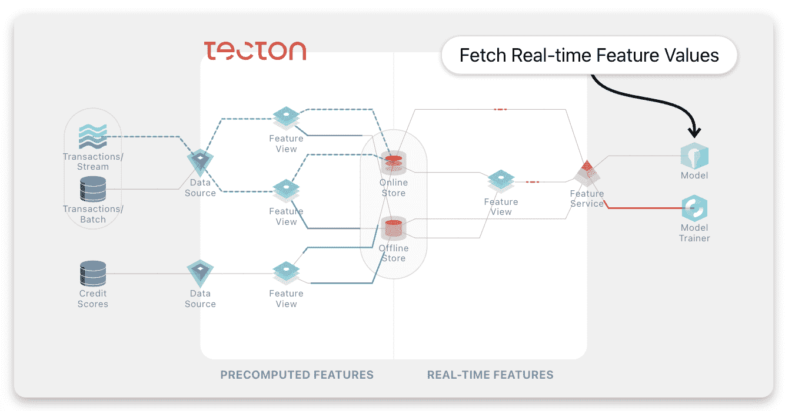
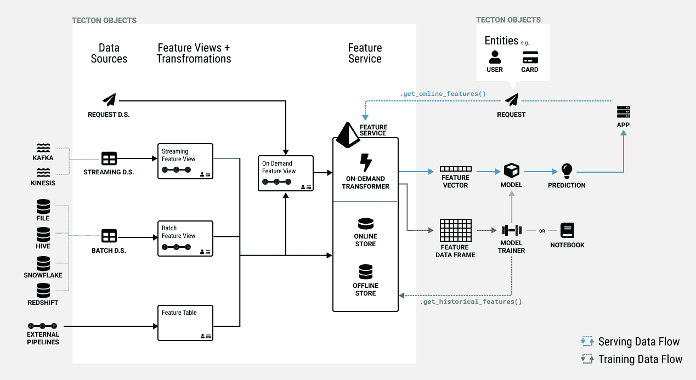

# 用泰克顿在你的笔记本上构建机器学习应用

> 原文：<https://thenewstack.io/create-machine-learning-apps-in-your-notebook-with-tecton/>

由优步米开朗基罗机器学习(ML)平台的创造者创建的机器学习(ML)“特征平台”公司泰克顿(Tecton)今天宣布了其产品的 0.6 版本。Tecton 的联合创始人兼首席执行官 Mike Del Balso T1 表示，这一更新允许用户“直接在笔记本上构建生产就绪功能，并在几分钟内将其部署到生产中”。

我与 Del Balso 在一次 Zoom 电话会议中进行了交谈，以了解 ML 功能平台到底是什么——以及它通常用于企业内部的情况。参加电话会议的还有[泰克顿](https://www.tecton.ai/)公司的营销主管[盖坦·卡斯特林](https://www.linkedin.com/in/gaetan-castelein/)。

## 什么是特性，它有什么作用？

“如果你考虑一个机器学习应用程序，它有两个部分，”Del Balso 说。“有一个最终做出预测的模型。但是，该模型[…]需要接受一些数据输入，这些数据输入就是特征。而那些特征包含了它此时需要知道的关于世界的所有相关信息，因此它可以做出正确的预测。”

要素的一个示例是关于优步旅行的道路繁忙程度的数据。或者，现在是高峰时间吗？这两组数据都是 ML 应用程序的“特征”。

经由泰克顿的图表

事实上，德尔·巴尔索和他的泰克顿联合创始人凯文·斯顿夫(首席技术官)在优步工作时就提出了“功能平台”的想法。根据泰克顿的“关于”页面，两人在优步建立了米开朗基罗 ML 平台，该平台“有助于优步在短短几年内将生产规模扩大到 1000 个[ML]模型，支持从实时定价到欺诈检测和 ETA 预测的广泛用例。”

他们很快意识到，一个功能平台可以用于任何涉及 Del Balso 所谓的“实时生产机器学习”的 ML 工作负载在优步之前，德尔·巴尔索在谷歌工作，“研究为谷歌广告系统提供动力的机器学习。”泰克顿技术的其他用例包括推荐系统、实时动态定价和支付系统的欺诈检测。

## 定义和运行特征

Tecton 的主要用户是数据科学家或工程师，它需要使用代码定义一个特性。根据文档中的[，Tecton 中的特性“被定义为使用 Python、SQL、Snowpark 或 PySpark 的数据源视图。”](https://docs.tecton.ai/docs/introduction/)

“这不是一个无代码平台或类似的东西，”德尔巴尔索证实。“当您使用功能平台时，您正在定义代码，定义获取您的业务原始数据并将其转换为模型用来进行预测的数据(功能)的转换。”

泰克顿概念图(via 泰克顿)；点击查看完整视图

在通过代码定义了功能之后，功能平台“在机器学习生命周期的所有阶段管理这些数据管道的所有方面，”他说。

这包括在整个过程中对数据本身进行计算和更新。

他解释说，特征平台“不断计算所有这些信号的最新值，以便模型总是拥有最相关的信息，从而做出最准确的预测”。

## 连接开发和生产

因为应用程序中的机器学习在企业中仍然相对较新，所以 Tecton 用户中经常有技能组合。

Del Balso 说:“我们在这个行业中处于一个有趣的空间，在这个空间中，各个公司的机器学习团队看起来非常不同。”。“所以，我们的目标是构建你的机器学习应用的人。这可能是一名不具备生产工程技能的数据科学家，但在一家公司中，通常是一名拥有生产工程技能的工程师，但他们可能并不是真正的数据科学专家。”

过去出现问题的地方是开发环境和生产环境之间的“墙”。尤其是数据科学家，他们通常没有将应用程序转移到生产环境的经验。德尔·巴尔索说，泰克顿公司旨在解决这个问题。

“你有这两个不同的世界，数据科学家和工程师不知道如何相互合作——在开发阶段，更不用说持续运营阶段了。而功能平台带来的价值是，它打破了那堵墙，让它变得简单。它为数据科学家提供了一种集中的方式，一种单一的方式来定义他们开发工作流程中的所有这些功能管道，并且基本上没有额外的任务来生产它们。”

## 笔记本集成

Tecton 表示，在其平台的 v0.6 中，它已经将功能工作流集成到了数据科学家现有的笔记本工具中。Del Balso 说，这消除了阻碍数据科学家轻松投入生产的障碍。

“现在你甚至不必离开你的数据科学工具，”他说。“你可以用你的 Jupyter 笔记本。您可以使用自己构建或习惯使用的相同数据科学环境。因此，这种体验更接近于他们(数据科学家)喜欢和舒适的东西。它使我们能够将开发和生产环境以及体验变得前所未有的接近。”

## 企业中的人工智能

虽然生成性人工智能继续占据所有头条(OpenAI 本周刚刚发布了 GPT-4)，但跟踪人工智能和机器学习如何进入企业 it 世界也同样有趣。正如我们在 2000 年代末和 2010 年代看到云计算出现后的 DevOps 革命一样，我们现在看到 2020 年代初的“MLOps”(没有更好的术语)革命，因为人工智能占据了主导地位。

总的来说，泰克顿是人工智能工具范围不断扩大的又一个例子，这些工具在商业环境中变得越来越重要。

<svg xmlns:xlink="http://www.w3.org/1999/xlink" viewBox="0 0 68 31" version="1.1"><title>Group</title> <desc>Created with Sketch.</desc></svg>