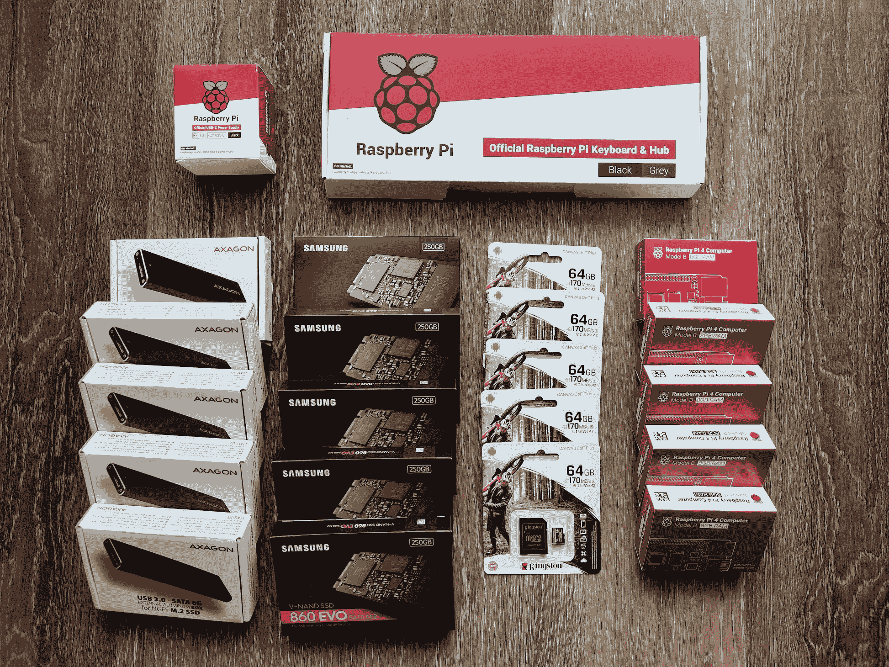
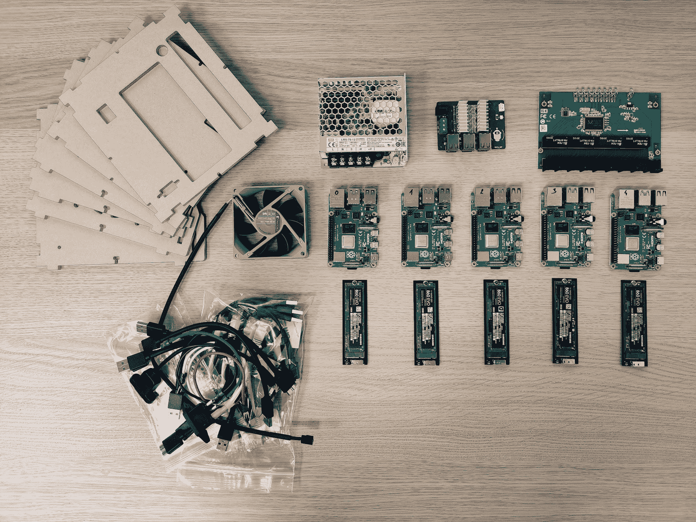
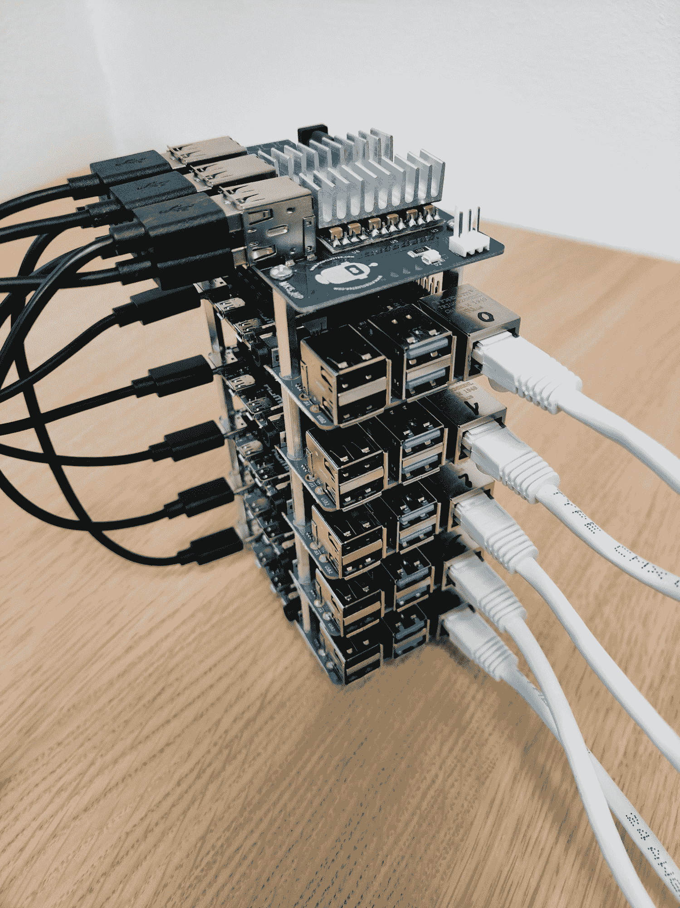
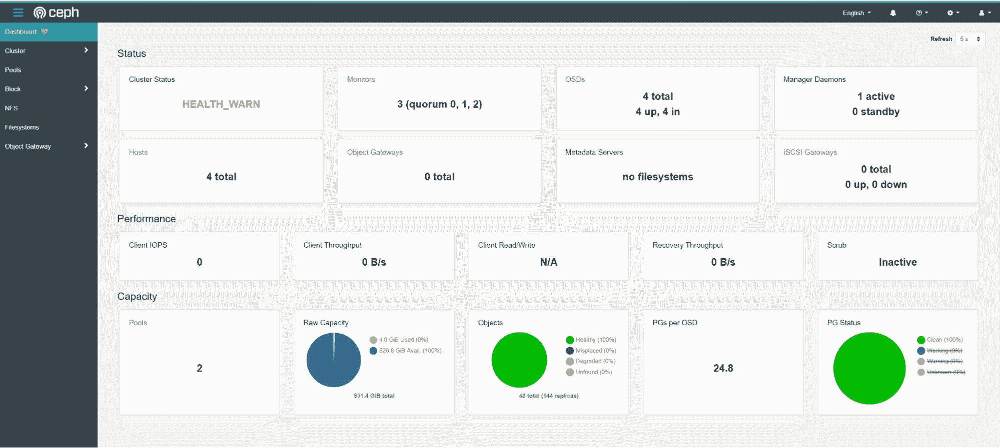
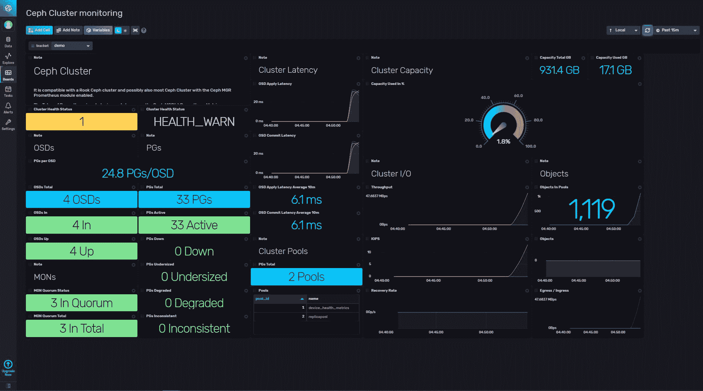
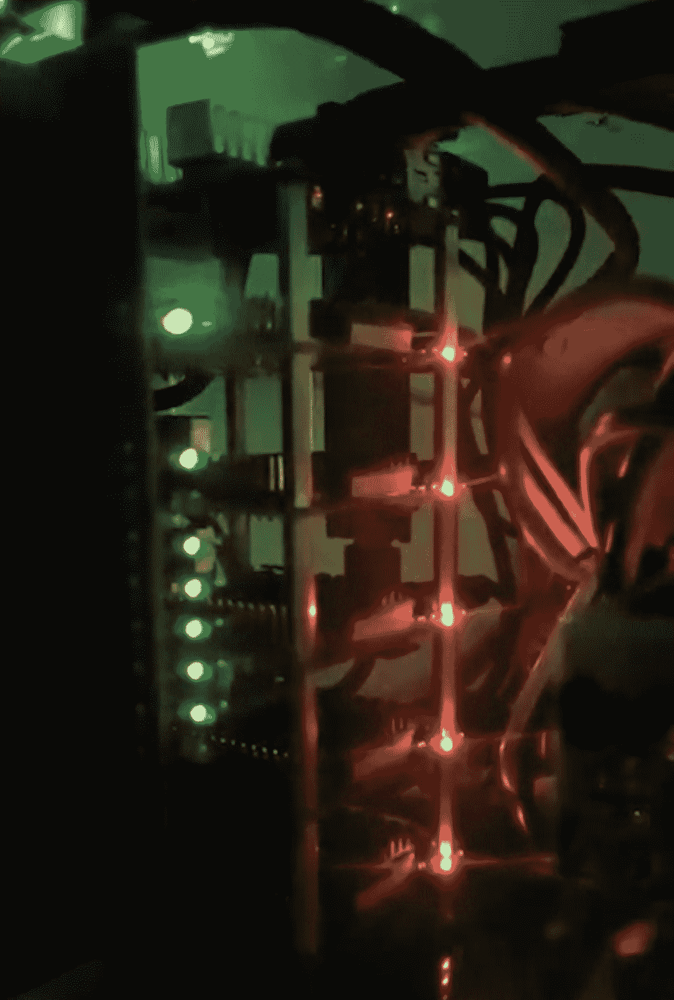

# 使用 Raspberry Pi 集群创建演示环境

> 原文：<https://thenewstack.io/creating-a-demo-environment-with-a-raspberry-pi-cluster/>

查尔斯·马勒

查尔斯是 InfluxData 网站的技术营销作家。Charles 的背景包括从事数字营销和全栈软件开发。

在当今世界，默认的应用程序托管选择是在云中运行一些东西。不过，有时候，替代选择效果更好。

一年多以前，InfluxData 营销团队想用 Kubernetes 建立一个演示环境。我们的计划是用它进行基准测试，生成演示数据，并能够测试我们可能有的任何其他随机想法。

使用任何可用的托管 Kubernetes 服务是显而易见的解决方案，但这似乎超出了我们的需求。我们不打算在生产中使用它，也不会经常使用它，所以用大量的资源来支付 24/7 可用性是没有意义的。使用集群执行资源密集型任务的情况很少见。

在考虑了一些备选方案后，我们决定使用树莓 Pi 集群。这给了我们灵活性，另外，唯一的长期成本是集群在办公室运行时使用的少量电力。

## Raspberry Pi 集群替代方案

一旦我们决定不采用云托管的 Kubernetes 环境，仍然有几个备选方案需要考虑。一种选择是创建一个更传统的 x86 服务器集群，但这也是多余的。

另一个当时不可用的替代方案是 [TuringPi](https://turingpi.com/) ，它使用 Raspberry Pi 计算模块，而不是 Raspberry Pi 4。为了让事情变得更简单，我们使用了来自 [Pico Cluster](https://www.picocluster.com/collections/pico-5/products/pico-5-raspberry-pi4) 的一个工具包，其中包含了我们需要的所有组件。我们所要做的就是组装它。

最终，我们选择了 Raspberry Pi，而不是其他一些更便宜的替代产品，主要是因为它有巨大的社区，以及大量可用的教程和其他社区资源。

## 硬件故障

现在让我们来看看令人兴奋的东西，我们实际使用的硬件类型！

我们的 Raspberry Pi 集群运行以下硬件:

*   5 Raspberry Pi 4B，带 8GB 内存和四核 Broadcom 1.5GHz CPU
*   5 三星 860EVO V-NAND 固态硬盘 SATA M.2 + SATA M2 250GB
*   5 金士顿 64GB micro sdxc Canvas Go Plus 170 r A2 U3 v 30

该群集使用带有专用路由器的每秒 1GB 的本地网络。每个 Raspberry Pi 充当 Kubernetes 集群中的一个节点，具有一个静态 IP 地址，使用 MetalLB 作为负载平衡器。CPU 已经超频到 2.0GHz，以获得更高的性能。

## 软件故障

【T2

Ubuntu 20.04 被用作这个 Raspberry Pi 集群的操作系统。应用程序在 Docker 内部运行，由 Kubernetes 编排容器。我们使用 Jenkins 来自动化作业，这些作业在 Kubernetes 和 [InfluxDB](https://www.influxdata.com/products/influxdb/) 中运行，使用 Telegraf 来监控所有演示数据和集群上运行的其他东西。Ceph 用于存储。

这种设置工作得很好，当我们测试集成并为一些可以与 InfluxDB 一起使用的最流行的软件开发[模板](https://www.influxdata.com/products/influxdb-templates/gallery/)时，可以使用这种设置。

## Raspberry Pi 集群的用例

对于我们在 InfluxData 的用例，我们的 Raspberry Pi 集群工作得非常好。但是，除了运行 Kubernetes 集群来处理与工作相关的事务之外，您还可以做更多的事情。下面是我们团队关于如何使用你自己的 Raspberry Pi 集群的一些想法。

### 家庭自动化

你可以使用你的 Raspberry Pi 集群的一个很酷的方式是管理和自动化你家里的一些东西，同时维护你的隐私。家庭助手是一个用于家庭自动化的开源平台，集成了 1000 多种不同的设备，如亚马逊 Alexa、谷歌助手、菲利普斯照明、Plex 服务器和 MQTT 等协议。它是为您的使用案例定制和扩展而构建的。

一些常见的用例是从相机发送通知，用灯创建唤醒警报，根据特定因素最小化能源使用等等。

应该注意的是，就计算能力而言，您可能可以用单个 Raspberry Pi 完成大多数家庭自动化任务，但是集群对于冗余来说可能是有用的。

### 树莓 Pi 超级计算机

虽然我们的集群只有五个相连的 Raspberry Pis，距离被视为超级计算机还有很长的路要走，但如果你愿意，你可以将事情推向下一个层次。例如，Oracle 让一组销售人员创建了一个 12 节点的 Raspberry Pi 集群，作为 Oracle 云的演示环境。随着时间的推移，Oracle 将该项目扩展到 1060 节点的集群。

### 学问

构建一个 Raspberry Pi 集群也是了解大量在技术工作中有用的不同事物的好方法。在这个过程中，你会学到网络、信息技术和许多其他东西。一旦你设置好了，你就有了一个完美的环境来学习 DevOps 和任何你想尝试的东西，而不用担心在玩的时候会破坏一些重要的东西。

## 经验教训

对我们的团队来说，设置和运行 Raspberry Pi 集群是一件有趣的事情，从商业角度来看，这正是我们要做的事情。这并不是说一切都是阳光和彩虹；有几件事你需要注意。

首先，你将在网上找到的许多教程将只涵盖一些非常一般的用例，所以你将不得不处理边缘情况。对于我们的团队来说，一个问题是，因为我们选择 Ubuntu ARM64 作为基本操作系统，而不是 Raspbian，所以当试图运行关键组件时，许多 Docker 映像无法正常工作。(随着越来越多的项目开始支持 ARM64，这已经变得越来越好了。)

另一个主要限制是任何涉及大量网络通信的事情(在你的办公室或家里没有强有力的连接是最明显的问题)。如果您试图与运行在云中的系统通信，也可能会遇到延迟问题。然而，对于任何涉及物联网、监控或小型 R&D 用例的情况，Raspberry Pi 集群都是一个很好的解决方案。

<svg xmlns:xlink="http://www.w3.org/1999/xlink" viewBox="0 0 68 31" version="1.1"><title>Group</title> <desc>Created with Sketch.</desc></svg>