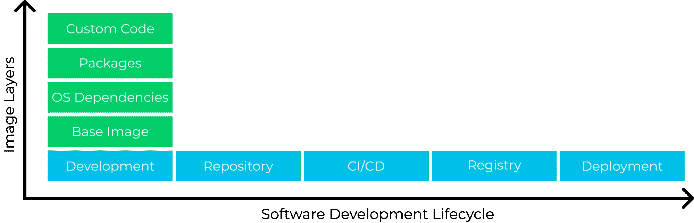

# 创建可信的集装箱供应链

> 原文：<https://thenewstack.io/creating-a-trusted-container-supply-chain/>

说到对容器的信任，这是一个二维问题。首先，容器的整个堆栈，从基本映像开始，必须被验证为安全的，具有可接受的漏洞和配置风险级别。第二，在软件开发生命周期的每个阶段——从开发，通过 CI/CD 管道到部署——对于那些可接受的风险级别的违反，应该有一致的反馈和护栏。当超过 [99%的攻击使用已知的漏洞](https://www.gartner.com/smarterwithgartner/focus-on-the-biggest-security-threats-not-the-most-publicized/)时，验证图像的可信度对于关闭绝大多数可利用的问题是至关重要的。

【T2

让我们看看，如果您是一名开发人员，正在为您的公司构建一个多服务电子商务 Kubernetes 应用程序，这将如何工作。

## 第一维:可信容器层

### 现成的图像

 [泰勒·史密斯

Taylor 是 Palo Alto Networks Prisma Cloud 的高级产品营销经理，负责“左移”和容器安全。他帮助客户将安全性集成到 DevOps 实践中，以保护整个云原生堆栈。](https://www.linkedin.com/in/taylorbsmith/) 

有时你搜索 Docker Hub 或其他公共注册中心，就会中大奖。你需要为你的商店运行一个基于机器学习的推荐引擎，你发现一个预建有推荐算法的容器图像已经准备就绪。描述是完美的，粗略的谷歌搜索没有显示任何投诉。所以你把图像放到你的 Kubernetes 集群中，然后继续前进。

这不是个好主意。当许多容器映像被发现带有恶意软件、漏洞或重大错误配置时，这种做法可能会暴露您的应用程序。如果您找到了完美的映像，运行它通过扫描仪可以验证映像的状态，并在集群中运行它之前识别已知和未知的恶意软件。

### 基础图像

对于大多数用例来说，图像可以帮助您完成部分工作，但是接下来您需要在其上进行构建。然而，即使在构建了您所需要的基础映像之后，这些基础映像仍然经常占据容器映像和运行包的大部分。这就是为什么在第一个“From”语句中从安全的基础映像开始非常重要。

例如，假设您的应用程序的前端使用 Go，那么您使用`golang:1.2.0`作为基础映像复制您在 GitHub 上找到的一个前端。现在，您已经包括了至少 14 个漏洞，其中 5 个是关键的，而且您还没有添加应用程序组件。

相反，如果您从经过全面审查的注册表中提取基础映像，就可以从一开始就消除这些漏洞。想象一下，如果你的应用完全基于 100 个微服务。有了现成的版本，你就为一个坏演员引入了成千上万的切入点。有了可信的映像，您就大大减少了攻击面。

### 操作系统依赖项和程序包

构建容器映像信任的下一步是包含依赖关系。继续前端服务的例子，这将是用`apt`安装的操作系统包，比如处理证书的`ca-certificates`，以及从`go.mod`文件安装的 Go 包，比如为您的服务处理网络的`net`库。这些开源库，无论是在操作系统层面还是在语言层面，都需要被扫描以确保它们不包含漏洞[以防止被利用。如果是这样，它们需要更新到更高的版本，这可能会有需要在您的代码中修复的重大更改。](https://www.debian.org/lts/security/2021/dla-2593)

### 自定义代码

如果您已经做到了这一步，根据许多估计，您已经保护了超过 90%的服务代码。通过代码扫描器和 linter 运行您的定制代码来发现您编写的代码中的漏洞仍然很重要，例如 SQL 注入没有净化您的输入。

应该在 SDLC 的多个阶段对每一层进行检查，以确保您能够尽早、经常地收到反馈，并在生产之前进行修补。

## 第二个维度:贯穿 SDLC 的信任

### 发展

修复漏洞的最有效时间是在开发阶段。这就是为什么使用能够在开发环境中或通过 CLI 本地提供反馈的安全平台非常重要。关于漏洞和错误配置的警告可以确保映像从一开始就值得信任。

当您构建前端服务时，通过扫描器运行它，以识别需要修复的漏洞。这样，您就可以先升级并在此基础上构建，而不是依赖于有漏洞的旧版本。

然而，容器最完整的图像是在运行时，当它开始与主机和其他容器交互时。这就是[图像沙箱](http://paloaltonetworks.com/blog/prisma-cloud/image-analysis-sandbox)的用武之地。映像沙箱在隔离的开发环境中动态分析运行中的容器行为，以便在运行前提供容器映像的更准确视图。结果是了解漏洞和错误配置，以便可以在运行前进行补救。

### 存储库和 CI/CD 管道

在将容器映像集成到存储库之前，可以对其进行检查，以确保它们是安全的并符合法规遵从性要求。如果您已经在 CI/CD 工具(如 Jenkins)中设置了一个自动化测试步骤，那么代码可以因为原因(已知漏洞)而被阻止，以防止漏洞进入您的存储库代码库。

假设您向前端服务添加了一个新的 Go 包。由于截止日期，您忘记在本地扫描它。您向您的 Git 存储库创建一个 pull 请求，几分钟后，您被告知新的包不能提交到主分支，因为它包含一个重要的漏洞，该漏洞已在包的新版本中进行了修补。你已经从犯漏洞中被拯救出来，并且你已经得到了可以工作的包版本。

### 登记处

从存储库到注册表，将构建的映像发送到可信的私有注册表，以确保映像的安全。这就是一些公司依赖签约图像的地方。然而，尽管这是一个很好的安全实践，[它并不是一个完美的解决方案](https://www.impidio.com/blog/manipulating-signed-docker-images)。让 Kubernetes 只从一个[信任的注册表](https://www.paloaltonetworks.com/blog/prisma-cloud/cloud-container-image-trust-groups/)中取出你的前端容器，并阻止所有其他的。可以持续监控该注册表以发现新的漏洞，从而让您知道是否需要更新您的前端服务。

### 部署

最后，软件世界的发展太快了，不能自满。在运行时，使用能够识别新漏洞并发出警报的代理，不断验证使用中的容器是否可信。如果发现违反信任策略的新漏洞或错误配置，请修复该映像，并再次通过信任管道运行它。对于那些无法修补的漏洞，使用运行时安全性来阻止试图利用漏洞的恶意进程和网络行为。

## 完全 2D 信托

这种验证容器信任的二维方法极大地改善了云本机应用程序的状态，而不会产生大量额外开销。通过多次检查来验证每一层，可以让您相信您已经做了正确的事情来保护您的应用程序。

*要了解更多关于保护容器和其他云原生技术的信息，请考虑参加 10 月 11 日至 15 日举行的 [KubeCon+CloudNativeCon 北美 2021](https://events.linuxfoundation.org/kubecon-cloudnativecon-north-america/) 。*

<svg xmlns:xlink="http://www.w3.org/1999/xlink" viewBox="0 0 68 31" version="1.1"><title>Group</title> <desc>Created with Sketch.</desc></svg>