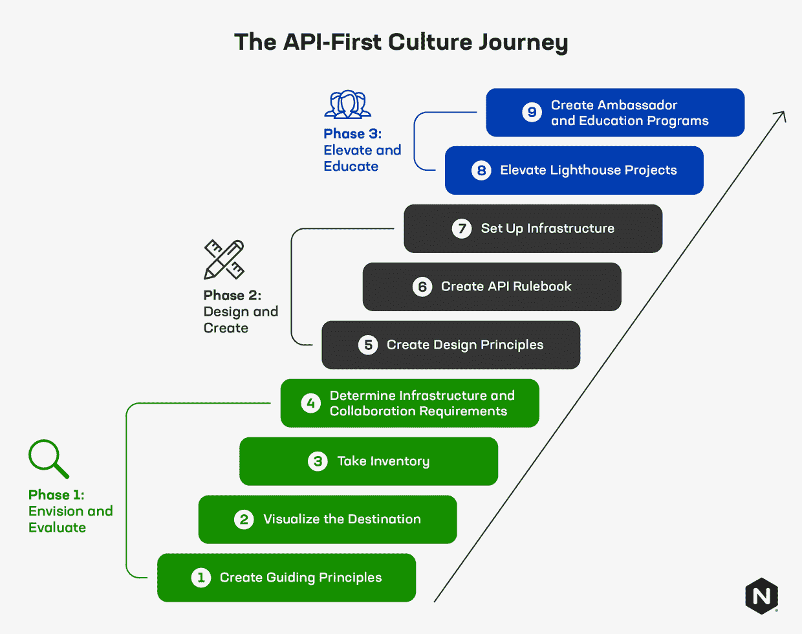

# 创建 API 优先的文化和公司，第 1 部分

> 原文：<https://thenewstack.io/creating-an-api-first-culture-and-company-part-1/>

[kart hik Krishnaswamy](https://www.linkedin.com/in/kkrishnaswamy/)

[kart hik 是 F5 旗下 NGINX 的产品营销主管。他拥有芝加哥大学布斯商学院的 MBA 学位和伊利诺伊理工学院的计算机科学学位。他来自印度南部的钦奈，现在住在加州圣何塞。](https://www.linkedin.com/in/kkrishnaswamy/)

这篇博客是由四部分组成的系列文章的一部分。

1.  *创造 API 至上的文化和公司* *(本帖)*
2.  [*创造 API 至上的文化和公司(第二部分* *)*](https://thenewstack.io/creating-an-api-first-culture-and-company-part-2/)
3.  [*像管理四星级餐厅一样管理你的 API(第三部分)*](https://thenewstack.io/manage-your-apis-like-a-4-star-restaurant/)
4.  *[平台运营团队应该如何思考 API 策略(第四部分)](https://thenewstack.io/how-platform-ops-teams-should-think-about-api-strategy/)*

也许在过去的十年中，技术世界最大的转变是应用编程接口 API 的兴起。这是因为 API 是许多其他大规模转变的潜在推动者:SaaS、云计算、容器编排、分布式应用、无服务器计算，甚至机器学习。API 使得技术的持续模块化成为可能，如果不是不可避免的话。结构化数字服务的编程接口是技术堆栈的最低公分母，这一理念已经被很好地融入到软件工程中，对于许多类型的功能，开发人员永远不会想到编写自己的库和服务。

考虑到 API 是如何变得无处不在和必不可少的，我们预计未来的大赢家将是 API 第一的公司，它们将 API 作为其产品的核心或其走向市场的关键要素。一些企业显然是 API 优先的，因为 API 本身就是他们的主要产品。斜纹、条纹和格子是这种商务设计的三个流行例子。但是其他组织仍然可以被归类为 API 优先，因为他们的文化和精神要求一切都可以通过 API 消费和寻址。亚马逊、谷歌和脸书符合这一描述。

也就是说，绝大多数公司既不是科技巨头，也不是 API 即产品的创新者。然而，现在每个领域的赢家和输家在很大程度上取决于他们的技术和软件设施。推而广之，这些公司应该熟悉 API，并向 API 优先的思想和商业实践过渡。我们在 NGINX 经常思考的一个问题是，“公司如何创建 API 优先的文化，并过渡到成为 API 优先的公司？”这是一个核心考虑因素，因为他们发展了现有的技术堆栈，并转向更加云原生的分布式应用架构，其中 API 扮演着越来越重要的角色。

## 我们正处于 API 经济的第三次浪潮中

在 API 经济的第一波浪潮中，我们见证了 API 作为将关键功能引入应用程序的一种方式的兴起。脸书、推特和谷歌地图都展示了开发者如何看到通过引入 API feeds 为应用增加功能的巨大好处。在第二次浪潮中，我们看到了像 Twilio 和 Stripe 这样的 API 即产品公司的崛起。这些巨头验证了将关键服务作为嵌入到其他应用程序和服务中的 API 进行销售的能力。

今天，我们在第三次浪潮中。API 经济的第三次浪潮是将许多核心的内部和外部业务流程分解成由 API 支持的微服务和小型应用程序。API 成为企业使用技术来共享信息、简化流程和改进业务逻辑的主要方法。

API 可以开拓新市场，同时也能以更快、更经济的方式进入现有市场。API 还允许更好地内部利用技术。这正在推动微服务和一种更广泛的——或许更激进的——从杂乱的“巨石”转移到更好的扩展和更敏捷的“要做的工作”(JTBD)方法。JTBD 框架支持组织内部更广泛的所有权。服务可以有所有者和小团队，将“两个比萨饼团队”的概念编码为企业中的主要创建机制，并使工作可重用以构建新产品和新功能。

## 创建 API 第一的文化和公司

实际上，创建 API 第一的文化和公司是一个需要考虑和基础的旅程。有多个步骤——从 API 结构和开发的设计和规则，到支持 API 的正确基础设施类型的优先级和规划。然而，这一旅程中最重要的部分是精神上的转变。API 优先的公司将这种思想转变铭记于心，将 API 作为他们的主要产品。所有其他产品都源自 API。API 公开的任何东西都有利于下游应用程序和用例。

## 阶段 1:设想和评估

### 步骤 1:为理想的 API 第一状态创建指导原则

你可能不想对开发者发号施令——这很少会有好结果。但是你可以也应该列出指导原则来阐明理想的最终状态。基本原则可能包括:

*   API 是每个 JTBD 的第一个用户界面(UI)。
*   每个新产品或服务都是从 API 的描述和设计开始的。
*   API 提供了广泛有用的通用服务或实用程序。因此，API 被设计成完全独立于客户端和通道。
*   所有的 API 对于内部和外部的使用都应该是一样的。这是因为我们无法预测哪些 JTBDs 将在内部、外部或作为两者的组合来执行。
*   最低限度的 API 安全需求是身份验证。这些是没得商量的。API 是防火墙中的漏洞，也是横向穿越的捷径。因此，必须非常小心地对待它们，用 Web 应用程序防火墙(WAF)保护它们，并在每个会话开始时进行身份验证。
*   API 在发布之前已经定义并记录在案。永远要本末倒置。

就像十二因素应用定义了应用开发人员应该为云编写应用的方式一样，您的 API 原则应该定义您的团队如何为您的业务目标编写 API，同时遵守您的技术原则。

### 第二步:想象目的地

首先想象一下在 API 优先的状态下，你的公司会是什么样子。然后，从那里向后工作。例如，如果你是一家时装销售公司，API-first 可能意味着所有内容、商业和物流渠道都由 API 架构驱动，这些架构为各种消费前端和应用程序提供支持。这颠覆了在不同的商业平台或经销商内部分别开发移动应用、网络应用和存在的标准范式。在物流方面，这可能意味着所有关于运输材料、将批次发送到商店和直接向消费者运输的数据都包含在一组单独的 API 中，甚至包含在一个 API 中。从目的出发，逆向设计。

### 步骤 3:清点您现有的 API 足迹

统计你的组织发布的所有内部或外部使用的 API。有可能比你意识到的要多，因为团队可能为了他们自己的使用而创建它们。这些团队可能是将您的组织转变为 API 优先公司的最佳变革代理人和布道者。这个清单还会让你很好地了解 API 正在做什么，你的开发人员正在考虑如何使用它们，以及他们正在积极使用哪些实践和工具。一般来说，围绕前沿开发人员已经在使用的工具来标准化 API 开发更容易。然后，你可以授权他们去传福音给其他人，或者成为你组织内部的“实践专家”。平台团队可以从这些工具带中进行管理，同时更好地了解如何映射到基础设施和协作工具。对于 NGINX，作为一个广泛部署的 web 服务器和负载均衡器，也有一个 [API 管理解决方案](https://www.nginx.com/products/nginx-controller/api-management/)。

### 步骤 4:确定基础设施和协作需求

在这一步中，您需要与您的开发运维团队和平台运维团队合作，了解如何使用 API 以及他们更喜欢哪些工具。

不同的 API 类型和使用情形在环境、计算支持级别和交易的附加存储方面可能有不同的要求。

基础设施要求示例:

*   面向客户的金融交易 API 可能需要低容忍度的 SLA 和非常低的延迟，这可能决定了对该 API 的支持需要全球不同数据中心中的 N+3 个实例来推动 API 处理更接近客户端调用。这个场景可能需要一个针对高性能优化的 [API 网关](https://www.nginx.com/learn/api-gateway/)。
*   在较旧、较慢的硬件和较少的数据中心上，只要求一致性(而不是低延迟)的内部 API 可以与不太严格的 SLA 愉快地共存。
*   因为 GraphQL 被设计为处理许多查询类型，并且经常与图形数据库进行交互，所以与更窄的 REST APIs 相比，GraphQL APIs 可能需要更多的计算能力和更大的通信带宽。

确保创建 API 的公共协作环境与基础设施支持一样重要。Postman 和 SwaggerHub 是 API 协作和托管平台的领先提供商。他们的工具自动化了许多繁重的工作，比如 API 模式生成和文档。

## 准备 API 优先的设计、创建和实现

一旦他们在 API 优先之旅的第一阶段进行了设想和评估，API 优先组织就准备通过精心设计支持性的设计原则和基础设施来转变他们的文化。本系列的下一篇文章将帮助您充分利用您的旅程，并包括在这种新文化的创建中可能是您最重要的利益相关者的人——您的创造者和开发者。

<svg xmlns:xlink="http://www.w3.org/1999/xlink" viewBox="0 0 68 31" version="1.1"><title>Group</title> <desc>Created with Sketch.</desc></svg>