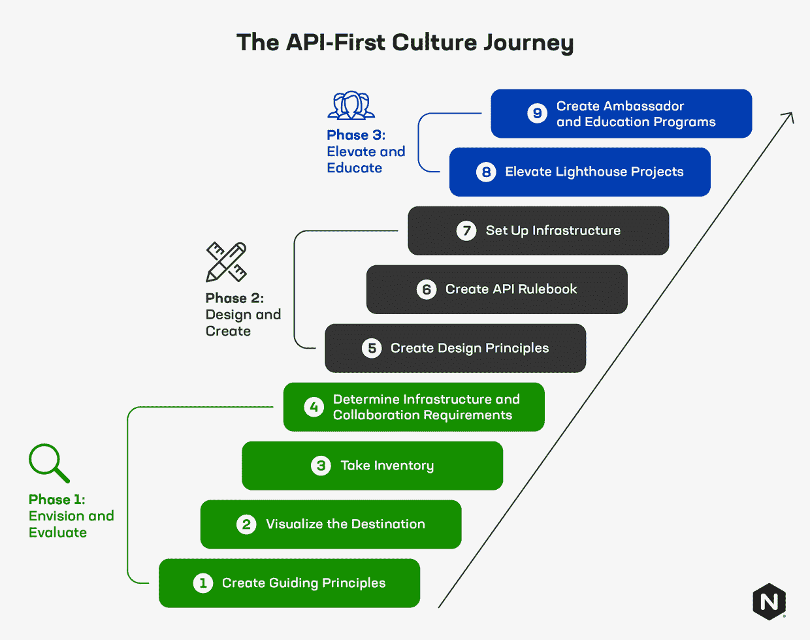

# 创建 API 优先的文化和公司，第 2 部分

> 原文：<https://thenewstack.io/creating-an-api-first-culture-and-company-part-2/>

[kart hik Krishnaswamy](https://www.linkedin.com/in/kkrishnaswamy/)

[kart hik 是 F5 旗下 NGINX 的产品营销主管。他拥有芝加哥大学布斯商学院的 MBA 学位和伊利诺伊理工学院的计算机科学学位。他来自印度南部的钦奈，现在住在加州圣何塞。](https://www.linkedin.com/in/kkrishnaswamy/)

这篇博客是 4 部分系列的一部分。

1.  *[创造 API 至上的文化和公司，第 1 部分](https://thenewstack.io/creating-an-api-first-culture-and-company-part-1/)*
2.  *创建 API 第一的文化和公司，第 2 部分(本文)*
3.  [*像管理四星级餐厅一样管理你的 API(第三部分)*](https://thenewstack.io/manage-your-apis-like-a-4-star-restaurant/)
4.  *[平台运营团队应该如何思考 API 策略(第四部分)](https://thenewstack.io/how-platform-ops-teams-should-think-about-api-strategy/)*

在我们的第一篇文章中，我们展示了组织如何为 API 优先的文化打下基础。API 正在改变我们的技术，改变公司的方向，推动重要的技术变革。API 优先的公司在他们的行业中很有竞争力并推动创新。因此，组织如何过渡到 API 优先的思想是一个关键的考虑因素，即使对于那些不是 API 即产品的公司也是如此。

本系列的第二部分从我们停止的地方继续，介绍创建 API 优先文化过程的第二阶段(设计和创建)。API 优先文化的设计和评估方式为它们在 API 经济的第三次浪潮中的表现设定了标准——API 继续推动从单一基础设施向更好的技术利用转变。

API 第一文化之旅的第二阶段将企业带入 API 规则手册、设计原则和基础设施的设计和创建。从那里，你的利益相关者被邀请参与塑造你的新文化，继续你的 API 优先之旅。

## 阶段 2:设计和创造

### 步骤 5:为你的 API 创建一套设计原则

对于一个真正成为 API 第一的企业来说，它必须有一个共享的观点和一套关于如何设计 API 的规则。从一般设计原则开始。两个例子包括:

*   *平台独立性*:任何客户端都应该能够调用 API，不管 API 是如何实现的。
*   *服务独立性*:API 所有者应该能够完全独立于任何客户端应用程序来发展和添加功能。

其他规则可能规定了字符使用的经济性，这意味着使用 API 的 URI 结构中的每个字符，任何无关的字符，如正斜杠，都将中断 URI 调用。一个简单的问题应该指导原则*:用户将如何使用和编写这个 API？*对于内部和外部用户来说，答案应该是相同的。这些听起来像是基本的常识性设计原则，但是奠定基本的期望和指导方针是至关重要的。

注意:这也是一个让安全团队参与进来的好时机，让他们参与到减少攻击面和风险的 API 设计模式中来。

### 步骤 6:创建 API 规则手册

是的，规则很无聊——但它们也是必要的。草率的 API 设计会带来很多问题。虽然开发人员从来不打算设计一个松散的 API，但时间压力或合作伙伴要求等因素会对设计选择产生负面影响。选择您希望您的组织支持什么类型的 API:REST、GraphQL、gRPC 甚至 SOAP(一种较旧但在处理遗留系统时仍然有用的 API 结构)。对于你决定支持的每一种 API，列出一个风格指南，描述具体的设计标准(URI 结构、模式等)。).

### 步骤 7:设置 API 管理和安全基础设施

管理和保护 API 可以通过现有的负载平衡器、反向代理或 ADC 来完成；但是，它需要额外的功能。API 不同于标准流量请求，因为它是机器对机器的，并且表现出不同的消费模式。保护外部 API 需要一种新的思维方式，因为默认情况下，外部 API 会在安全边界上打一个洞来开放服务，类似于通过防火墙的 web 流量。就 API 而言，可能有许多端口为了不同的目的和服务而打开和关闭，每个端口都有自己的一套预期和允许的业务逻辑。对于内部 API，如果您计划将业务关键功能转移到这些 API，建立适当的性能管理同样重要。流量和内部 API 的管理都应该在公司网络中进行——否则你会危及你的安全。

## 阶段 3:提升和教育

### 步骤 8:创建或提升 Lighthouse API 项目

可见的成功故事激励人们投身于 API 文化和创造。理想情况下，这些成功故事涉及创新的新产品或触及特定业务日常依赖的核心能力。创建一个涵盖外部和内部用例以及一系列具有不同需求的服务类型的多样化清单是很有帮助的。

除了这个计划，为你的 API 优先之旅的预期结果和发展设立明确的目标。获得高层管理人员的认同，他们是 API 经济的粉丝，并且愿意强调高层人员的进步。并确保创建者和开发人员——您最重要的利益相关者——乐于参与并成为您企业内部的 API 杰出人物。

### 步骤 9:创建 API 大使和教育计划

有了开源技术，像 Comcast 和微软这样的公司已经建立了大使计划，突出不同开源领域的内部专家。然后这些专家作为顾问被提供给其他想要为开源项目贡献代码的员工。类似的大使计划受到广泛的尊重，并成功地部署在数十家公司。API 大使可以帮助培训不熟悉 API 的开发人员，帮助他们掌握规划和构建 API 的过程。

另一个常见的策略是启动一个内部 API 大学和一系列培训课程。理想情况下，这些应该集中在真正的 API 项目上，在这些项目中，开发人员正在构建一些组织实际上将在不久的将来实现的东西。

## 进入 API 第一的思维模式

遵循上述阶段和步骤将会增加 API 成功的机会。关键是在将您的技术和产品开发过渡到 API 优先的思维模式和执行框架时，采取一种全面而现实的方法。像任何技术采用之旅一样，胡萝卜和鼓励比大棒更有效。与任何重大的范式转变类似，您需要考虑解决面向 API 的团队的需求，从开发人员和开发人员到负责锁定 API 的基础设施和安全团队。成为一个 API 第一的公司，并获得在创建产品和功能时转向模块化、JTBD 方法的好处，永远不会太迟。

好处不仅仅包括效率和灵活性的提高，还包括开发人员和小团队更大的自主权，允许每个机构构建和完全拥有某些东西。很明显，作为原生 API 公司的科技巨头似乎行动如此之快，迭代如此之快；为什么亚马逊每年能推出几十款新的云产品。好消息是没有秘方——只有聪明的计划和合理的步骤来激发你自己的 API 转换。

<svg xmlns:xlink="http://www.w3.org/1999/xlink" viewBox="0 0 68 31" version="1.1"><title>Group</title> <desc>Created with Sketch.</desc></svg>