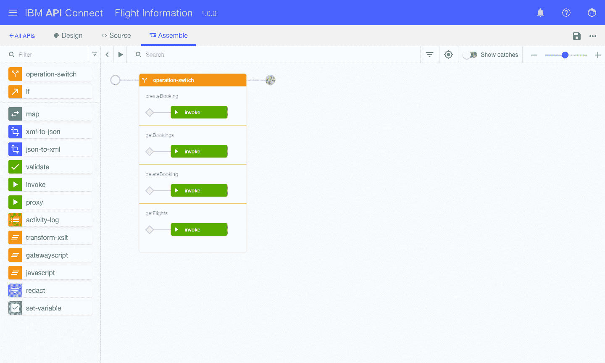
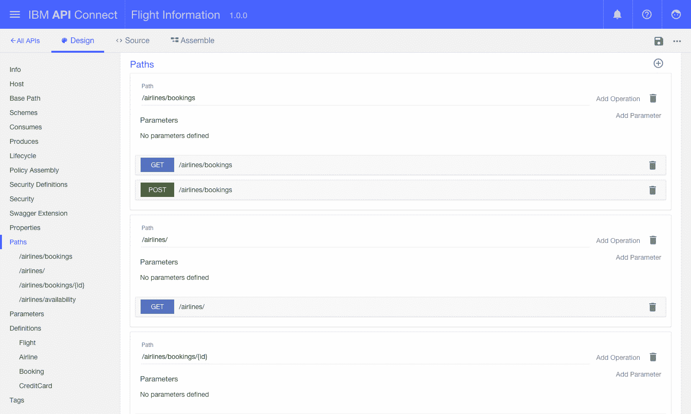
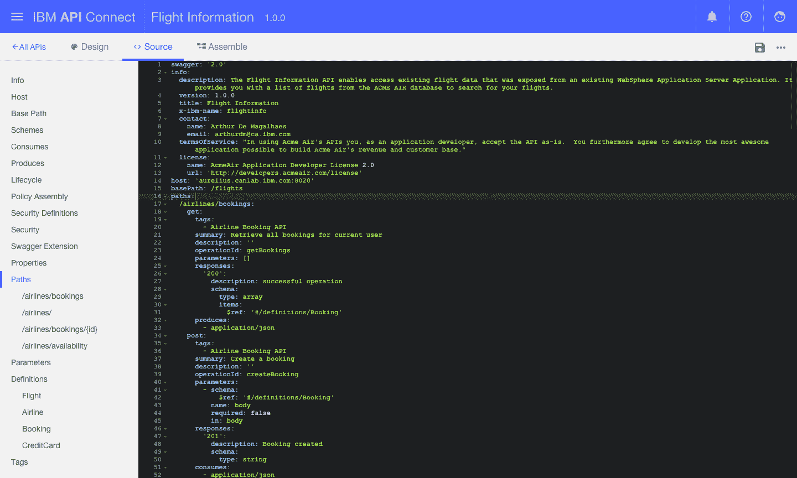

# 创建 API 是容易的部分:IBM 现在提供完整的 API 生命周期管理

> 原文：<https://thenewstack.io/creating-api-easy-part-ibm-now-offers-full-api-lifecycle-management/>

“创建 API 是最简单的部分。就像把小狗带回家一样。IBM 负责云战略和投资组合管理的副总裁 Don Boulia 解释了为什么 API 在创建后很长一段时间内都需要持续的维护和偶尔的清理。

IBM 已经更新了其 API Connect 管理工具，使其能够使用从去年的 [StrongLoop 购买](http://techcrunch.com/2015/09/10/ibm-buys-strongloop-to-add-node-js-app-development-to-its-cloud-platform/)中获得的软件来创建和运行应用编程接口(API)。根据 IBM 的估算，这使得该软件成为世界上第一个完整的 API 生命周期管理包。API Connect 第 5 版现在既有云形式，也有可以在本地安装的 bits 形式。

Boulia 说，企业正在慢慢接受 API 的想法。几年前，高管们在询问 API 的效用。Boulia 说，今年，在 IBM Interconnect 2016 会议上，他们正在讨论实施战略。

API 本身只是关于如何从某个系统中提取数据或服务的机器可读指令。然而，将它们引入 IT 基础架构会带来额外的考虑，尤其是要确保它们遵守所有现有的 IT 安全策略。

需要记住的一点是，面向用户的移动应用程序的开发比后端记录系统或事务系统要快得多。Boulia 说，API 提供了一个“减震器”，允许栈的不同部分以自己的速度发展。

但是，虽然 API 可以提供一个通向后端服务的管道，但是它们的用途却一点也不简单。移动应用程序很少对后端系统进行一对一的调用。相反，数据集被过滤或与来自其他 API 的数据合并。在某些情况下，必须对用户提交的数据进行验证，以确保其格式正确。

“实际上，你最终会得到一些业务逻辑，”在 API 层，Boulia 说。

API 产生了其他必须解决的问题。另一个潜在的问题是由外部公开的 API 产生的流量。它们可以产生比后端系统习惯的流量多一个数量级的流量。当向实际上整个世界开放内部系统时，还需要考虑安全问题。

需要考虑的更多:必须创建文档来帮助外部甚至其他内部开发人员理解 API。API 会在某个时候更新，所以版本控制必须考虑在内。

您还想通过收集大量的用户指标来充分利用您的 API。API 获得了多少流量？用户是谁？API 是否有足够的响应能力？需要设置费率限制，如果 API 是付费服务，则需要制定服务水平协议(SLA)。

Boulia 说，API 管理工具“处理你可能一无所知的问题”。

在去年 2 月于拉斯维加斯举行的 IBM Interconnect 大会上，IBM 项目工程师 Matt Roberts 演示了新版本的 API Connect 如何工作，其中考虑了 StrongLoop 特性。

在服务器上，API Connect 使用 Node.js 来协调操作。未来的版本还将根据需求提供 Java、 [Swift](https://thenewstack.io/ibms-mission-forge-apple-swift-cloud-native-language/) 和其他语言。

为了开始，用户从节点包管理器(npm)下载一个工具包。安装完成后，用户会看到一个命令行和一个可视化界面，可以用来创建新的 API。StrongLoop 将为新的 API 建立一个框架。还可以下载连接器来连接数据库系统和其他数据源。

通过数据库配置，API Connect 可以为 API 创建一个数据模型。一旦 API Connect 有了最终的数据模型。它可以自动创建 API。在任何时候，开发人员都可以在 [Swagger](https://thenewstack.io/why-swagger-makes-apis-easier-to-describe-and-consume/) 中检查配置，因为每个 API 都在 [YAML](http://yaml.org/) 文档中定义。

当 API 完成时，软件会将 API 推送到内部服务器，或 IBM Bluemix，并将其可用性的细节添加到服务目录中。API Connect 可以在不同的组中收集 API，比如“付款”、“客户资料”等等。

API Connect 自去年以来一直处于测试阶段，它将提供免费的“基本”版本，每月仅限于 50，000 次 API 调用。还有专业版和企业版，两者都有订阅模式。

IBM 是新堆栈的赞助商。

拉斯维加斯德拉诺酒店的专题艺术。

<svg xmlns:xlink="http://www.w3.org/1999/xlink" viewBox="0 0 68 31" version="1.1"><title>Group</title> <desc>Created with Sketch.</desc></svg>