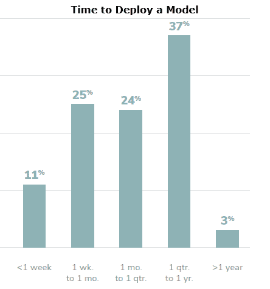
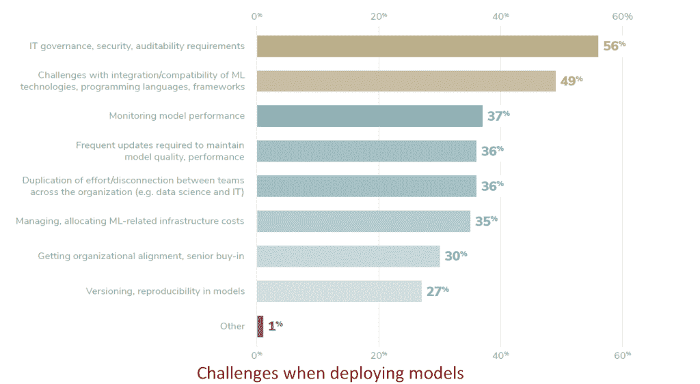

# 创建机器学习模型需要太多时间

> 原文：<https://thenewstack.io/creating-machine-learning-models-takes-too-much-time/>

机器学习(ML)生命周期中最具挑战性的阶段是什么？数据收集和清理一直是数据科学家和分析从业者工作中最耗时的方面。但是随着解决这个问题的方案的出现，瓶颈已经转移到创建和部署 ML 模型上。

对于标准 ML 生命周期中有多少个阶段，还没有定论，但可以肯定的是，开始并不是问题。高管们在项目上砸钱。尽管许多项目在概念验证阶段失败了，但其他项目在确定真正的业务目标和建立数据科学团队方面取得了成功。

实际上，构建和评估机器学习模型是 ML 生命周期的核心阶段。但是根据 Algorithmia 的[“2021 年机器学习的企业趋势](https://web.archive.org/web/20201210182823/https://info.algorithmia.com/tt-state-of-ml-2021)”一旦用例被实际定义，66%的组织需要一个多月的时间来开发一个 ML 模型。对于 64%的组织来说，部署该模型至少需要一个月的时间。根据该报告，大多数数据科学家至少花 25%的时间来部署模型。在[这些图表](https://thenewstack.io/software-engineers-use-spreadsheets-data-engineers-use-the-cloud/)中描述的机器学习工程师经常被部署到测试环境和生产环境中。评估其他研究时，重要的是要认识到受访者可能不了解这两种部署类型之间的区别。

一旦一个模型投入生产，就要根据 DevOps 和 it 相关的性能指标对其进行监控，同时还要确保其准确性不会随着时间的推移而降低。重新训练模型、审计、跟踪适当的安全性和治理以及现场 A/B 测试都是迭代步骤，可以反馈到生命周期的早期阶段。

归根结底，数据科学家分析和理解数据以影响决策。近年来，他们不太可能“浪费”时间来获取或清理数据，但在编写自己的软件来自动化部署和工作流方面变得更加熟练。如果 ML 平台和受欢迎的项目可以抽象出一些这种工作，那么数据科学家和机器学习工程师可以花更多的时间为他们的组织创造价值。

来源:Algorithmia 的《2021 年机器学习的企业趋势》。

根据 Algorithmia 的“2021 年机器学习企业趋势”，IT 治理、安全性和可审计性是与部署机器学习模型相关的最大挑战。

通过 Pixabay 的特征图像。

<svg xmlns:xlink="http://www.w3.org/1999/xlink" viewBox="0 0 68 31" version="1.1"><title>Group</title> <desc>Created with Sketch.</desc></svg>